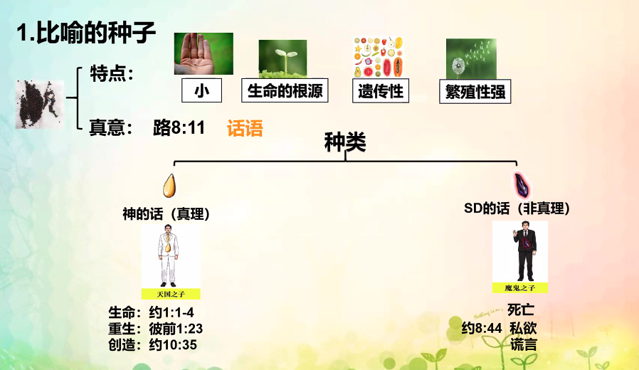
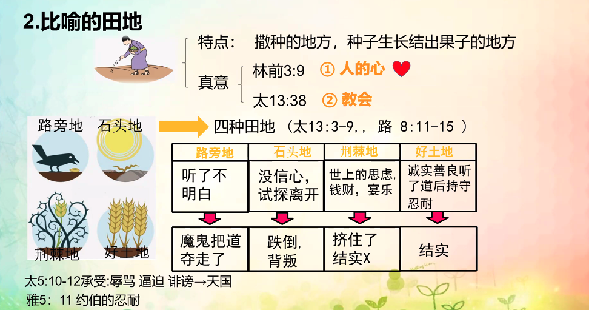
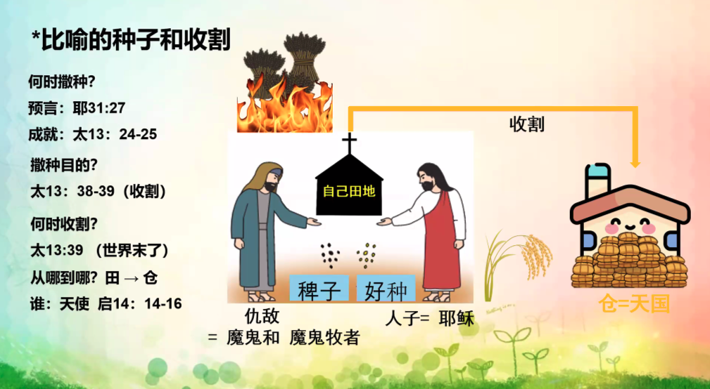
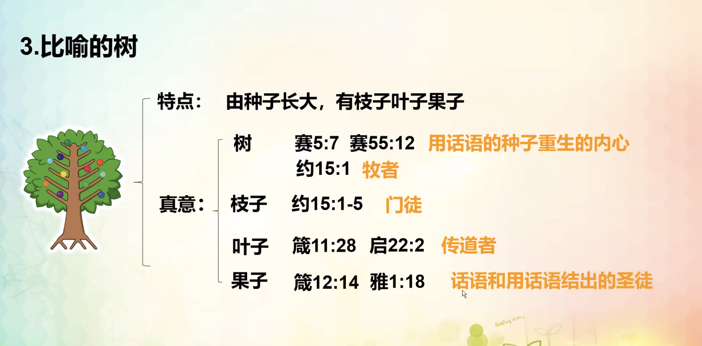
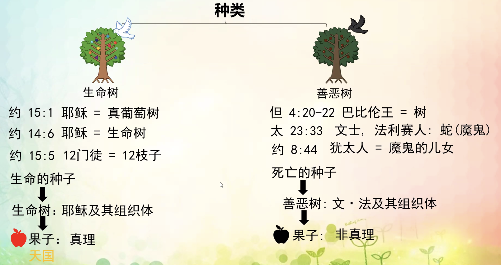
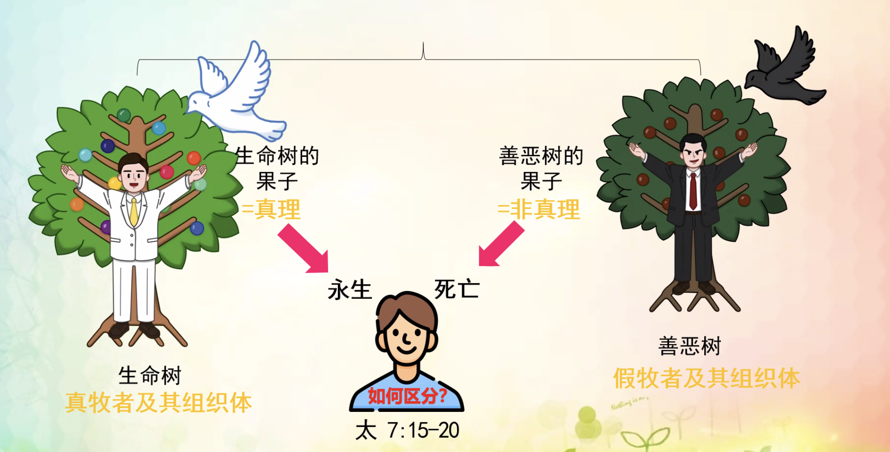
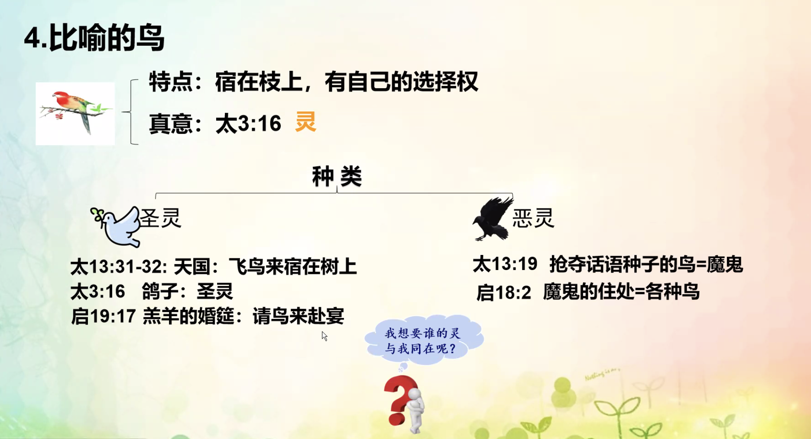

% 10-28：种田树鸟的比喻

{ width=500px }

__马太福音 13:31-32__

> 他又设个比喻对他们说：“天国好像一粒芥菜种，有人拿去种在田里。
>
> 这原是百种里最小的，等到长起来，却比各样的菜都大，且成了树，天上的飞鸟来宿在它的枝上。”

- 天国好像人撒种在田里
- 天国好像一粒芥菜有人拿去种在田里
- 天国好像面酵，有妇人拿来藏在三斗米里，直到全团都发起来
- 天国好像宝贝藏在地里
- 天国好像买卖人寻找好珠子
- 天国好像网撒在海里，聚拢各种海族

__罗马书 1:20__

> 自从造天地以来，　神的永能和　神性是明明可知的，虽是眼不能见，但藉着所造之物就可以晓得，叫人无可推诿。

{ width=500px }

__路加福音 8:11__

> “这比喻乃是这样：种子就是　神的道。

__彼得前书 1:23__

> 你们蒙了重生，不是由于能坏的种子，乃是由于不能坏的种子，是藉着　神活泼常存的道。

__约翰福音 10:35__

> 经上的话是不能废的；若那些承受　神道的人尚且称为神，

__约翰福音 8:44__

> 你们是出于你们的父魔鬼，你们父的私欲你们偏要行。他从起初是杀人的，不守真理，因他心里没有真理。他说谎是出于自己；因他本来是说谎的，也是说谎之人的父。

{ width=500px }

__哥林多前书 3:9__

> 因为我们是与　神同工的；你们是　神所耕种的田地，所建造的房屋。

__马太福音 13:38__

> 田地就是世界；好种就是天国之子；稗子就是那恶者之子；

__马太福音 5:10-12__

> 为义受逼迫的人有福了！ 因为天国是他们的。
>
> 人若因我辱骂你们，逼迫你们，捏造各样坏话毁谤你们，你们就有福了！ 应当欢喜快乐，因为你们在天上的赏赐是大的。在你们以前的先知，人也是这样逼迫他们。”

__雅各书 5:11__

> 那先前忍耐的人，我们称他们是有福的。你们听见过约伯的忍耐，也知道主给他的结局，明显主是满心怜悯，大有慈悲。

{ width=500px }

__耶利米书 31:27__

> 耶和华说：“日子将到，我要把人的种和牲畜的种播种在以色列家和犹大家。

__马太福音 13:24-25__

> 耶稣又设个比喻对他们说：“天国好像人撒好种在田里，
>
> 及至人睡觉的时候，有仇敌来，将稗子撒在麦子里就走了。

{ width=500px }

__以赛亚书 5:7__

> 万军之耶和华的葡萄园就是以色列家； 他所喜爱的树就是犹大人。他指望的是公平，谁知倒有暴虐；指望的是公义，谁知倒有冤声。

__以赛亚书 55:12__

> 你们必欢欢喜喜而出来， 平平安安蒙引导。大山小山必在你们面前发声歌唱；田野的树木也都拍掌。

__约翰福音 15:1-5__

> “我是真葡萄树，我父是栽培的人。
>
> 凡属我不结果子的枝子，他就剪去；凡结果子的，他就修理干净，使枝子结果子更多。
>
> 现在你们因我讲给你们的道，已经干净了。
>
> 你们要常在我里面，我也常在你们里面。枝子若不常在葡萄树上，自己就不能结果子；你们若不常在我里面，也是这样。
>
> 我是葡萄树，你们是枝子。常在我里面的，我也常在他里面，这人就多结果子；因为离了我，你们就不能作什么。

__箴言 11:28__

> 倚仗自己财物的，必跌倒； 义人必发旺，如青叶。

__启示录 22:2__

> 在河这边与那边有生命树，结十二样（或作“回”）果子，每月都结果子；树上的叶子乃为医治万民。

__箴言 12:14__

> 人因口所结的果子，必饱得美福； 人手所做的，必为自己的报应。

__雅各书 1:18__

> 他按自己的旨意，用真道生了我们，叫我们在他所造的万物中好像初熟的果子。

{ width=500px }

__约翰福音 15:1__

> “我是真葡萄树，我父是栽培的人。

__约翰福音 15:5__

> 我是葡萄树，你们是枝子。常在我里面的，我也常在他里面，这人就多结果子；因为离了我，你们就不能作什么。

__但以理书 4:22__

> “王啊，这渐长又坚固的树就是你。你的威势渐长及天，你的权柄管到地极。

{ width=500px }

{ width=500px }

{ width=500px }

{ width=500px }

__第四课习题__

1. __比喻的种子，田地的真正含义是什么？__

种子是神的道，田地指人的灵和信仰世界。

2. __我之前是谁的种子所生的？现在呢？怎么证明我是神的子女？__

过去由撒旦的种子所生。现在由神的种子所生。
根据自己能有机会领受从得胜者而来的神的道，并且被收割到仓中，可以证明自己是神的子民。

3. __田地的种类有几种？我是哪种？有哪些表现？如何做才能成为好土地？__

田地分为路旁地、石头地、荆棘地、好土地。
我现在在在石头地、荆棘地、好土地之间跳转，需要每天学习神的话语，洁净自己的内心，洗净罪，同时需要用自己的行为荣耀上帝，并确定自己是神的子民。
