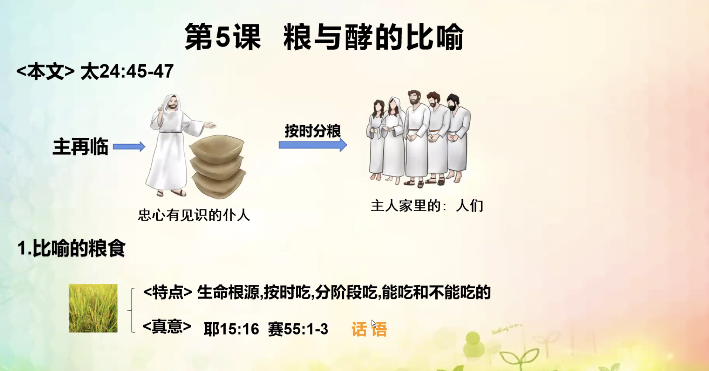
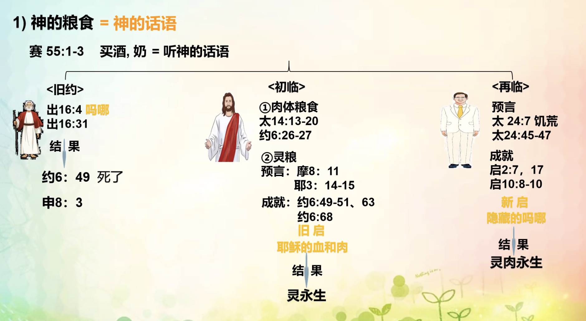
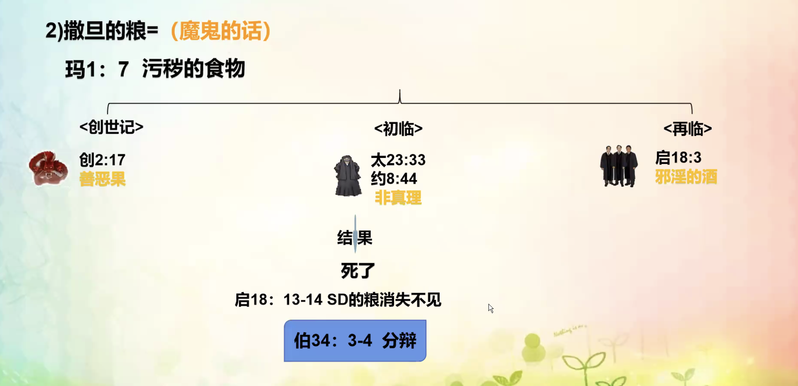
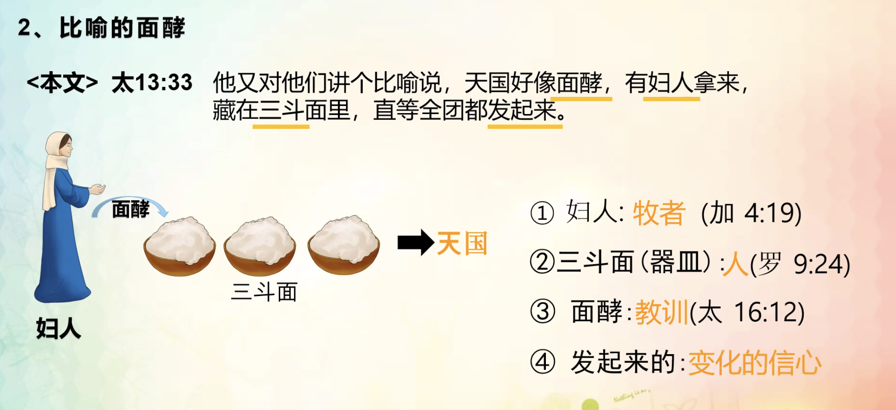
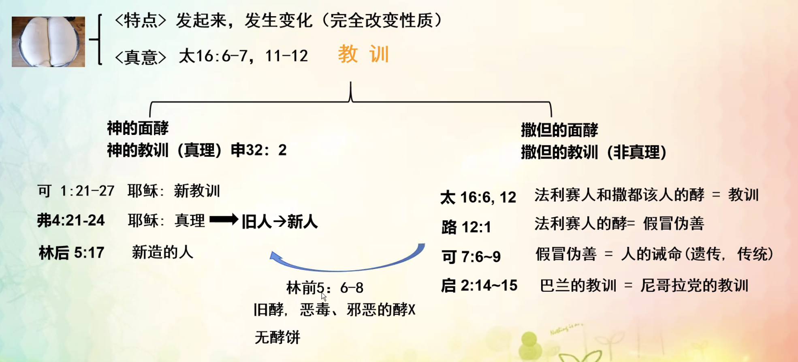

% 10-31：糧與酵的比喻

{ width=500px }

__耶利米書 15:16__

> 耶和華萬軍之　神啊， 我得着你的言語就當食物吃了；你的言語是我心中的歡喜快樂，因我是稱爲你名下的人。

__以賽亞書 55:1-3__

> “你們一切幹渴的都當就近水來； 沒有銀錢的也可以來。你們都來，買了吃；不用銀錢，不用價值，也來買酒和奶。
>
> 你們爲何花錢（原文作“平銀”）買那不足爲食物的？ 用勞碌得來的買那不使人飽足的呢？你們要留意聽我的話就能吃那美物，得享肥甘，心中喜樂。
>
> 你們當就近我來； 側耳而聽，就必得活。我必與你們立永約，就是應許大衛那可靠的恩典。

{ width=500px }

#### 舊約

__出埃及記 16:4__

> 耶和華對摩西說：“我要将糧食從天降給你們。百姓可以出去，每天收每天的份，我好試驗他們遵不遵我的法度。

__出埃及記 16:31__

> 這食物，以色列家叫嗎哪；樣子像芫荽子（yan sui zi），顔色是白的，滋味如同攙蜜的薄餅。

#### 初臨

- <b><u>肉體糧食</u></b>

__馬太福音 14:13__ 耶稣給五千人吃飽

__約翰福音 6:26-27__

> 耶稣回答說：“我實實在在地告訴你們，你們找我，并不是因見了神迹，乃是因吃餅得飽。
>
> 不要爲那必壞的食物勞力，要爲那存到永生的食物勞力，就是人子要賜給你們的，因爲人子是父　神所印證的。”

#### 再臨

{ width=500px }

{ width=500px }

{ width=500px }

__申命記 32:2__

> 我的教訓要淋漓如雨； 我的言語要滴落如露，如細雨降在嫩草上，如甘霖降在菜蔬中。

__哥林多後書 5:17__

> 若有人在基督裏，他就是新造的人，舊事已過，都變成新的了。

{ width=500px }

__第五课习题__

1. 粮食的真意是（神的道）。有（两）种，分别是（神的粮食）和（撒旦的粮食）。
2. 面酵的真意是（教训）。有（两）种，分别是（神）的教训和（撒旦）的教训。
3. 若要找到神的粮食，旧约时要找到（摩西），初临时要找到（耶稣），在临时要找到（得胜者）。
4. 旧约时所吃的神的粮是什么（吗哪）？初临时所吃的神的粮是什么（肉体粮食和灵粮）？再临时所吃的神的粮是什么（隐藏的吗哪，预言和成就）？
5. 今天的我要想得到生命，要以怎样的姿态吃怎样的粮？多选（A, B）
    - A. 要带着感恩的心，谦卑的心吃新约启示的话语
    - B. 要带着敬畏的心，渴慕的心吃再临启示的话语
    - C. 要带着感恩的心吃旧约的吗哪
