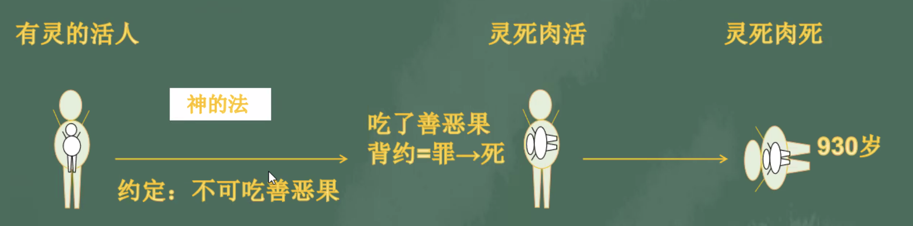

% 10-7：我是怎樣的存在

__現今世人的狀态是怎樣的？神爲什麽會經曆生老病死？神希望我們怎麽活着？__

### 死亡從哪裏來

__詩篇 90:10__

> 我們一生的年日是七十歲， 若是強壯可到八十歲；但其中所矜誇的不過是勞苦愁煩，轉眼成空，我們便如飛而去。

→ 七八十歲的人生，勞苦愁煩？

起初神造之人的變化

__創世記 2:7__

> 耶和華　神用地上的塵土造人，将生氣吹在他鼻孔裏，他就成了有靈的活人，名叫亞當。

__創世記 2:15-17__

> 耶和華　神将那人安置在伊甸園，使他修理，看守。
>
> 耶和華　神吩咐他說：“園中各樣樹上的果子，你可以随意吃，
>
> 隻是分别善惡樹上的果子，你不可吃，因爲你吃的日子必定死！”

__創世記 3:6__

> 于是女人見那棵樹的果子好作食物，也悅人的眼目，且是可喜愛的，能使人有智慧，就摘下果子來吃了，又給她丈夫，她丈夫也吃了。

__雅各書 1:15__

> 私欲既懷了胎，就生出罪來；罪既長成，就生出死來。

__羅馬書 6:23__

> 因爲罪的工價乃是死；惟有　神的恩賜，在我們的主基督耶稣裏，乃是永生。

### 罪的種類

1️⃣ 原罪

__羅馬書 5:12__

> 這就如罪是從一人入了世界，死又是從罪來的，于是死就臨到衆人，因爲衆人都犯了罪。

2️⃣ 遺傳罪

__詩篇 51:5__

> 我是在罪孽裏生的， 在我母親懷胎的時候就有了罪。

3️⃣ 自犯罪

__約翰一書 1:8-10__

> 我們若說自己無罪，便是自欺，真理不在我們心裏了。
>
> 我們若認自己的罪，　神是信實的，是公義的，必要赦免我們的罪，洗淨我們一切的不義。
>
> 我們若說自己沒有犯過罪，便是以　神爲說謊的，他的道也不在我們心裏了。

### 末後神造之人的變化

__啓示錄 21:3__

> 我聽見有大聲音從寶座出來說：“看哪，　神的帳幕在人間。他要與人同住，他們要作他的子民。　神要親自與他們同在，作他們的　神。

→ 神與人同住，神是聖潔的，需解決人的罪
