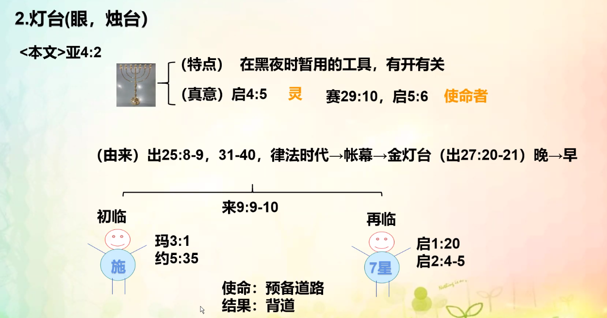

% 11-11：光，燈台和瞎子，聾子，禮服的比喻

### 光和黑暗

- 光
    - 特點：亮、生命的起源，照亮黑暗，使人看見
    - 真意：生命之道，話語
        - 約 1:1-4
        - 詩 119:130
- 黑暗
    - 特點：沒有生命，暗，沒有光的狀态，看不見
    - 真意：
        - 約 1:5

{ width=500px }

__测试题__

1. __光和暗的比喻真意。__

光的真意是生命之道、话语；黑暗指的是缺少真理的话语。

2. __光的使命是什么？黑暗不接受光的理由是什么？初临、再临光和黑暗的实体。__

使命是照亮黑暗；黑暗是邪恶的且惧怕光。

| 时代 | 光     | 黑暗   |
|------|--------|--------|
| 初临 | 耶稣   | 文法人 |
| 再临 | 得胜者 | 假牧师 |

3. __今天我想成为光明之子，应该怎么做？__（A,B,C）
    - A. 领受光的种子
    - B. 去照亮黑暗
    - C. 找到光的牧者

### 燈台

{ width=500px }

__撒迦利亞書 4:2__

> 他問我說：“你看見了什麽？”我說：“我看見了一個純金的燈台，頂上有燈盞，燈台上有七盞燈，每盞有七個管子。

__啓示錄 4:5__

> 有閃電、聲音、雷轟從寶座中發出；又有七盞火燈在寶座前點着；這七燈就是　神的七靈。

💡燈 → 靈

__以賽亞書 29:10__

> 因爲耶和華将沉睡的靈澆灌你們， 封閉你們的眼，蒙蓋你們的頭。你們的眼就是先知；你們的頭就是先見。

__啓示錄 5:6__

> 我又看見寶座與四活物，并長老之中有羔羊站立，像是被殺過的，有七角七眼，就是　神的七靈，奉差遣往普天下去的。

__出埃及記 25:8-9__

> 又當爲我造聖所，使我可以住在他們中間。
>
> 制造帳幕和其中的一切器具都要照我所指示你的樣式。”

{ width=500px }

__测试题__

1. 请写出比喻的灯台是什么？
2. 初临时、再临时灯台的实体是谁？
3. 灯台的实体是谁？为了不让我这盏灯熄灭，我该怎么做？

### 瞎子、聋子

{ width=500px }

__啓示錄 3:17-18__

> 你說：我是富足，已經發了财，一樣都不缺；卻不知道你是那困苦、可憐、貧窮、瞎眼、赤身的。
>
> 我勸你向我買火煉的金子，叫你富足；又買白衣穿上，叫你赤身的羞恥不露出來；又買眼藥擦你的眼睛，使你能看見。

### 礼服

{ width=500px }

1. __请写出瞎子、聋子、礼服的真意是什么？__

瞎子、聋子指不领受话语的人，礼服指教理和义的行为。

2. __瞎子、聋子初临时和再临时的实体分别是谁？不想成为瞎子和聋子该如何去做？现今信仰世界的信徒都是什么状态，神希望我们怎么做？__

文法人和假牧师；找到得胜者，领受真理的话语；信仰界充满高傲、不愿意领受真理话语的人，神希望我们可以与话语相伴，并且能够行出义的行为。

3. __礼服的种类有几种？分别是什么？如今我的礼服上还有哪些需要洁净的地方，该如何做？__

两种；神的礼服和撒旦的礼服；需要洁净的地方包含自私、缺乏奉献精神、遇到试炼下意识地转化为小信的缺点，需要每天用话语来洗净。
