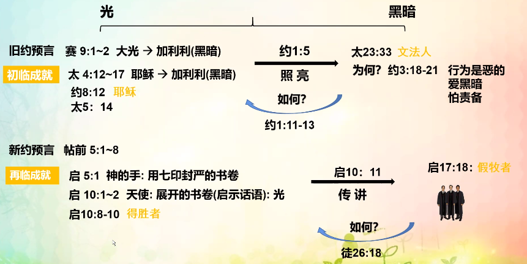

% 11-11：光，燈台和瞎子，聾子，禮服的比喻

### 光和黑暗

- 光
    - 特點：亮、生命的起源，照亮黑暗，使人看見
    - 真意：生命之道，話語
        - 約 1:1-4
        - 詩 119:130
- 黑暗
    - 特點：沒有生命，暗，沒有光的狀态，看不見
    - 真意：
        - 約 1:5

{ width=500px }

### 燈台

{ width=500px }

__撒迦利亞書 4:2__

> 他問我說：“你看見了什麽？”我說：“我看見了一個純金的燈台，頂上有燈盞，燈台上有七盞燈，每盞有七個管子。

__啓示錄 4:5__

> 有閃電、聲音、雷轟從寶座中發出；又有七盞火燈在寶座前點着；這七燈就是　神的七靈。

💡燈 → 靈

__以賽亞書 29:10__

> 因爲耶和華将沉睡的靈澆灌你們， 封閉你們的眼，蒙蓋你們的頭。你們的眼就是先知；你們的頭就是先見。

__啓示錄 5:6__

> 我又看見寶座與四活物，并長老之中有羔羊站立，像是被殺過的，有七角七眼，就是　神的七靈，奉差遣往普天下去的。

__出埃及記 25:8-9__

> 又當爲我造聖所，使我可以住在他們中間。
>
> 制造帳幕和其中的一切器具都要照我所指示你的樣式。”

### 瞎子、聋子

__啓示錄 3:17-18__ 主要经文

> 你說：我是富足，已經發了财，一樣都不缺；卻不知道你是那困苦、可憐、貧窮、瞎眼、赤身的。
>
> 我勸你向我買火煉的金子，叫你富足；又買白衣穿上，叫你赤身的羞恥不露出來；又買眼藥擦你的眼睛，使你能看見。

- 特点：看不见、听不见
- 真意：不领悟话语的人
    - 赛 29:9-13
    - 赛 42:18-20
- 初临实体
    - 太 23:16,24 文士法利赛人：成为瞎子的引导者
    - 太 15:14 瞎子领瞎子 → 坑里
    - 约 9:39-41 承认 → 从黑暗中出来、就光
- 再临实体
    - 太 13:10-11 耶稣用比喻讲话
    - 太 13:13-17 不明白天国奥秘比喻
    - 启 3:17-18

### 礼服

- 为了守礼节穿的衣服，洗净再穿
- 真意：
    - 启 22:1,14 心和行为
    - 启 19:13 17:4 教理
    - 礼服 19:8 义的行为
- 由来：出 28:2-5 律法时代祭祀服 → 来 9:9-10
    - 神的真理
        - 太 22:1-14
        - 启 3:4-5 得胜
        - 启 22:14 洗净
    - 撒旦的非真理
