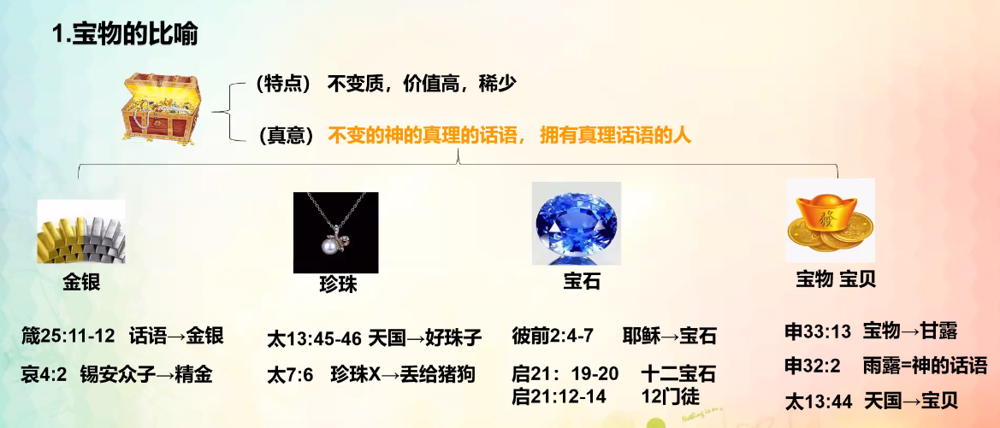
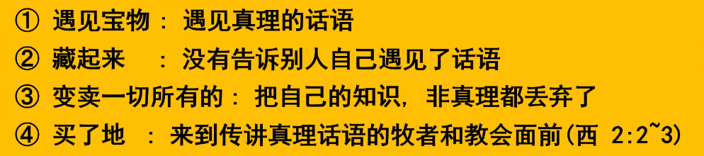
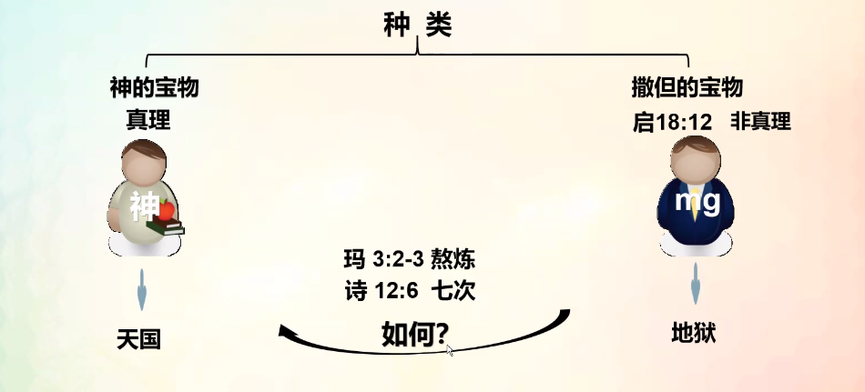
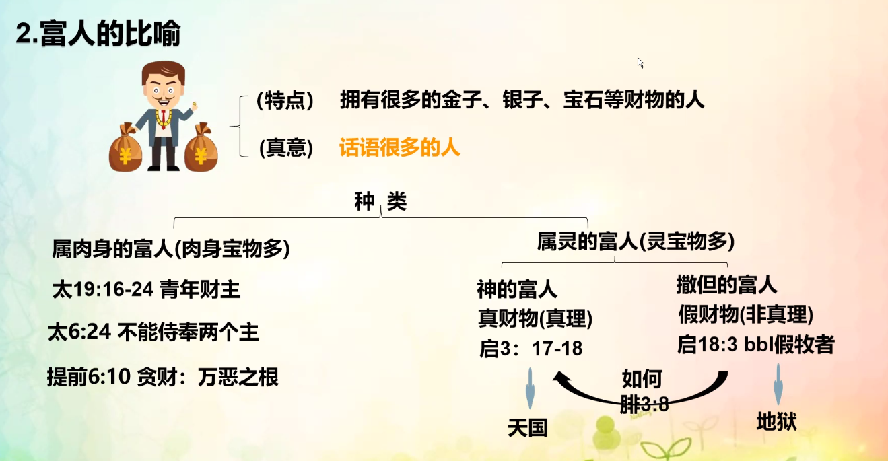

% 11-15：寶物、富人的比喻

### 寶物的比喻

__啓示錄 3:17-18__

> 你說：我是富足，已經發了财，一樣都不缺；卻不知道你是那困苦、可憐、貧窮、瞎眼、赤身的。
>
> 我勸你向我買火煉的金子，叫你富足；又買白衣穿上，叫你赤身的羞恥不露出來；又買眼藥擦你的眼睛，使你能看見。

{ width=500px }

{ width=500px }

{ width=500px }

__詩篇 12:6__

> 耶和華的言語是純淨的言語， 如同銀子在泥爐中煉過七次。

1. __请写出宝物的真意是什么？__

不变的神的真理的话语，拥有真理话语的人。

2. __宝物的种类有几种？初临和再临宝物的实体分别是？__

四种：金银（话语）、珍珠（天国）、宝石（耶稣、12门徒）、宝物（甘露、神的话语、天国）；分别是耶稣、12门徒和得胜者。

3. __需要丢掉的撒旦的宝物有哪些？如何才能成为神的宝物？拥有神的宝物怎样做最有价值？__ 

对于世俗成功的过分渴求；所行之事符合神的旨意才能成为神的宝物；要将真理的话语传给饥渴慕义之人。

### 富人的比喻

{ width=500px }

1. __比喻的富人真意是什么？__

话语很多的人

2. __富人的种类有几种？属神的富人是谁？属撒旦的富人是谁？__

有两种：肉身的富人和属灵的富人；属神的富人是拥有真理话语的人；属撒旦的富人是拥有非真理话语的人。

3. __我要成为怎样的富人？真正的财富是什么？__

要成为灵里的富人；真正的财富是拥有神的真理话语、天国永生。
