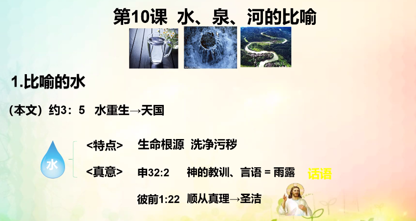
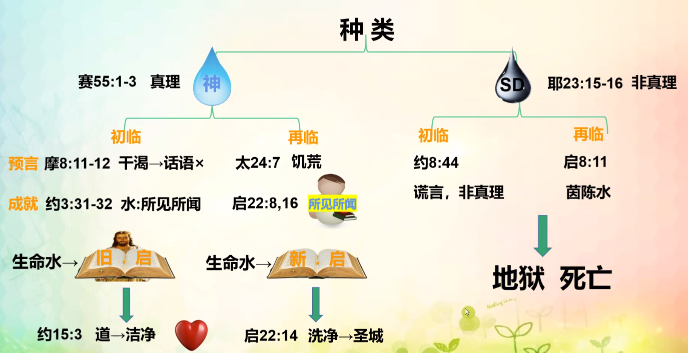
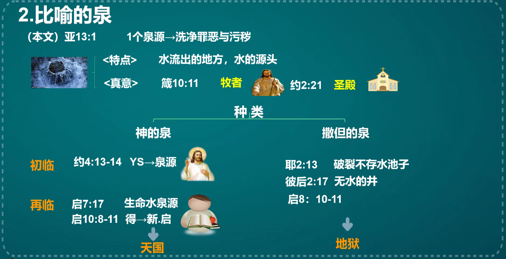
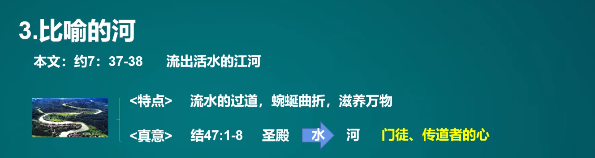
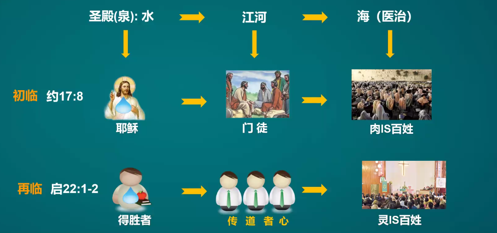
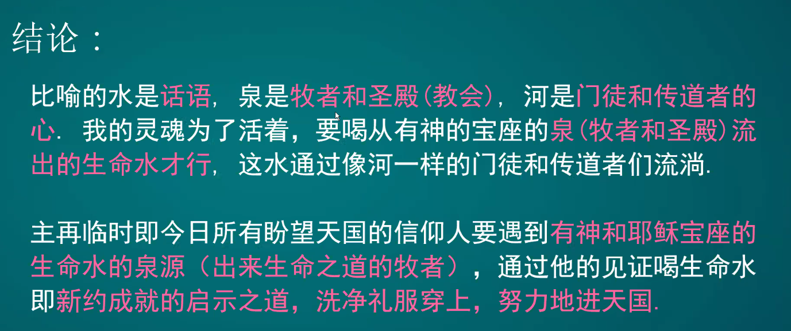

% 11-19：水、泉、河的比喻

### 比喻的水

{ width=500px }

{ width=500px }

__阿摩司書 8:11-12__

> 主耶和華說：“日子将到， 我必命饑荒降在地上。人饑餓非因無餅，幹渴非因無水，乃因不聽耶和華的話。
>
> 他們必飄流，從這海到那海， 從北邊到東邊，往來奔跑，尋求耶和華的話，卻尋不着。

__約翰福音 3:31-32__

> “從天上來的是在萬有之上；從地上來的是屬乎地，他所說的也是屬乎地。從天上來的是在萬有之上。
>
> 他将所見所聞的見證出來，隻是沒有人領受他的見證。

__测试题__

1. __请写出比喻的水的真意是什么？__

洗净污秽的话语。

2. __水的种类有几种？初临时神的水是什么、拥有神水的人是谁？再临时神的水是什么、拥有神水的人是谁？__

有两种：神的水和撒旦的水。成就旧约启示的话语，耶稣；成就新约启示录的话语，得胜者。

### 比喻的泉

{ width=500px }

### 比喻的河

{ width=500px }

{ width=500px }

{ width=500px }

__测试题__

1. __比喻的泉、河的真意是什么？__ 泉是牧者和圣殿，河是门徒和传道者的心。
2. __泉的种类有几种？初临和再临的实体分别是谁？每个时代的泉有几个？现在我跟随的是谁的泉，为什么？__ 两种：神的泉和撒旦的泉。初临时泉水是耶稣，再临时泉水是得胜者。现在我跟随的是神的泉，因预言成就在了我自己身上。
3. __我们想要成为江河的实体应该怎么做？__ （A, B）
    - A. 上课好好印刻神的话语。
    - B. 向江河一样智慧传道，使海水变甜。
    - C. 自己领受，自己和家人得救就好。
