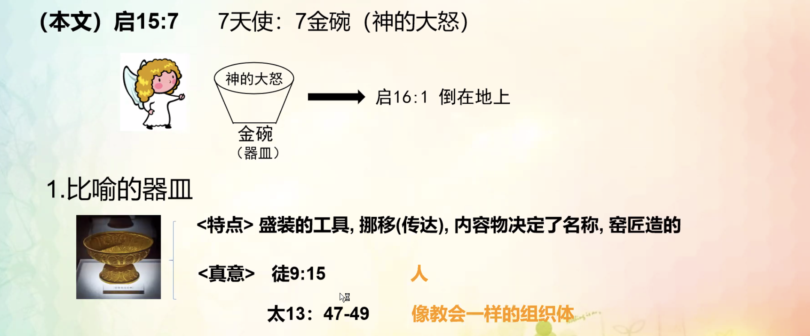
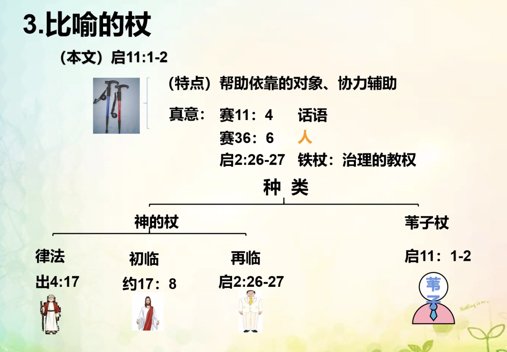

% 11-4：器皿、天平、杖的比喻

### 器皿

{ width=500px }

__使徒行傳 9:15__

> 主對亞拿尼亞說：“你隻管去！他是我所揀選的器皿，要在外邦人和君王，并以色列人面前宣揚我的名。

__馬太福音 13:47-49__

> “天國又好像網撒在海裏，聚攏各樣水族，
>
> 網既滿了，人就拉上岸來，坐下，揀好的收在器具裏，将不好的丢棄了。
>
> 世界的末了也要這樣。天使要出來，從義人中把惡人分别出來，

{ width=500px }

__路加福音 5:37-39 倒空器皿__

> 也沒有人把新酒裝在舊皮袋裏；若是這樣，新酒必将皮袋裂開，酒便漏出來，皮袋也就壞了。
>
> 但新酒必須裝在新皮袋裏。
>
> 沒有人喝了陳酒又想喝新的；他總說陳的好。”

__提摩太後書 2:21 脫離内心污穢__

> 人若自潔，脫離卑賤的事，就必作貴重的器皿，成爲聖潔，合乎主用，預備行各樣的善事。

__約翰福音 15:3 用道洗淨__

> 現在你們因我講給你們的道，已經幹淨了。

### 天平

{ width=500px }

__箴言 24:12__

> 你若說：“這事我未曾知道”， 那衡量人心的豈不明白嗎？保守你命的豈不知道嗎？他豈不按各人所行的報應各人嗎？

__撒母耳記上 2:3__

> 人不要誇口說驕傲的話， 也不要出狂妄的言語；因耶和華是大有智識的　神，人的行爲被他衡量。

__利未記 19:36__

> 要用公道天平、公道法碼、公道升鬥、公道秤。我是耶和華你們的　神，曾把你們從埃及地領出來的。

### 杖

{ width=500px }

__以赛亚书 11:4__

> 却要以公义审判贫穷人， 以正直判断世上的谦卑人，以口中的杖击打世界，以嘴里的气杀戮恶人。

__启示录 2:26-27__

> 那得胜又遵守我命令到底的，我要赐给他权柄制伏列国；
>
> 他必用铁杖辖管（“辖管”原文作“牧”）他们，将他们如同窑户的瓦器打得粉碎，像我从我父领受的权柄一样。

__启示录 11:1-2__

> 有一根苇子赐给我，当作量度的杖；且有话说：“起来！将　神的殿和祭坛，并在殿中礼拜的人都量一量。
>
> 只是殿外的院子要留下不用量，因为这是给了外邦人的；他们要践踏圣城四十二个月。
