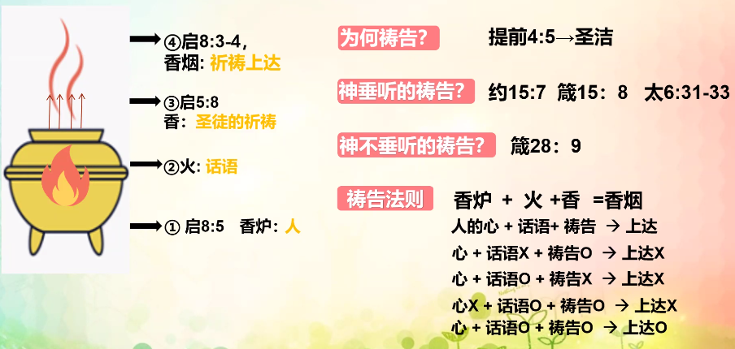

% 11-6：第七課：火、香爐、鍋的比喻

### 比喻的火

__路加福音 12:49__

> “我來要把火丢在地上，倘若已經着起來，不也是我所願意的嗎？

特點：熱、消滅、消毒、具有兩面性

種類：賽 6:6-7、耶 5:14

{ width=500px }

__瑪拉基書 4:1-2__

> 萬軍之耶和華說：“那日臨近，勢如燒着的火爐，凡狂傲的和行惡的必如碎稭，在那日必被燒盡，根本枝條一無存留。
>
> 但向你們敬畏我名的人必有公義的日頭出現，其光線（原文作“翅膀”）有醫治之能。你們必出來跳躍如圈裏的肥犢。

__馬太福音 3:11-12__ 從田裏收割的包含麥子和糠秕

糠秕是空心的，收割進倉裏，一揚就被抛棄了。

> 我是用水給你們施洗，叫你們悔改。但那在我以後來的，能力比我更大，我就是給他提鞋也不配。他要用聖靈與火給你們施洗。
>
> 他手裏拿着簸箕，要揚淨他的場，把麥子收在倉裏，把糠用不滅的火燒盡了。”

__利未記 10:1-2__

> 亞倫的兒子拿答、亞比戶各拿自己的香爐，盛上火，加上香，在耶和華面前獻上凡火，是耶和華沒有吩咐他們的，
>
> 就有火從耶和華面前出來，把他們燒滅，他們就死在耶和華面前。

1. 比喻的火的真意是（），有（）種，分别是：（）、（）。神的火作用：（）、撒旦的火作用：（）。
2. 再臨時，領受神的火的人會區分出幾種信仰人？分别是怎樣的存在？各自的結局是什麽？
3. 神的火對我有什麽作用，接受了上帝的話語會怎麽樣？自身還有哪些問題，是需要用神的話語除去的？領受真理之火的我該怎麽做？

總結：晝夜思想神話語的人，便有福（詩 1:1-2）。因此我們要像呼吸一樣思念着神的話語。

### 比喻的香爐

{ width=500px }

__啓示錄 8:3-5__

> 另有一位天使，拿着金香爐來，站在祭壇旁邊。有許多香賜給他，要和衆聖徒的祈禱一同獻在寶座前的金壇上。
>
> 那香的煙和衆聖徒的祈禱從天使的手中一同升到　神面前。
>
> 天使拿着香爐，盛滿了壇上的火，倒在地上；随有雷轟、大聲、閃電、地震。

{ width=500px }

### 比喻的锅

{ width=500px }
