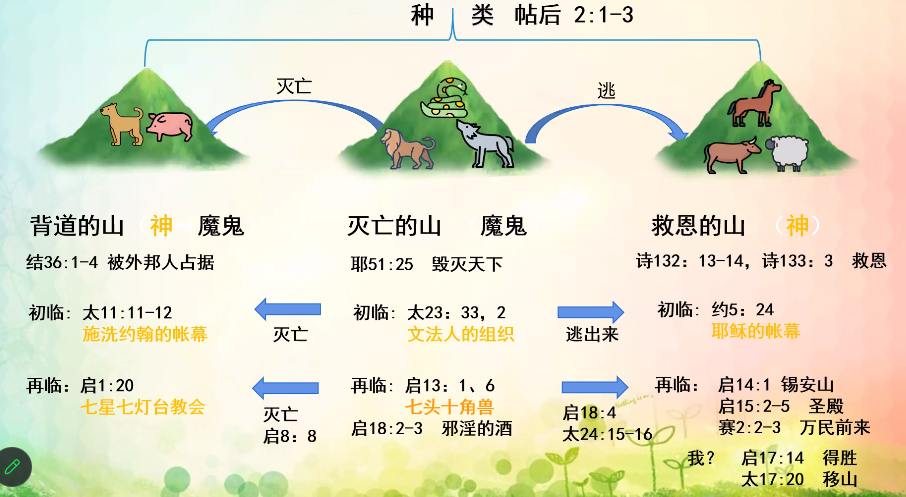

% 12-06：第十五课：山、石头、偶像的比喻

核心经文：但以理书 2:31-44

### 山

__马太福音 24:15-16__

> “你们看见先知但以理所说的‘那行毁坏可憎的’站在圣地（读这经的人须要会意）。
>
> 那时，在犹太的，应当逃到山上；

- 特点：动物、植物丰富
- 真意：教会、圣殿

{ width=500px }

### 石头

主要经文：启 2:17

- 特点：坚硬，建筑，砸碎东西
- 真意：
    - 审判的话语
    - 领受审判权的牧者
- 种类：
    - 神的石头
        - 旧约
            - 出 31:18 二块石板
            - 出 32:15-16 两面写字
            - 来 9:9-10
        - 初临
            - 赛 28:16 锡安石头
            - 彼前 2:4-8
            - 石头 = 耶稣 = 牧者
            - 约 5:22 审判权
        - 再临
            - 启 2:17 白石 → 得胜者
            - 启 10 接吃书卷
            - 启 20:12-15
    - 撒旦的石头
        - 申 32:31
        - 启 18:21

### 偶像

主要经文：启 13:15 兽像 → 生气

- 特点：人制造的，金银石木雕刻，像神一样被供奉
- 真意：假牧者
    - 哈 2:18
- 实体
    - 旧约
        - 出 20:4-6 不可造/拜偶像
        - 申 27:15 造偶像 → 咒诅
        - 耶 10:14-15 偶像 → 迷惑人
    - 初临
        - 太 23:33 文法人 = 假牧者
        - 太 23:13 关天国门，不让进去
    - 再临
        - 启 9:20-21 拜魔鬼 + 偶像
- 结果
    - 但 2:31-35 审判

### 祭物

主要经文：林前 10:19-21

- 特点：祭拜偶像的食物
- 真意：知识，教理，教训
- 初临
    - 太 15:17-18 入口的不污秽人，出口的污秽人
    - 太 16:6 文法人的酵
- 再临
    - 启 2:14-15 巴兰教训
- 结果
    - 启 14:9-11 硫磺火湖永远痛苦
- 如何做
    - 启 15:2 得胜者和兽像
    - 启 14:12 忍耐
