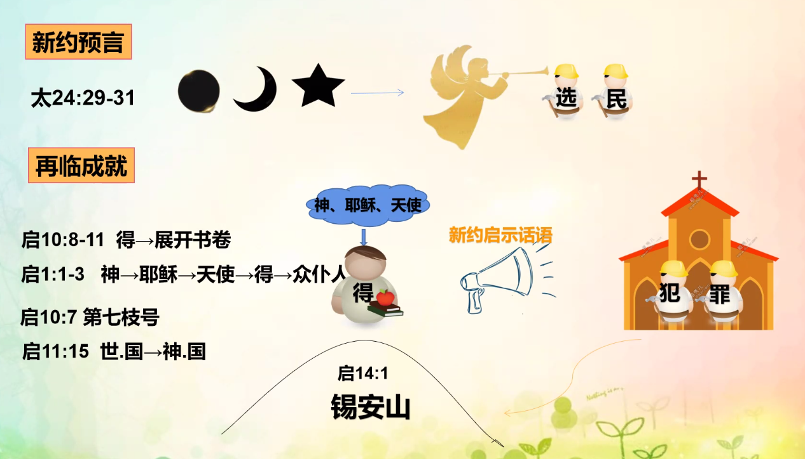

% 12-10：第十六课：印、号、歌的比喻

### 印记

<本文经文> 启 7:2-3

- 特点：表示对某件事认可，表明物品所属
- 真意
    - 约 1:1 神的话语
    - 约 3:31-33
        - 印印 见证话语
        - 受印 领受话语，认证并刻印在心版之上
- 种类
    - 神
        - 初临
            - 约 6:27 JS → 神印证
            - 约 15:1 神栽培耶稣
            - 约 17:8-9
            - 约 3:31-34 受印 → 神的所属
        - 再临
            - 启 10:1-2,8-10 天使 → 约翰
            - 启 22:8 约翰 → 所见所闻
            - 启 10:11
            - 启 22:16
            - 启 14:1,7:2-4 锡安山 144,000
    - 撒旦
        - 启 13:16-18 受666 兽印
            - 手上：举手认证假教理
            - 额上：被按手
            - 受撒旦印：认证假牧者及其非真理
        - 启 14:9-11
            - 永永远远在硫磺火湖中

### 号

<本文经文> 太 24:29-31

- 特点：召聚、传达旨意、信号、响亮、用嘴吹（工具）
- 真意
    - 号：人
    - 吹号：灵
    - 号声：告知的话语即晓谕发生之事件的声音
- 背景
    - 民 10:1-10
        - ① 银号
        - ② 统帅军队
        - ③ 征战
        - ④ 庆祝
    - 书 6:1-21
        - 吹号攻破耶利哥

{ width=500px }

{ width=500px }

### 歌

__启示录 15:3__ 本文经文：摩西的歌 + 羔羊的歌

> 唱　神仆人摩西的歌和羔羊的歌，说： “主　神，全能者啊，你的作为大哉！奇哉！万世（或作“国”）之王啊，你的道途义哉！诚哉！

- 特点：歌谱、歌曲、曲
- 真意
    - 诗 119:54 律例 → 歌
        - 歌：证道的话语
    - 申 31:30 歌 → 话
        - 新歌：预言成就的实状福音
- 分类
    - 神的歌
        - 启 15:3
            - 摩西的歌：旧约圣经的话语
            - 羔羊的歌：新约圣经的话语
        - 启 14:3 新歌
        - 启 14:6 永远
    - 魔鬼的歌
        - 启 18:22
