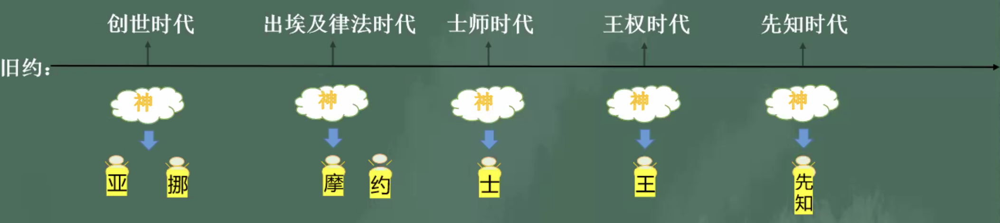

% 9-26：時代區分

### 時代劃分

__路加福音 12:54-56 分辨時候__

> 耶稣又對衆人說：“你們看見西邊起了雲彩，就說：‘要下一陣雨’；果然就有。
>
> 起了南風，就說：‘将要燥熱’；也就有了。
>
> 假冒爲善的人哪，你們知道分辨天地的氣色，怎麽不知道分辨這時候呢？”

- 舊約時代
    - 創世時代
    - 出埃及律法時代
    - 士師時代
    - 王權時代
    - 先知時代
- 新約時代
    - 耶稣初臨時代：天國福音時代
    - 耶稣再臨時代：再創造啓示時代

---

### 創世時代

__創世記 2:15-17__

> 耶和華　神将那人安置在伊甸園，使他修理，看守。
>
> 耶和華　神吩咐他說：“園中各樣樹上的果子，你可以随意吃，
>
> 隻是分别善惡樹上的果子，你不可吃，因爲你吃的日子必定死！”

→ 神和亞當立法，善惡樹上的果子不可吃

__創世記 3:6__

> 于是女人見那棵樹的果子好作食物，也悅人的眼目，且是可喜愛的，能使人有智慧，就摘下果子來吃了，又給她丈夫，她丈夫也吃了。

→ 亞當沒有守住與神的法，吃了善惡果

創世紀 6:9

創世紀 7-8 洪水審判

創世紀 9 神與諾亞立約

創世紀 9:18-27 諾亞的兒子犯罪

創世紀 11 迦南後代們造巴别塔

→ 迦南後代們造巴别塔

---

### 出埃及律法時代

__創世記 15:13-15__

> 耶和華對亞伯蘭說：“你要的确知道，你的後裔必寄居别人的地，又服侍那地的人；那地的人要苦待他們四百年。
>
> 并且他們所要服侍的那國，我要懲罰，後來他們必帶着許多财物從那裏出來。
>
> 但你要享大壽數，平平安安地歸到你列祖那裏，被人埋葬。

__出埃及記 12:40-41__

> 以色列人住在埃及共有四百三十年。
>
> 正滿了四百三十年的那一天，耶和華的軍隊都從埃及地出來了。

→ 神與亞伯拉罕立約（預言）→ 摩西來成就

__出埃及記 19:5-6__

> 如今你們若實在聽從我的話，遵守我的約，就要在萬民中作屬我的子民，因爲全地都是我的。
>
> 你們要歸我作祭司的國度，爲聖潔的國民。’這些話你要告訴以色列人。”

__出埃及記 20__ 十誡

→ 神通過摩西和以色列人立約

__出埃及記 32__ 百姓拜金牛犢

→ 亞倫在山下與百姓造了金牛犢拜了偶像 → 受審判

---

### 士師時代

__士師記 2:7__

> 約書亞在世和約書亞死後，那些見耶和華爲以色列人所行大事的長老還在的時候，百姓都侍奉耶和華。

__士師記 2:10-12__

> 那世代的人也都歸了自己的列祖。後來有别的世代興起，不知道耶和華，也不知道耶和華爲以色列人所行的事。
>
> 以色列人行耶和華眼中看爲惡的事，去侍奉諸巴力，
>
> 離棄了領他們出埃及地的耶和華他們列祖的　神，去叩拜别神，就是四圍列國的神，惹耶和華發怒；

__士師記 2:14__

> 耶和華的怒氣向以色列人發作，就把他們交在搶奪他們的人手中，又将他們付與四圍仇敵的手中，甚至他們在仇敵面前再不能站立得住。

__士師記 2:18__

> 耶和華爲他們興起士師，就與那士師同在。士師在世的一切日子，耶和華拯救他們脫離仇敵的手。他們因受欺壓擾害，就哀聲歎氣，所以耶和華後悔了。

→ 以色列百姓适逢别神，受外邦攻擊 → 神與士師同在施行拯救

---

### 王權時代

__撒母耳記上 7:15__

> 撒母耳平生作以色列的士師。

__撒母耳記上 8:1__

> 撒母耳年紀老邁，就立他兒子作以色列的士師。

__撒母耳記上 8:4-6__ 以色列百姓要求立王

> 以色列的長老都聚集，來到拉瑪見撒母耳，
>
> 對他說：“你年紀老邁了，你兒子不行你的道。現在求你爲我們立一個王治理我們，像列國一樣。”
>
> 撒母耳不喜悅他們說“立一個王治理我們”，他就禱告耶和華。

- __掃羅__
    - 撒上 15 掃羅違背耶和華的命令
- __大衛__
    - 撒下 11-12 大衛犯錯和悔改
- __所羅門__
    - 王上 11 所羅門離棄神
    - 王上 11:4 所羅門年老的時候，他的妃嫔誘惑他的心去随從别神，不效法他父親大衛誠誠實實地順服耶和華他的　神。

→ 所羅門時因侍奉外邦神犯罪，南猶大被巴比倫所滅，北以色列被亞述所滅。沒有神國之後，神通過先知說預言，進入先知時代。

---

### 先知時代

__以賽亞書 14:24__
通過先知預言了要差遣救恩者彌賽亞

> 萬軍之耶和華起誓說： “我怎樣思想，必照樣成就；我怎樣定意，必照樣成立，

耶利米、但以理
