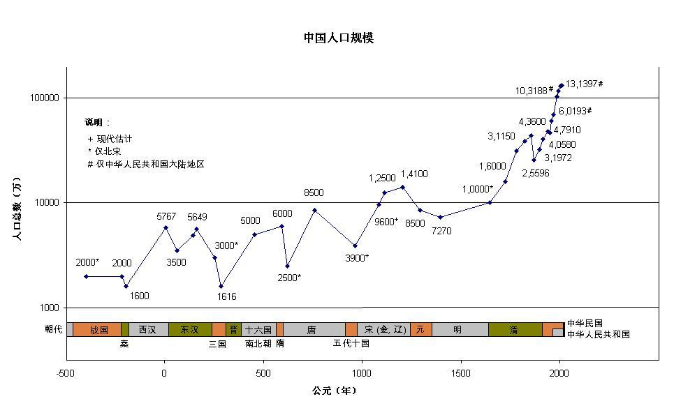

% 阶级

文明社会创造出来的资源越多，就能够允许更多下层阶级的人活着。文明是少数创造者创造出来的，允许很多飞创造者以下等人身份存在。

少数精英的创造除了养活他们自己以外，作为一个附属品，使得大多数没有创造能力的人还能够存在，而且还能以某种安抚他们自尊心的方式继续存在。

如果社会的演化机制破坏了少数创造者的创造机制，这样社会就会崩坏，回到蛮荒的状态之中，创造力差的人生存空间也就更小。所以文明有其内在的不稳定性，它不是天然地不断向前发展的。

### 祖父学

你的命运受自己努力的影响很小，受你祖父一辈的选择极大；同样的，你现在的决定就是你子孙未来的命运，当然，如果你是无产阶级出身，你的本能便是吃子孙饭。

你现在的处境大多数都是你的家系过去的选择所造成的结果，所以不是你本人的责任；
__但个人唯一能改变未来的途径就是勇敢的抉择，你对自己的选择付有不可推卸的责任。__

历史不存在随机性，历史是混沌系统，即使表面随机，事后看来都有其草蛇灰线的必然性。历史的势能，就像路径积分，当事人其实并没有那么多选择的空间，祖父决定你的选择，你的选择决定孙辈的选择。

你现在是什么样的人，你的后代就会朝那个方向发展，并超出你的意料，他们的成就离不开你今天的微小举动和所信仰的信念。

### 中产阶级

__中产阶级的概念是二战之后社会学建构出来的几个概念，__
它以为民主自由是由中产阶级支撑，而中产阶级的界定标准是其收入和教育程度，
它本质上是不正确的，其不符合历史发展的逻辑。

战后增加了两类人，一类是政府雇员，另一类是大公司的职员。
这两种人按收入来讲，比起原先构成中产阶级的那些人来说可能还要更多一些，因此也被社会学家放在中产阶级里面了，但是他们的独立性却更弱。所以他们的出现实际上是削弱了民主，而不是加强了民主。

但是社会学家和现在的中产阶级往往是把这种人作为羡慕的对象，因为他们的就业有保障，收入更高。虽然他们的独立性反而比以前的杂货店老板更弱了，但他们比以前的杂货店老板更有钱，所以就会受到更多的羡慕。但是实际上，二十世纪，特别是二战以后的西方，是西方长期自由传统的堕落，而不是发展。

其中的一个必然产物就是，这样的连接无法继续，因为这样的连接本身就是总体战的产物。总体战以前的国家不需要这样庞大的政权机关。如果没有苏联的话，FBI和中央情报局都不会存在，这么多雇员根本没有存在的必要。只是撒切尔夫人、道格拉斯寡妇和牧师这些民间人士组织的志愿者团体显然是对付不了克格勃间谍的，所以你非得养一帮专业人员不可。所以它是在被动的情况下不得不以比苏联小得多的方式扩大了政府官员的数目，同时也产生了官方赡养的比如说火箭研究专家、为国防服务的这些冷战科学家团体。这些科学家团体获得了很高的收入，受人羡慕，但是他们完全不符合自由秩序的要求。以前的科学家团体，像皇家学会，他们就跟牛津大学一样，跟皇家根本没有关系。所谓“皇家”，只不过是问国王要了一个特许状而已，是自己一拨人自己组织起来的自治团体，这样的团体才是有利于自由的。而国防部发工资、宇航局发工资养着的这一批留平头的数学家，他们像所有的公务员一样，对自由秩序是不利的。当然，在冷战结束以后，他们的前途跟苏联的国防工厂的人员一样，社会地位、收入和就业前景极大地削弱了。

__大众民主制是无产阶级的一次重大胜利__，它严重地削弱了贵族和中产阶级的势力，用遗产税和通货膨胀，使得你必须依靠跟通货膨胀不断同步增长的工资，而不能依靠随着通货膨胀而消失的遗产和嫁妆。
它是一种缓慢温和的打土豪分田地，尽管宣传家把东方和西方说得完全不同，但是西方对于资产阶级的剥夺是不流血的，东方是通过暴力革命。

__民主社会的基石是自组织团体，而不是中产阶级。__

### 体制内人口

体制内人口都是有特殊体质的人口，可以随意改变自己的说法和立场，面不改色心不跳，对付这种人你跟他们讲道理是没有办法的，最终你肯定会放弃谈判。

这种人是如何形成的呢，是在不断地折腾中产生的。就像奥威尔说的那样，天主教徒说穆斯林是坏蛋，是几千年一直都是这么说的，所以不影响人格结构；而共产主义者今天说希特勒是好人，明天说希特勒是坏蛋，今天江青同志是革命英雄，明天江青同志是大坏蛋，今天八荣八耻，明天又三个代表，反正每天都折腾，最后把人的道德和整个认知结构都折腾得像抹布一样。他们已经达到了佛学家所谓的不动心的至高境界。无论他说什么，都像是一滴油从一个光滑的台球表面越过一样。他无论说什么，跟他的心灵的稳定性毫无关系。他心灵中唯一关心的一件事情就是，绝对机会主义。

### 大学的爆炸

二战以后的大学爆炸一方面是民主化的产物，一方面也是为了迎合中产阶级的扩张，给他们提供专业训练。
中产阶级看到上大学就有高薪，于是得出某种因果关系，其实这是历史的偶然，是一战二战冷战以来总体战趋势发展的产物。

这样一个大学的市场现在急剧缩小。
原先这些人是培养什么的？答案是，他们是培养科举人才的，他们是培养为相当于封建领主的大企业的企业家服务的管家一类的人才，他们没有决策能力，他们是跟着走的。

如果有这样的大公司存在的话，他们可以替大公司或政府办事并提供技术服务；如果不再需要有大政府或者大公司，被更多的小公司取代，他们就没有出路。那么他们的目的是什么呢？如果他们要维持过去的地位，那么产生他们的这个1950年社会已经不存在了，而且他们的存在本身是有害的，他们不可能回来。日本所谓的从“一亿总中流”到“M型社会”，正是这个阶级垮台的一个写照。但是在历史上的大多数时期这个阶级就不存在，他们也没有存在的必要。

### 无产阶级

阶级出身决定你的想象力空间。你在讨好别人或毁谤别人的时候，都会不由自主地以己度人，从而暴露自己的阶级。你的恐惧和希望，视角的出发点，阶级地位越低，比例感越失调。越是下等人，越是远离秩序中心，他们眼中的世界就越是扭曲和夸张。下等人不容易翻身，恰好就是因为比例感差。

__无产阶级的特征就是只认得出眼前摸得着的物质，认不出没有可见形态的信用、品质、机会，而且本能地认为时间和空气一样免费而无限。__

无产阶级的诬蔑对象一般是有恩于他的上等人，由于施恩的慷慨超越了他的阶级习惯，以及产生了迫使他面对自身卑鄙的心理不愉快，必须将恩惠反向发明为迫害或剥削。

中國人知道自己是卑劣的奴隸，如果有人按照他們真實的階級身份對待他們，他們就會暗中佩服，覺得這些人有眼力，對其他事情的判斷，大概也沒錯。如果有人尊重中國人，把他們當做有靈魂有良知有廉恥的生物，中國人根據同樣的理由，就會懷疑這些人的判斷力，包括對其他跟中國無關事情的判斷力，不但不會信任和追隨這些人，反而會覺得這些人是適合欺騙掠奪的對象。

因此，中國人總是會落入比原來更壞的主人手中。只有邪惡的統治者才能讓中國人心悅誠服，同時大大降低他們對世界其他部分本來必然會造成的破壞。

### 知识分子

知识分子爱理论胜过爱经验，他们越是在具体的生活中笨手笨脚，就越是喜爱抽象思维的世界。在理念世界中，他们所向无敌，以酣畅淋漓的快感遮蔽了现实的挫败感。他们不爱野草丛生的达尔文世界，只爱条理分明的柏拉图世界。他们总想用理想矫正经验，而不是用经验修正理想。

知识分子是既犯不了重罪，又受不了大苦的角色，虽然他们最擅长打笔仗。愚夫愚妇或者说比较熟悉人性的没牙老太婆，反而对于这点是非常清楚的。能够口述的道理要嘛完全不对，要嘛就是非常肤浅的东西；真正的深刻道理你只能感觉得到，但是说不清楚。

知识分子的通病是希望太多而力量太小，因此不由自主地过高估计自己仅有的武器，梦想用赞美和贬斥影响世界的走向。世界有没有受到影响犹在未定之中，历史遭到更大的扭曲倒是可以肯定的。

知识分子对于人类弱点的理解能力非常的低，理解人类弱点需要强烈而丰富的、无法用文字表述的各种默会知识，而知识分子的特点恰好就是缺少默会知识。知识分子喜欢在纸堆里面大谈人性的阴暗，以及各种各样的伦理学问题。但实际上他们是不懂的，因为人性的幽暗面要真正体会过才能够领会

没有亲自经历过的事情，只从书本和理论出发做分析是很容易弄得荒腔走板的。培养知识分子的途径恰恰就是一个与世隔绝的安静环境，所以知识分子实际上根本没有经历过特别深刻的人生痛苦，他们代表的恰好是宗教人士的反面。基督教是怎么产生的？耶稣基督分享了全人类的罪恶和痛苦，他的力量也来源于体验及征服了罪恶和痛苦。

---

下等人战斗力虽然不强，但还能打；知识分子自称是上等人，但是很不幸地连战斗力并不强的农民工都打不赢，于是他们就只能满足于像我和全中国所有的所谓自由主义者和民主主义者一样，一天到晚地民主民主自由自由，然后动不动说我看过谁谁谁的书。

**其实，你念谁的经也不行。** 拿着圣经管用的是那些左手拿圣经右手拿枪的人，拿着伯克管用的人是带者皇家海军的军舰出现的，拿着鲁索管用的人是带着拿破仑的大炮去的。

**知识分子全都是在自欺欺人，根本问题就是他们不能打。** 不能打，他不怪自己，他怪他的书不对。他说，上一次我失败了是因为念了鲁索的书，所以法国人该死而我不该死，他不问问拿破仑是怎么打赢的，然后他说现在我们要听英国人的话，念英国人的书；念英国人的书又遭到一次暴打以后，他们又说，其实是我们听了世俗主义的话，不行，我们要听基督教的话。

### 士大夫阶级

士大夫阶级的特点一般是恃才傲物、眼高手低、理论丰富、行动力不足、组织度极低。

不涉及行动的观念是非常软弱的，观念太多但行动能力太薄弱，对一个人的性格是有极大伤害的。
这样的人，还不如观念和思想少一点、但是其中有五六成可以付诸行动的那些比较红脖的人。
长期无法兑现自己的意志，在想象中过日子，这是非常危险的，会让人神经衰弱。

士大夫阶级最擅长的事情就是制造一个楚门的世界，把各种材料歪曲解释到有利于自己的这方面来，显然没有人比知识分子更出色。
自我欺骗这个东西就像是用吗啡一样（除非是已经预定你马上就要死了，只顾减轻痛苦），一旦用上了以后就会没完没了，你只能不断地增加剂量。
__而中国人的麻烦在于，人人都是小知识分子，这是无阶级社会的一个重大特征，因此大家都能够把这种逻辑运用到登峰造极的地步。__
你只要稍微有了一点点成就，立刻就会幻想。幻想的一个重要要素就是历史发明，发明出一套哪怕是跟你自己亲身经历的历史完全不符的历史来。这套历史中间，你自己不是一个卑微、可怜、狼狈不堪的角色，而是全世界的中心，诸如此类的东西。

而全世界最喜欢搞历史发明学的，士大夫文化深刻地影响到每一个可怜巴巴的贫下中农身上的，也只有中国了。
__在世界上的大多数地方，蛮族性比较强的地方，可以说，读书和解释这件事情还是极少数人才关心的事情，大多数老百姓是根本不理睬知识分子搞了什么理论的。__
其实这一点才是他们保存得比较健康、到关键时刻还能够集结起力量来的主要原因。而中国呢，中国就像是一个深度、长期使用吗啡的鸦片鬼一样，全民从上到下都是这个样子的，
__所有的中国人都是优秀的表演艺术家，当然这也意味着他们说出来的话全都是不能听的。__

假如（这是士大夫阶级的梦想）又不愿意出自己的老命、又不愿意出钱、只凭动动嘴皮子就可以享受统治阶级的待遇，那么地球上没有几个人不愿意的。相对于真正掌握统治权的各种辛苦，幻想自己已经是统治阶级了，那显然是要舒适得多。

### 民小

民小的基本成分是什么呢？是改革开放以来无产阶级出身的死大学生和由这些死大学生衍生出来的各种人。他们共同的特点是没有历史记忆，
__他们的世界是平面的，因此他们就自然而然选择了那种好像是不需要他们支付任何成本而收益又无比美好的东西。__

民小看不透的或者说是觉得世界不公平的种种东西背后都是有其原因的。而世界像一个实验室一样，能够维持得住的东西和维持不住的东西背后都是有其原因的。而民小主要的作用就是建立虚假的因果关系。当然，这一点也是所有知识份子的天性。

__世界上是没有免费午餐的，而无根知识份子热爱的就是免费午餐，他们要求的实际上是零成本地充当统治阶级。__
他们不愿意流血，而且没有战斗力，不愿意出钱，而且没有钱，但是他们要求统治阶级的权力。他们要求所有的统治阶级像侍候国师一样侍候他们，服从他们的指挥。如果不服从他们的指挥的话，他们就要诅咒你快点倒台。

西方宪法的基本理论就是，宪法的核心就是军事和财政，在政治术语上就是贵族和资产阶级。文官只是书记官，无足轻重的。知识份子是报刊编辑，尤其是无足轻重的。而你要看中国的知识份子编造的那些历史，除了文官和报刊编辑在古代类似的人，世界上没有别的人，整个历史都是由他们推动的。这部历史假得跟人民日报一样。苏联和东欧国家的历史伪造学是从共产党开始的，而很不幸，中国的历史伪造学是从士大夫阶级开始的。去掉了共产党的历史伪造学，背后还有这么一套历史伪造学。

### 上班族

**现在的上班族，他们从来源上来看，基本上是过剩无产阶级的产物。** 他们能够享受到古代帝王享受不到的物质生活，但是他们的祖先，不多几代人，顶多二、三百年以前的祖先，恰好就是我说的那种，从事简单田间劳动，不太需要动脑筋，动脑筋的事情由别人去承担，同时寿命也很短，靠着吃土豆或者吃其他的玉米面包之类的低等食物，勉勉强强度日。这种人进了城里面以后，生活水平变得可能跟其他人相差不远，但是他们能够胜任的冒险范围也是并没有很明显的变化。因此，他们喜欢的娱乐，像乌尔城的那些神像和神庙，罗马的面包与竞技，现在的电子游戏，在网络产生以前的吃角子老虎机之类的，这些东西都是为他们所设计的。

**从事单调性工作的大部分工作人口，基本上就是原始部落里面会被除掉的那种人口。** 他们在单调的生活当中能够接受的娱乐的频谱也是很单调的，只是比他们日常生活的刺激强度稍微强一点，但是波幅的宽度不能超出太多。超出太多，他有强烈的受到威胁的感受，他就不但不能感到娱乐或者放松，反而会感到紧张。人类在接触太多超出自己领会范围的事情的时候，首先是感到紧张，呆滞，一举一动都不自然，像是奥斯汀小说里面那种出入社交场的生涩少女那样；再强一点，发现这种东西是自己应付不了又逃避不了的，就会像是战壕里面的炮弹震荡症的患者一样陷入呆木状态。

### 张献忠地区

90 年代的中国就是一个极其可怕的、充满张献忠色彩的中国。用霍布斯的话来说，就是所有人对所有人的战争，没有任何人是安全的。

就是这样一个充满混乱的中国。白宝山和诸如此类的悍匪经常到处流窜作案，公安局不敢打他们，因为公安局也是靠资金和技术，它自己的枪支不够硬的时候是不敢乱来的，它也不会去管那些实在是管不了的混乱地带。

张献忠地区人口有多少，没有人知道，但是至少有几亿人。这几亿人的人命是有如草芥的，随随便便被人杀了或者吃人肉了也没有人管，没有人会在乎的。 **中国历史上死人多少从来没有人知道**：太平天国、大饥荒，众说纷纭，这充分说明这些人的生命还不如屠宰厂里面的猪牛羊。 张献忠地区的所谓人口跟赤裸裸的野兽是没有区别的，只在生物学意义上还能算人。他们到底有多少人或者到底死了多少人，都不会进入文明社会的记忆，就像是根本不存在一样。

**我对现在的中国人装逼的伟大诚意表示十分的诧异**，因为九十年代并不是一个十分遥远的时代，大多数现在活着的人都是经过了那个时代的，但 他们做出的那个样子好像是他们从来没有见过那样的事情。

张献忠地区遍布着解体性的社区， 一个村子中的人，所有人手上都背着血债，所有人都处于精神病的状态。 他们在土改时期和文革时期已经多少次干过这样的事情了，首先把本村的富人集合起来杀掉，然后为了害怕他们将来报复，就把他们的妇女儿童也杀掉。 这种现象在以前真正的张献忠时代都不会出现，这是因为共产党把基本的社会结构打翻了的结果。

我党尝尝受到民小的非议，**但是它在关键事情上讲的是真没有错的。** 没有共产党，中国早已变成流民遍地、张献忠横行的地方了。 共产党恰恰是是守住了中国人的下限，保全了中国人的最后一丝面子。

王小波有一本小说《红拂夜奔》，内部有一个情节，唐朝（当然这是讽刺了，他所谓的唐朝其实也就是九十年代江泽民时代的中国）首都洛阳的街头有黑人出租汽车司机，你只要给他钱，他就会背着你跑到各种地方去，但是众所周知，出租汽车只有对阔佬和外国人才是安全的，一般人如果坐上去的话很有可能会被扑通一声扔到河里面或者杀人越货了。当然，**这跟唐朝一点关系都没有，这就是九十年代中国的实际情况**。

从概率论的角度来说，中国人能活到现在，所冒的风险跟活过了纳粹时期的欧洲犹太人是差不多的，是属于那种天生运气特别好的人。凡是运气比1946年的以色列人要差一点的人，在这个时期都很容易落到诸如此类的张献忠手里面。

张献忠地区的事件记录：[盲井](https://zh.wikipedia.org/zh-cn/%E7%9B%B2%E4%BA%95)，[千岛湖事件](https://zh.wikipedia.org/zh-cn/%E5%8D%83%E5%B2%9B%E6%B9%96%E4%BA%8B%E4%BB%B6)，[上海魏广秀敲头抢劫案](https://zh.wikipedia.org/wiki/%E4%B8%8A%E6%B5%B7%E9%AD%8F%E5%B9%BF%E7%A7%80%E6%95%B2%E5%A4%B4%E6%8A%A2%E5%8A%AB%E6%A1%88)，[湖南操场埋尸案](https://zh.wikipedia.org/zh-cn/%E6%96%B0%E6%99%83%E4%B8%80%E4%B8%AD%E6%93%8D%E5%9C%BA%E5%9F%8B%E5%B0%B8%E6%A1%88)，[道县大屠杀](https://zh.wikipedia.org/zh-tw/%E9%81%93%E5%8E%BF%E4%BA%8B%E4%BB%B6)
