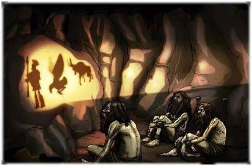

% 信仰

### 理性的局限

信主不能靠理性，而是靠恩典，恩典其实无处不在，只是人总是拒绝神的进入。

人类大脑的主要工作程式是删除。在众多的资讯中间删除大部分，留下一部分，最后剩下来的东西形成你的认知图景。然后才能根据这个认知结构做出有效反应。这个建立有效反应的体系，通俗地经常被称为是人的理性。

理性是一种特殊的疯狂。你以为理性是能够前后连贯、建立因果关系的，其实这是建立了错误的因果关系，因为你把多余的资讯删掉了，而多余的资讯很可能是重要的，普通法的精髓就在于怀疑人的理性。

人的认知天生就是扭曲的，必然放大最接近自己的部分。虔诚的意义是敬畏隐藏在世界表象背后的神秘法则，在一定程度上矫正认知扭曲。

命运遵循人类不大理解的奇特法则，在表面的不公之下维持着神秘的公正。世界历史就是世界法庭，审判正在进行时。我们经常没有意识到：草拟判决，其中有我们一份；承受判决，其中也有我们一份。

### 关于宗教奇迹

超出人类理解的东西，只能用比喻来描述，而比喻就像是投影一样的东西，会丢失大部分信息。

如果你是一个二维生物的话，你只能看到树影，但是却无法看到完整的树，你只能通过影子来认识世界，但是你看的却不是真实的世界，这就是柏拉图洞穴囚犯预言所说的道理。

柏拉图说人就像是戴着锁链的罪犯，坐在一个山洞之中，光从你的背后照进来，影子投在山洞的墙壁上，你只能看到影子活动，但是却逃离不了这个山洞。

基督教传统中谈到的此岸世界和彼岸世界的区别，彼岸世界的美好是无法想象的，就像是树和树的影子，你没有办法用平面的语言去树的三维立体性，因为你被你自己所处的监狱所束缚住了。

人类就是一种被时间和空间禁锢住的生物，所以他像二维世界里的生物跳不出平面一样，他跳不出时间。可能在更高维度来看，时间本身可能并不是一个不可逆的东西，它可以跳来跳去，那样复活和死亡一样自然。

我们都生活在一个楚门的世界中，我们所生活的这个世界，是一个舞台布景所搭起来的世界，好像很正常，但它依靠的是这种布景之外、人类无法理解的极大不正常来维持的。

### 关于原罪

地狱就是上帝的恩典照不到的地方，并不是说有一个跟上帝平起平坐的魔鬼，双方像是举行冷战一样实时交战。黑暗不是光明的对立面，而是光明找不到的地方。

人类的罪恶并不是说人类犯了什么具体的罪，而是说他是残缺不全的，他离圆满状态有着用自身的努力不可弥合的距离。人是有原罪的，因为人是残缺的。

你可以假定人是犯了罪，才被禁锢到时间的监狱里面，也许天堂伊甸园就是人类的远古记忆。在人类犯罪以前，它本来是不受禁锢的，是可以自由自在，是因为犯了罪才被囚禁到这个监狱当中。监狱里面呆久了，就觉得监狱里面就是整个世界了。

### 神是灵

神是灵，他是逻辑和理性的创造者，怎能试图用他自己所造的东西去证明他自己呢。

认清自己的位置，做自己该做的事情，一切成败利钝交给上帝。
