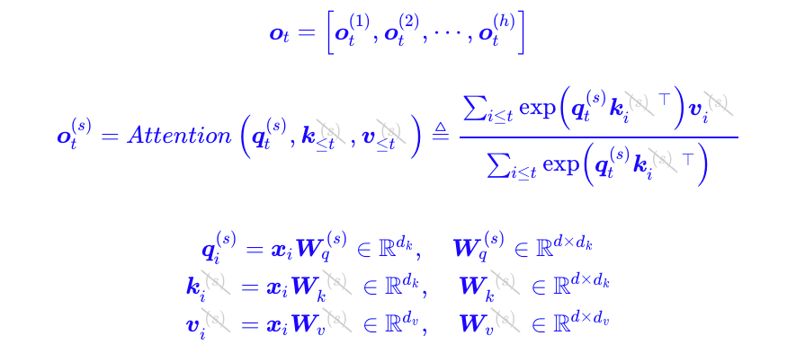
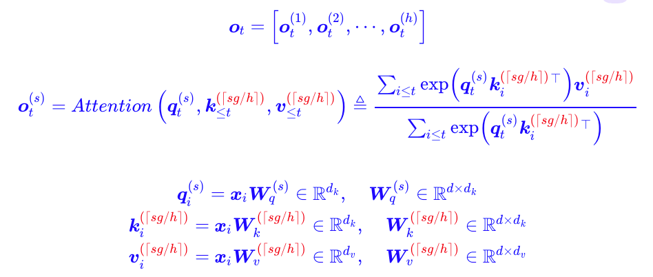
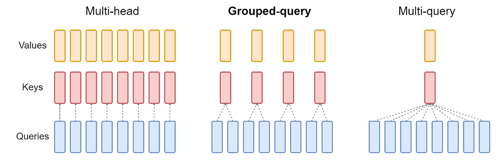

% Attention

### MHA

输入为矩阵 $X \in \mathbb{R}^{L \times d_{\text{model}}}$，长度为 $L$，模型维度为 $d_{\text{model}}$。

我们有：

* $h$：attention head 的数量
* $d_k = d_v = d_{\text{model}} / h$

每个 head 有独立的投影：

$$ Q_i = X W_i^Q,\quad K_i = X W_i^K,\quad V_i = X W_i^V,\quad i = 1, \dots, h $$

每个 head 的 attention：

$$ \text{head}_i = \text{softmax}\left( \frac{Q_i K_i^\top}{\sqrt{d_k}} \right) V_i $$

最后拼接并映射输出：

$$ \text{MHA}(X) = \text{Concat}(\text{head}_1, \dots, \text{head}_h) W^O $$

### MQA

MQA：Multi-Query Attention（多查询注意力）

{ width=500px }

**核心区别**：**所有 head 共享同一个 K 和 V**。

我们仍然有：

* $Q_i = X W_i^Q \quad (i = 1, \dots, h)$
* 但所有 head 使用同一组：
  $$ K = X W^K,\quad V = X W^V $$

那么每个 head 的 attention 变成：

$$ \text{head}_i = \text{softmax}\left( \frac{Q_i K^\top}{\sqrt{d_k}} \right) V $$

最后再拼接：

$$ \text{MQA}(X) = \text{Concat}(\text{head}_1, \dots, \text{head}_h) W^O $$

### GQA

GQA：Grouped Query Attention（分组查询注意力）

GQA 就是对 hidden dimension 进行分组，组内使用相同的 K/V，相当于采取了 MHA 和 MQA 的一个这种方案，对于每一组，实际上是使用 MQA。

{ width=500px }

假设：

* $h$：总 head 数
* $g$：K/V 分组数（每组共享一个 K/V）
* $h_g = h / g$：每组中的 head 数

我们有：

* 对每组 $j = 1, \dots, g$，生成：
  $$ K_j = X W_j^K,\quad V_j = X W_j^V $$
* 每个 head $i$ 属于某组 $j = \lfloor i / h_g \rfloor$，该 head 用：
  $$ Q_i = X W_i^Q,\quad K_j,\quad V_j $$

对应 attention 计算为：

$$ \text{head}_i = \text{softmax}\left( \frac{Q_i K_j^\top}{\sqrt{d_k}} \right) V_j $$

最后一样拼接：

$$ \text{GQA}(X) = \text{Concat}(\text{head}_1, \dots, \text{head}_h) W^O $$

---

{ width=500px }

|     | $Q_i$ | $K_i, V_i$               | 说明                 |
| --- | ----- | ------------------------ | ------------------ |
| MHA | 独立    | 独立                       | 每个 head 有自己的一套 K/V |
| MQA | 独立    | 所有 head 共用一个 $K, V$      | 显存最省，但表达力略差        |
| GQA | 独立    | 每组共享 $K_j, V_j$（共 $g$ 组） | 折中方案，性能和表达力均衡      |

### Code

#### Attention

$Q, K, V = XW$ 

$Attention(Q, K, V) = \text{Softmax}(\frac{Q K^{T}}{\sqrt{d_k}}) V$

$Output = Attention(Q, K, V) W_{O}$

```python
import numpy as np
import torch
from einops import rearrange
from torch import nn

class SelfAttentionAISummer(nn.Module):
    def __init__(self, dim):
        super().__init__()
        self.to_qvk = nn.Linear(dim, dim * 3, bias=False)
        self.scale_factor = dim ** -0.5  # 1/np.sqrt(dim)

    def forward(self, x, mask=None):
        assert x.dim() == 3, '3D tensor must be provided'

        qkv = self.to_qvk(x)  # [batch, tokens, dim*3 ]

        # decomposition to q,v,k
        # rearrange tensor to [3, batch, tokens, dim] and cast to tuple
        q, k, v = tuple(rearrange(qkv, 'b t (d k) -> k b t d ', k=3))

        # Resulting shape: [batch, tokens, tokens]
        scaled_dot_prod = torch.einsum('b i d , b j d -> b i j', q, k) * self.scale_factor

        if mask is not None:
            assert mask.shape == scaled_dot_prod.shape[1:]
            scaled_dot_prod = scaled_dot_prod.masked_fill(mask, -np.inf)

        attention = torch.softmax(scaled_dot_prod, dim=-1)
        return torch.einsum('b i j , b j d -> b i d', attention, v)
```

#### MHA

{ width=600px }

$MultiHead(Q, K, V) = Concat(head_1, \cdots, head_h) W_{o}$

$\text{ where } head_{i} = Attention(X W_{i}^{Q}, X W_{i}^{K}, X W_{i}^{V}) = Attention(Q_i, K_i, V_i)$

在多头注意力中，训练时会计算出更多的参数，用于表示不同的投影子空间。
但是在非多头注意力中，W 中只有一个投影子空间，所以捕获的特征更少。

```python
class MultiHeadSelfAttentionAISummer(nn.Module):
    def __init__(self, dim, heads=8, dim_head=None):
        """
        Implementation of multi-head attention layer of the original transformer model.
        einsum and einops.rearrange is used whenever possible
        Args:
            dim: token's dimension, i.e. word embedding vector size
            heads: the number of distinct representations to learn
            dim_head: the dim of the head. In general dim_head<dim.
            However, it may not necessary be (dim/heads)
        """
        super().__init__()
        self.dim_head = (int(dim / heads)) if dim_head is None else dim_head
        _dim = self.dim_head * heads
        self.heads = heads
        self.to_qvk = nn.Linear(dim, _dim * 3, bias=False)
        self.W_0 = nn.Linear( _dim, dim, bias=False)
        self.scale_factor = self.dim_head ** -0.5

    def forward(self, x, mask=None):
        assert x.dim() == 3
        qkv = self.to_qvk(x)  # [batch, tokens, dim*3*heads ]

        # decomposition to q,v,k and cast to tuple
        # the resulted shape before casting to tuple will be:
        # [3, batch, heads, tokens, dim_head]
        q, k, v = tuple(rearrange(qkv, 'b t (d k h) -> k b h t d ', k=3, h=self.heads))

        # resulted shape will be: [batch, heads, tokens, tokens]
        scaled_dot_prod = torch.einsum('b h i d , b h j d -> b h i j', q, k) * self.scale_factor

        if mask is not None:
            assert mask.shape == scaled_dot_prod.shape[2:]
            scaled_dot_prod = scaled_dot_prod.masked_fill(mask, -np.inf)

        attention = torch.softmax(scaled_dot_prod, dim=-1)
        out = torch.einsum('b h i j , b h j d -> b h i d', attention, v)
        out = rearrange(out, "b h t d -> b t (h d)")
        return self.W_0(out)
```

#### Intuition


