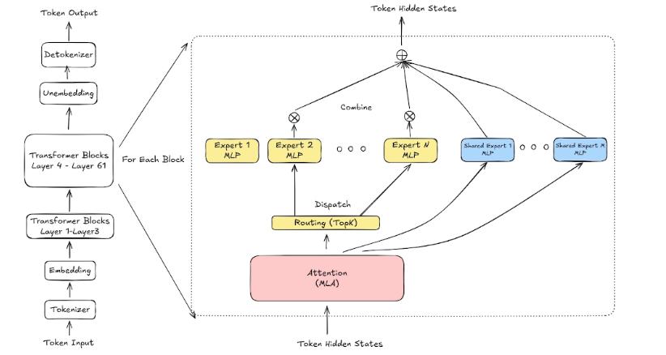
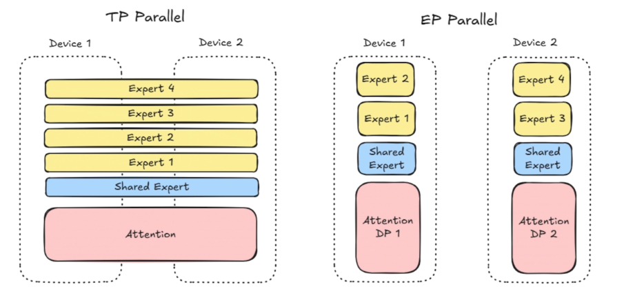
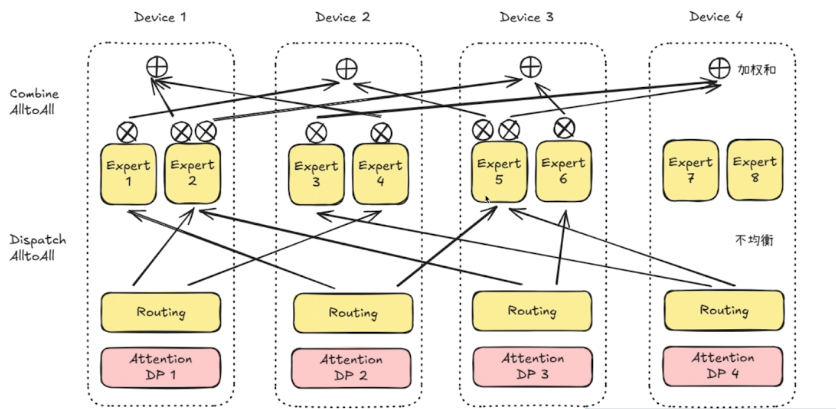
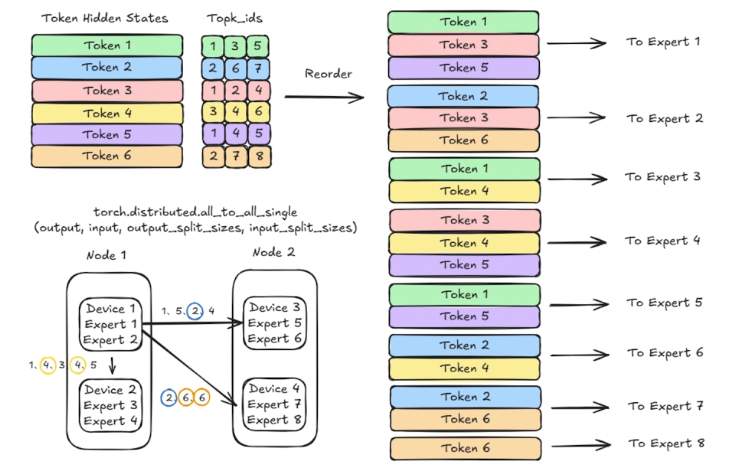
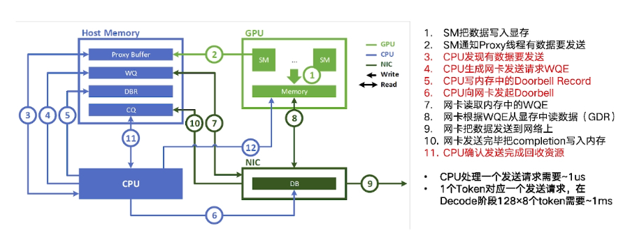

% Deepseek

### MLA

#### Traditional MHSA

The computing process:

$$\boldsymbol{q}_t = W^{Q} \cdot \boldsymbol{h}_t$$
                                                 
$$\boldsymbol{k}_t = W^{K} \cdot \boldsymbol{h}_t$$
                                                 
$$\boldsymbol{v}_t = W^{V} \cdot \boldsymbol{h}_t$$
                  
$$\boldsymbol{q}_t = [\boldsymbol{q}_{t,1}, \boldsymbol{q}_{t,2}, \cdots, \boldsymbol{q}_{t,n_h}]$$
                                                                                                
$$\boldsymbol{k}_t = [\boldsymbol{k}_{t,1}, \boldsymbol{k}_{t,2}, \cdots, \boldsymbol{k}_{t,n_h}]$$
                                                                                                
$$\boldsymbol{v}_t = [\boldsymbol{v}_{t,1}, \boldsymbol{v}_{t,2}, \cdots, \boldsymbol{v}_{t,n_h}]$$

$$\boldsymbol{o}_{t, i} = \sum_{j=1}^{t} \text{Softmax} \frac{\boldsymbol{q}_{t,i}^T \cdot \boldsymbol{k}_{j,i}}{\sqrt{d_h}} \boldsymbol{v}_{j,i}$$

$$\boldsymbol{u}_t = W^{O} [\boldsymbol{o}_{t,1}, \boldsymbol{o}_{t,2}, \cdots, \boldsymbol{o}_{t,n_h}]$$

__dimensions__

$$W^Q, W^K, W^V \in \mathbb{R}^{d_n n_h \times d}$$

$$W^O \in \mathbb{R}^{d \times d_h n_h}$$

__explanation__

$\boldsymbol{h_t}$ is attention input

#### Multi Latent Attention

$$\boldsymbol{c}_{t}^{KV} = W^{DKV} \boldsymbol{h}_t$$

$$\boldsymbol{k}^{C} = W^{UK} \boldsymbol{c}_{t}^{KV}$$

$$\boldsymbol{v}^{C} = W^{UV} \boldsymbol{c}_{t}^{KV}$$

### MOE

{ width=500px }

routing top k 选择 8 个专家，dispatch 分发，计算完成后 combine 组合一个输出。

{ width=500px }

在 TP 中，每个专家被拆得很细，计算 MFU 不够高。

EP 实现专家更加集中，计算密度更高。

{ width=500px }

Dispatch All2All 和 Combine All2All 虽然叫做 All2All，但是在 deepseek moe 中的语义并不是完全的 all2all。

因为它并不需要将 tokens 传输到所有的 dp 上。

Dispatch 走的 FP8，Combine 走的 BF16 传输。

{ width=500px }

机内冗余、卡内冗余（多个 EP 在一张卡中）

{ width=500px }

1. SM把数据写入显存
2. SM通知Proxy线程有数据要发送
3. CPU发现有数据要发送
4. CPU生成网卡发送请求WQE
5. CPU写内存中的Doorbell Record
6. CPU向网卡发起Doorbell
7. 网卡读取内存中的WQE
8. 网卡根据WQE从显存中读数据(GDR)
9. 网卡把数据发送到网络上
10. 网卡发送完毕把completion写入内存
11. CPU确认发送完成回收资源

Decode 和 Prefill 在 EP 通信上的差别：

|                           | Prefill | Decode    |
|---------------------------|---------|-----------|
| 规模                      | 32      | 320/144   |
| 平均每个 Node 激活专家数  | 2       | 0.2/0.44  |
| batch size                | 16k     | 256       |
| 平均每 rank 分配 token 数 | 500     | 0.8/1.78  |
| 时长要求                  | 6-8ms   | 100-350us |

Decode中EP通信的实现：

- 不使用两阶段
    - EP规模大，两阶段几乎无收益
    - 两阶段需要复杂元数据交互
- Token粒度发送
    - bs小，无法chunk聚合
    - CPU必然成为瓶颈，需要IBGDA
