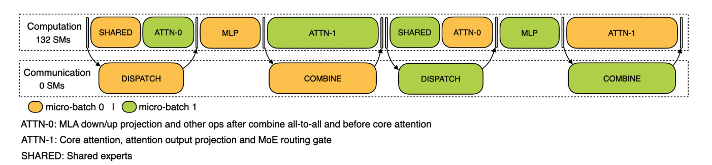

% Dualpipe

### Prefill


分为四个阶段：

- `attn + shared` vs `combine`
- `attn` vs `dispatch`
- `dispatch` vs `mlp`
- `mlp + shared` vs `combine`

每层的时间计算方法如下，就是看每个阶段的 dispatch 和 combine 有没有被 overlap 住：

```python
# whatever need 20us for issue and hook kernel launch
# attn + shared vs combine
combine_overlaped1 = (attn_gate_pure + shared_time) > combine_time
combine_overlaped1_time = (
    attn_gate_pure + shared_time + 20 if combine_overlaped1 else combine_time
)
# attn vs dispatch
dispatch_overlaped1 = attn_gate_pure > dispatch_time
dispatch_overlaped1_time = (
    attn_gate_pure + 20 if dispatch_overlaped1 else dispatch_time
)
# dispatch vs moe-layer
dispatch_overlaped2 = moe_layer_time > dispatch_time
dispatch_overlaped2_time = (
    moe_layer_time + 20 if dispatch_overlaped2 else dispatch_time
)
# mlp + shared  vs combine
combine_overlaped2 = (shared_time + moe_layer_time) > combine_time
combine_overlaped2_time = (
    shared_time + moe_layer_time + 20 if combine_overlaped2 else combine_time
    )
```

### Decode

In prefill, the prompt has many tokens, so we need to dispatch large tensors to EP (expert parallel) workers and then combine results. Because the data volume is large, the all-to-all communication itself needs GPU SM participation to pack/unpack and move chunks efficiently.

In decoding, each step processes only one token per sequence, so the tensors are tiny; after launching RDMA/NVLink sends, data movement happens asynchronously in hardware, without occupying SMs.



- `shared + attn0` vs `dispatch`
- `attn1` vs `combine`
- `mlp` 不需要 overlap
