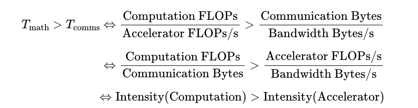

% Estimation

### Time

#### Computation

A deep learning model is effectively a bunch of matrix multiplications, each composed of floating-point multiplication and addition ‘operations’ (FLOPs). Our accelerator speed determines how long these take to compute:

$T_{math} = \text{Computation_FLOPs} / \text{Accelerator_FLOPs/s}$

例如，NVIDIA H100 大约能达到 9.89e14 bfloat16 FLOPs/s 的性能，而 TPU v6e 则为 9.1e14 FLOPs/s。这意味着在 H100 上执行 1e12 FLOPs 大约需要 1e12 / 9.89e14 = **1.01 毫秒**，在 TPU v6e 上则需要 1e12 / 9.1e14 = **1.1 毫秒**。

#### Communication within a chip

在 Accelerator 内部，Tensor 需要在片上存储器（HBM）和 Tensor Core 之间进行传输。这种连接的带宽被称为“HBM 带宽”。在 H100 上，这个带宽大约是 **3.35 TB/s**，而在 TPU v6e 上，大约是 **1.6 TB/s**。

#### Communication between chips

当我们把一个模型分布式部署到多个加速器上时，张量（数据）经常需要在它们之间进行传输。在我们的硬件上，通常有几种实现这种传输的选项（ICI、DCN 和 PCIe），每种都有不同的带宽。

不论是对于 inner chip，还是 intra chips，可以通过以下公式衡量时间：

$$T_{comms} = \frac{\text{Communication_Bytes}}{\text{Network/Memory_Bandwidth_Bytes/s}}$$

---

__计算访存比__（Intensity）：

{ width=500px }

Intensity(Accelerator) TPU 达到其峰值 FLOPs/s 时的算术强度。对于 TPU v5e MXU，这大约是 240 FLOPs/B，因为 TPU 每秒可以执行 1.97e14 FLOPs 并从 HBM 加载 8.2e11 字节/秒。

如果一个算子的计算强度低于 240 FLOPs/B，它将进入访存瓶颈，否则会进入计算瓶颈。

__Self Dot Product__

对于两个 vector 的内积：`x * y: bf16[N] * bf16[N] → bf16[1]`，我们需要将 `x` 和 `y` 加载到内存中进行计算，每个 vector 有 2N 的数据需要加载，进行 N 次乘法和 N-1 次加法：

$$Intensity(dot product) = \frac{N + N - 1}{2N + 2N} → \frac{1}{2}$$

当 $N → \inf$，这个计算访存比为 0.5，每加载一个字节的数据进行 0.5 次浮点计算，这意味着该阶段的通信开销远远大于计算开销。

### Roofline

### Matrix Gemm

对于以下配置：

| array | shape   |
|-------|---------|
| $x$   | $[P]$   |
| $y$   | $[P]$   |
| $A$   | $[N P]$ |
| $B$   | $[P M]$ |

- 两个向量 $x \cdot y$ 的 __点积__ 需要 $P$ 次加法和乘法，总计 $2P$ 次浮点运算。
- __矩阵-向量积__ $Ax$ 需要对 $A$ 的行进行 $N$ 次点积，总计 $2NP$ 次浮点运算。
- __矩阵-矩阵积__ $AB$ 需要对 $B$ 的每列进行 $M$ 次矩阵-向量积，总计 $2NPM$ 次浮点运算。
- 通常，如果我们有两个 __高维数组__ $C$ 和 $D$，其中一些维度是 **CONTRACTING** 维度，一些是 **Batching**维度。(例如，$C[GHIJKL]$，$D[GHMNKL]$)，那么这种收缩的浮点运算成本是 $C$ 和 $D$ 所有维度的乘积的两倍，其中批处理和收缩维度只计算一次（例如，$2GHIJMNKL$）。请注意，一个维度只有在两个乘数中都出现时才进行批处理。（另请注意，如果没有收缩维度，则因子2不适用，这只是一个元素级乘积。）

> Batching Dimension
>
> Contracting Dimension
>
> Non Batching and Non Contracting Dimension

### Transformer

首先给出一系列 dimension 的符号表示：

| symbol | dimension                                 |
|--------|-------------------------------------------|
| $B$    | batch size                                |
| $L$    | number of layers                          |
| $T$    | sequence length (query)                   |
| $S$    | sequence length (key value)               |
| $V$    | vocab                                     |
| $D$    | $d_{model}$, embedding dimension |
| $F$    | MLP intermidiate dimension                |
| $H$    | attention head dimension                  |
| $N$    | number of query heads                     |
| $K$    | number of key/value heads                 |
| $G$    | q heads per kv head = $N // K$            |

需要注意以下几点：

__embedding size 和 hidden size__

两者在实践中一般相同，但是却是不同的概念，embedding size 指的是对 token 进行 embed 后的维度。
hidden size 指的是 Q/K/V 的维度

__Q 和 K/V 的维度__

Q/K/V 的维度在实践中一般相同，但是在理论上可以不同，对于多头注意力，q 的维度是 NH，k/v 的维度是 KH。

__为什么要区分 K/N__

- 对于 MHA，K 和 N 相同
- 对于 MQA，K = 1
- 对于 GQA，N 是 K 的整数倍，G = N / K

__gating einsum__

这是一段关于“门控爱因斯坦求和”（gating einsum）的解释，以下是翻译内容：

我们将上投影矩阵分成两个矩阵（上面的 $W\_{In1}$ 和 $W\_{In2}$），它们的输出进行逐元素相乘，作为一种“门控函数”。并非所有大型语言模型（LLM）都使用这种方法，所以有时你会看到一个单独的 $W\_{In}$ 矩阵，并且总的多层感知器（MLP）参数计数是 2DF 而不是 3DF。通常在这种情况下，D 和 F 会按比例放大，以保持参数计数与三个矩阵的情况相同。尽管如此，Llama、DeepSeek 和许多其他模型都使用了某种形式的门控爱因斯坦求和。

### MLPs

__Gated MLP__

$$ A = \sigma(X W_{in1}) \odot (X W_{in2}) $$

解释：

* $W_{in1}, W_{in2}$ 都是从输入维度 $D$ 投影到扩展维度 $F$ 的两个不同矩阵
* 第一个投影 $X W_{in1}$ 通过 sigmoid 激活变成门控值
* 第二个投影 $X W_{in2}$ 作为被门控的主流路径
* 二者逐元素相乘之后再通过 $W_{out}$ 降维

这种结构比标准 MLP 更灵活，最早用于 GLU，也出现在 Gated MLP, SwiGLU, GeGLU 等设计中。

| operation                                             | train FLOPs        | params  |
|-------------------------------------------------------|--------------------|---------|
| $A[B, T, \textcolor{red}{D}] \cdot W_{in1}[\textcolor{red}{D}, F]$ | $6BTDF$            | $DF$    |
| $A[B, T, \textcolor{red}{D}] \cdot W_{in2}[\textcolor{red}{D}, F]$ | $6BTDF$            | $DF$    |
| $\sigma(A_{in1})[B, T, F] * A_{in2}[B, T, F]$          | *$O(BTF)$*         |         |
| $A[B, T, F] \cdot W_{out}[F, D]$                       | $6BTDF$            | $DF$    |
|                                                       | $\approx 18BTDF$   | $3DF$   |

### Attention

| operation                                                | train FLOPs              | params               |
|----------------------------------------------------------|---------------------------|----------------------|
| $A[B, T, \textcolor{red}{D}] \cdot W_Q[\textcolor{red}{D}, N, H]$ | $6BTDNH$                 | $DNH$                |
| $A[B, T, \textcolor{red}{D}] \cdot W_K[\textcolor{red}{D}, K, H]$ | $6BTDKH$                 | $DKH$                |
| $A[B, T, \textcolor{red}{D}] \cdot W_V[\textcolor{red}{D}, K, H]$ | $6BTDKH$                 | $DKH$                |
| $A[B, T, N, H] \cdot W_O[N, H, D]$                        | $6BTDNH$                 | $DNH$                |
|                                                          | $\mathbf{12BTD(N + K)H}$ | $\mathbf{2D(N + K)H}$ |

| operation                                                                 | train FLOPs                                      |
|---------------------------------------------------------------------------|--------------------------------------------------|
| $Q[B, T, \textcolor{blue}{K}, G, \textcolor{red}{H}] \cdot K[B, S, \textcolor{blue}{K}, \textcolor{red}{H}]$ | $6BTSKGH = 6BTSNH$                               |
| $\text{softmax}_S\quad L[B, T, S, K, G]$                                   | $O(BTSKG) = O(BTSN)$ |
| $S[B, T, \textcolor{red}{S}, \textcolor{blue}{K}, G] \cdot V[B, \textcolor{red}{S}, \textcolor{blue}{K}, H]$ | $6BTSKGH = 6BTSNH$                               |
|                                                                           | $\approx 12BTSNH = 12BT^2NH$                     |

### attn & gemm

Let's consider all the gemm operations ($A \cdot B$):

| B Name             | A           | B           | Param | FLOPs   |
|--------------------|-------------|-------------|-------|---------|
| $W_{Q}$            | $[B, D]$    | $[D, N, H]$ | $DNH$ | $2BDNH$ |
| $W_{K}, W_{V}$     | $[B, D]$    | $[D, K, H]$ | $DKH$ | $2BDKH$ |
| $W_{O}$            | $[B, N, H]$ | $[N, H, D]$ | $DNH$ | $2BDNH$ |
| $W_{in1}, W_{in2}$ | $[B, D]$    | $[D, F]$    | $DF$  | $2BDF$  |
| $W_{down}$         | $[B, F]$    | $[F, D]$    | $DF$  | $2BDF$  |

Let's consider the attention operation:

| Type   | A                | B                | FLOPs    |
|--------|------------------|------------------|----------|
| $QK^T$ | Q $[B, T, N, H]$ | K $[B, S, K, H]$ | $2BTSNH$ |

对于 prefill 阶段，T=S=prompt tokens数量，QK 的计算量为 $2BT^2 NH$，随着上下文二次增长。

对于 decode 阶段，T=1，S=上下文长度，QK 的计算量为 $2BSNH$，随着上下文长度线性增长。

| Phase   | Type                | A              | B                  | FLOPs      |
|---------|---------------------|----------------|--------------------|------------|
| prefill | Softmax($QK^T$) * V | $[B, T, N, H]$ | $V$ $[B, T, K, H]$ | $2BT^{2}NH$ |
| decode  | Softmax($QK^T$) * V | $[B, 1, N, H]$ | $V$ $[B, S, K, H]$ | $2BSNH$ |

---

__对于训练__

Suppose $F = 4D$，$N = K$：

$$\frac{\text{attention}}{\text{gemm}} = \frac{12BT^2NH}{18BTDF + 24BTDNH} = \frac{12BT^2D}{4 * 18BTD^2 + 24BTD^2} = \frac{12BT^2D}{96BTD^2} = \frac{T}{8D}$$

所以只有当 $T > 8D$ 的时候 attention 的计算量才会超过 gemm，假设 hidden size = 8K，只有上下文长度达到 64k 时 attention 计算量才会超过 gemm。

__对于推理__

Suppose $F=5D$，$N=K$：

$$\frac{\text{attention}}{\text{gemm}} = \frac{8BD^2 + 2BSD}{6BDF} = \frac{8D + 2S}{24D}$$

当上下文长度 $S > 8D$ 时，attention 阶段的计算量会超过 MLP。

### general rule

如果上下文比较短，然后忽略 attention 阶段的 self dot product 的计算量的话，那么计算量可以近似为：

$$
\begin{align*}
(18BTDF + 12BTD(N+K)H)L = 6 * BT * (3DF + 2D(N+K)H)L \\
    = 6 * \text{num tokens} * \text{parameter count}
\end{align*}
$$

这引出了一个著名的经验法则，用于估算密集型 Transformer 的浮点运算数（FLOP），同时忽略了注意力机制的浮点运算。 （去嵌入（Unembedding）是另一个简单的矩阵乘法，有 $6BSDV$ 浮点运算和 $DV$ 参数，也遵循相同的经验法则。）
