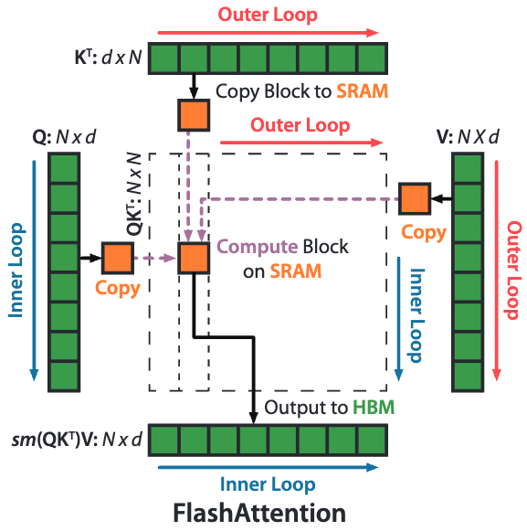

% Flash Attention

### Normal Attention Computation

$$S = QK^{T} \in R^{N \times N}$$

$$P = \text{softmax}(S) \in R^{N \times N}$$

$$O = PV \in R^{N \times D}$$

where $N$ is sequence length and $D$ is dimension.

### Flash Attention

{ width=500px }

#### 分块 softmax 算法

$$a = [0.1, 0.2, 0.3, 0.4] = [a_1, a_2];\ m(a_1) = 0.2;\ m(a_2) = 0.4;\ m(a) = 0.4$$ 

$$f(a_1) = [e^{0.1-0.2}, e^{0.2-0.2}];\ l(a_1) = \sum f(a_1)$$

$$f(a_2) = [e^{0.3-0.4}, e^{0.4-0.4}]; l(a_2) = \sum f(a_2)$$ 

$$f(a) = [e^{0.2-0.4}f(a_1), e^{0.4-0.4}f(a_2)]$$

$$l(a) = e^{0.2-0.4} l(a_1) + e^{0.4-0.4} l(a_2) $$

$$\text{softmax}(a) = \frac{f(a)}{l(a)}$$
