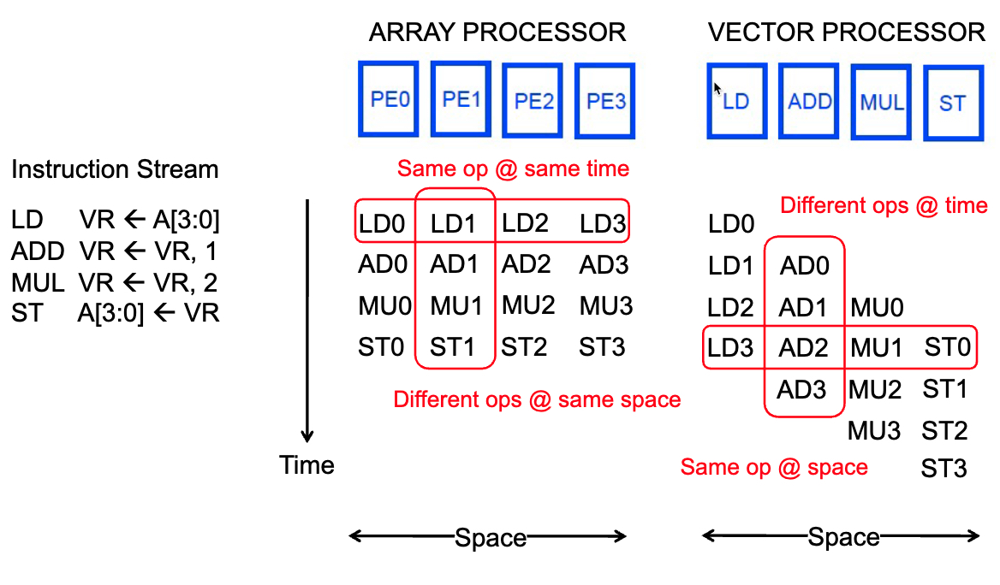
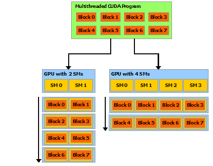
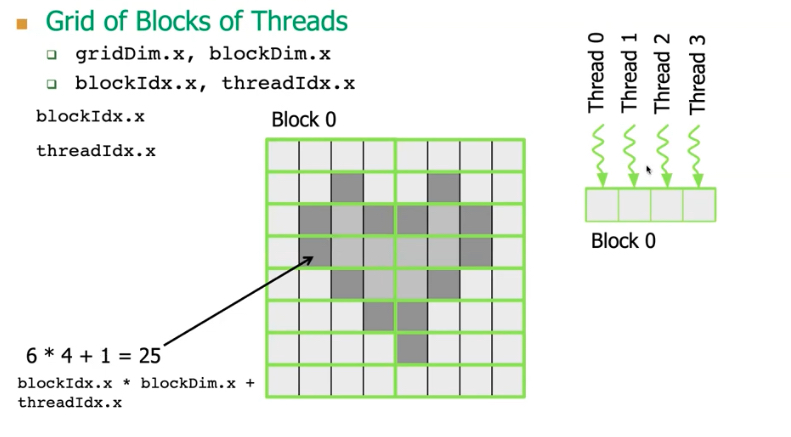
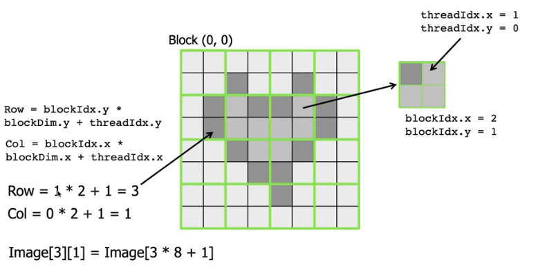
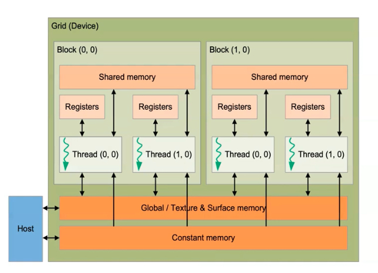
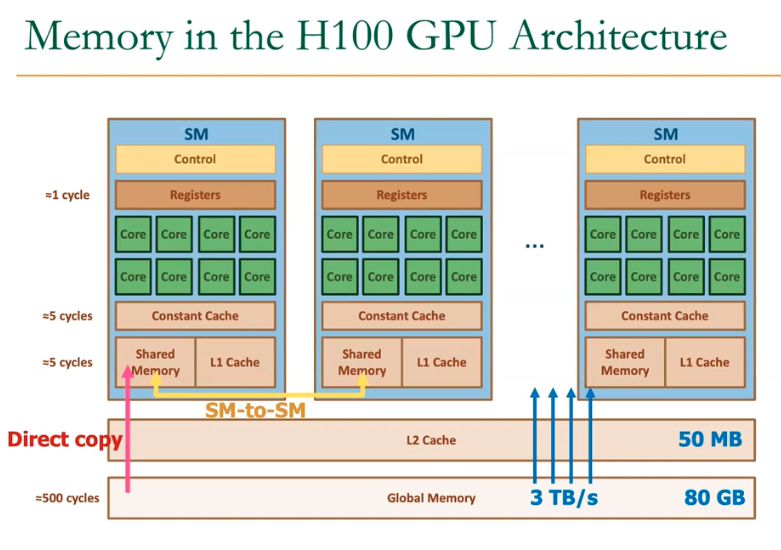
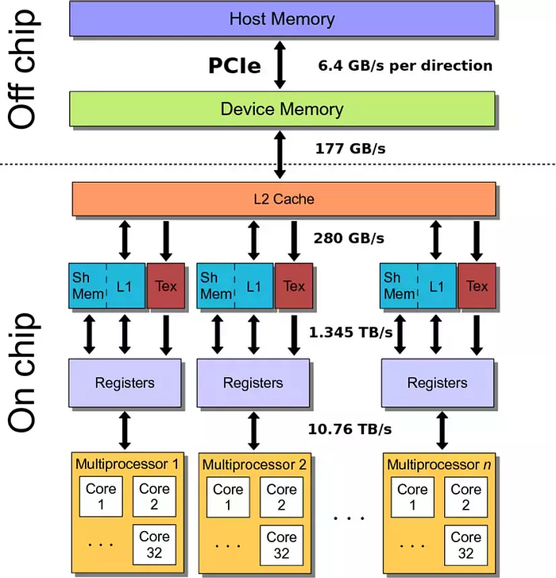
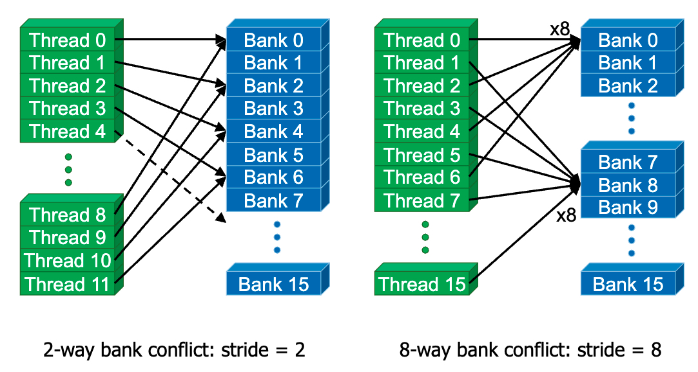

% GPUs

| GPU Model | Release Year | NetBW (GB/s) | Compute (FP16 GFLOP/s) | MemBW (GB/s) | Ratio (FLOP/B) |
|-----------|--------------|--------------|------------------------|--------------|----------------|
| V100      | 2017         | 300          | 125,000                | 900          | 139            |

### Flynn taxonomy

Computer architecture:

- SISD: single instruction stream operates on single data element
- SIMD: single instruction stream operates on multiple data elements
    - Array processor
    - Vector processor

#### SIMD Processing

SIMD: in time or in space

Time-space duality

- array processor: Instruction operates on multiple data elements at the same time using different spaces (PEs)
- vector processor: Instruction operates on multiple data elments in consecutive time steps using the same space (PE)

{ width=500px }

### Kernel

CUDA core three key abstractions:

- a hierarchy of threaded groups
- shared memories
- barrier synchronization

Grid → Block → Warp → Thread

SM (streaming multiprocessor) contains many cores. Each core execute instruction through SIMD (Single Instruction, Multiple Data) way, which means it applies the same intruction on multiple data elements at the same time.

Each SM can contain 32-64-128 cuda cores according to the architecture.

Each core can execute multiple warps at the same time. But each thread in these warps must execute the same instruction.

### Thread Hierarchy

{ width=500px }

- __kernels__: cpp functions executed in parallel
    - defined in `__global__` declaration specifier
    - use `<<<...>>>` to specify number of CUDA threads used

Each block can hold n-dimensional threads. All threads in the same block reside on the same streaming multiprocessor (SM) core and share the limited resource of that core.

Blocks are organized into n-dimensional grid of thread blocks. The number of thread blocks in a grid is usually dictated by the size of the data being processed.

Threads within a block can cooperate by sharing data through some shared memory and by synchronizing their execution to coordinate memory accesses.

{ width=500px }

{ width=500px }


### Memory Hierarchy

{ width=500px }

- local memory
- shared memory
- global memory
- texture memory or constant memory: special memory types in the GPU optimized for accessing specific data types such as textures or constant values.

{ width=700px }

Each SM possesses its own dedicated shared, cache, constant, and register memory. However, multiple SMs share the same global memory.

{ width=500px }

The entire memory is divided into different banks that can be accessed simultaneously. Banks share address and data buses (to minimize pin cost)

Can start and complete one bank access per cycle. Can sustain N concurrent accesses if all N go to different banks.

### Traditional Program Structure

__Function prototype__

`float serialFunction(...)`

`__global__ void kernel(...)`

__main()__

1. Allocate memory space on the device: `cudaMalloc(&d_in, bytes)`
2. Transfer data from host to device: `cudaMemCpy(d_in, h_in, ...)`
3. Execution configuration setup: #blocks and #threads
4. Kernel call: `kernel<<execution configuration>>(args...)`
5. Transfer results from device to host: `cudaMemCpy(h_out, d_out, ...)`

kernel

- automatic variables transparenly assigned to registers
- shared memory: `__shared__`
- intra-block synchronization: `__syncthreads()`

__constant memory__

- the mask is small
- it is constant
- it is accessed by all threads

Constant memory is cached inside each GPU core and it is particularly fast when all threads of a warp access the same value

```cpp
// Declare the mask as a global variable
#define MASK_WIDTH 5
__constant__ float M[MASK_WIDTH];
// Initialize the mask from the host
cudaMemcpyToSymbol(M, M_h, Mask_Width * sizeof(float));
```

### Variable Type Qualifier

| Variable declaration                  | Memory   | Scope  | Lifetime    |
|---------------------------------------|----------|--------|-------------|
| `int LocalVar`                        | register | thread | thread      |
| `int localArr[N]`                     | global   | thread | thread      |
| `__device__ __shared__ int SharedVar` | shared   | block  | block       |
| `__device__`                          | global   | grid   | application |
| `__device__ __constant__`             | constant | grid   | application |

`__device__` is optional when used with `__shared__` and `__constant__`

### Performance Consideration

- main bottlenetcks
    - cpu-gpu data transfer
    - global memory access
- memory access
    - latency hiding
        - occupancy
    - memory coalescing
    - data reuse
        - shared memory usage
- SIMD (Warp) Ultilization: Divergence
- Other Considerations
    - Atomic opeartions: Serialization
    - Data transfers between CPU and GPU
        - Overlap of communication and computation

typically, 32 banks in nvidia gpus, bank = address % 32

{ width=500px }
