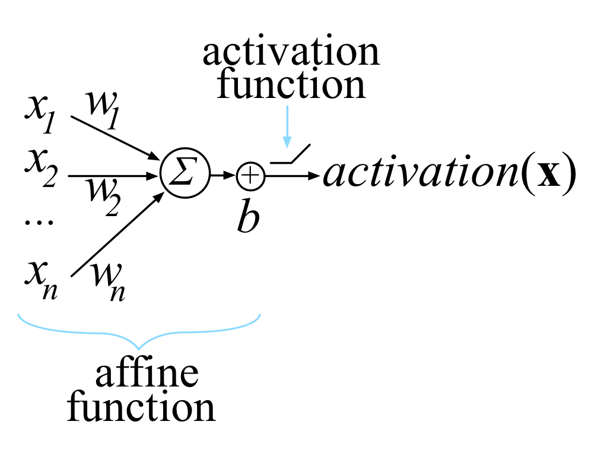
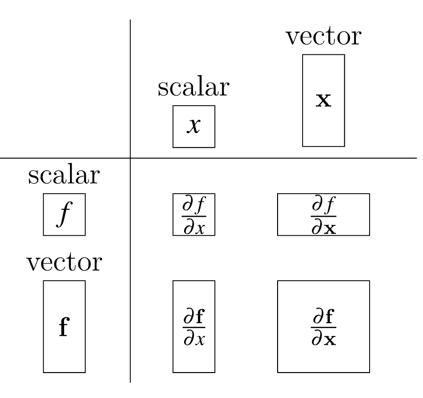

% Linear Algebra

## Introduction

{ width=300px }

The activation of a single computation unit in a neural network is typically calculated using the dot product of an edge weight vector $\mathbf{w}$ with and input vector $\mathbf{x}$ plus scalar bias:

$$z(x) = \sum_{i=1}^{n} w_i x_i + b = \textbf{w} \cdot \textbf{x} + b$$

Function $z(x)$ is called the unit's affline function and is followed by a rectified linear unit, which clips negative values to zero.

__Traning__ this neuron network means choosing weights $\mathbf{w}$ and bias $b$ so that we get desired output for all N input $\mathbf{x}$.

To do that, we minimize the loss function that compares the network's final $\text{activation}(\mathbf{x})$ with the $\text{target}(\mathbf{x})$ for all input $\mathbf{x}$ vectors.

To minimize the loss, we use some variation on gradient descent, such as plain stochastic gradient descent (SGD). All of those require the partital derivative of $\text{activation}(\mathbf{x})$ with respect to the model parameters $\mathbf{w}$ and $b$.
Our goal is gradually tweak $\mathbf{w}$ and $b$ sot that the overall loss function keeps getting smaller for all input $\mathbf{x}$.

## Matrix Calculas

### Partial Derivative

Difference between derivative and partial derivative:

- ordinary derivative is used in a single-variable
- partial derivative is used in multi-variable funciton. And when we try to get a variable's partial derivative. The other variables are regarded as constants.

### Gradient

When we calculate the partial derivative of multiple variables. Instaed of having the just floating around and not organized in any way, we can organize them into a horizontal vector:

$$\nabla f(x, y) = [ \frac{\partial f(x, y)}{\partial x}, \frac{\partial f(x, y)}{\partial y}]$$

So the graident of $f(x, y)$ is simply a vector of its partials.

If we have two functions, we get the _Jocobian matrix_ where gradients are rows:

$$
J = \begin{bmatrix}
\nabla f(x, y) \\
\nabla g(x, y)
\end{bmatrix} = \begin{bmatrix}
\frac{\partial f(x, y)}{\partial x} & \frac{\partial f(x, y)}{\partial y} \\
\frac{\partial g(x, y)}{\partial x} & \frac{\partial g(x, y)}{\partial y}
\end{bmatrix}
$$ 

Note there are many ways to represent this Jocobian. We are using the so-called numerator layout but many papers will use the denominator layout which is just transpose of the numerator layout.

### Jocobian in general

To define jocobian matrix more generally, let's combine multiple parameters into a single vector argument: $f(x, y, z) \rightarrow f(\mathbf{x})$

Let's clarify the formats:

- $\mathbf{x}$ is the same as $\vec{x}$, which is a vector.
- $x$ is a scalar.
- $x_i$ is a single element in vector.

We also have to define the orientation for vector $\mathbf{x}$

$$x = \begin{bmatrix}
x_1 \\
x_2 \\
\vdots \\
x_n
\end{bmatrix}$$

With multiple scalar-valued functions, we can combine them all into a vector just like we did with the parameters.

Let $\mathbf{y} = \mathbf{f(x)}$ be a vector of m scalar-valued functions that each take a vector $\mathbf{x}$. And each $f_i$ within $\mathbf{f}$ returns a scalar value.

$$y_1 = f_1(\mathbf{x})$$
$$y_2 = f_2(\mathbf{x})$$
$$\vdots$$
$$y_m = f_m(\mathbf{x})$$

Generally speaking, the Jacobian matrix is the collection of all $m \times n$ possible partial derivatives, which is the stack of $m$ gradients with respect to $\mathbf{x}$.

$$
\frac{\partial y}{\partial x} =
\begin{bmatrix}
\nabla f_1(\mathbf{x}) \\
\nabla f_2(\mathbf{x}) \\
\vdots \\
\nabla f_m(\mathbf{x}) \\
\end{bmatrix} =
\begin{bmatrix}
\frac{\partial f_1(\mathbf{x})}{\partial \mathbf{x}} \\
\frac{\partial f_2(\mathbf{x})}{\partial \mathbf{x}} \\
\vdots \\
\frac{\partial f_m(\mathbf{x})}{\partial \mathbf{x}} \\
\end{bmatrix} =
\begin{bmatrix}
\frac{\partial f_1(\mathbf{x})}{\partial x_1} & \frac{\partial f_1(\mathbf{x})}{\partial x_2} & \cdots & \frac{\partial f_1(\mathbf{x})}{\partial x_n} \\
\frac{\partial f_2(\mathbf{x})}{\partial x_1} & \frac{\partial f_2(\mathbf{x})}{\partial x_2} & \cdots & \frac{\partial f_2(\mathbf{x})}{\partial x_n} \\
\vdots \\
\frac{\partial f_m(\mathbf{x})}{\partial x_1} & \frac{\partial f_m(\mathbf{x})}{\partial x_2} & \cdots & \frac{\partial f_m(\mathbf{x})}{\partial x_n} \\
\end{bmatrix}
$$

{ width=300px }

The jocobian function $\mathbf{f(x)} = \mathbf{x}$ with $f_i(\mathbf{x}) = x_i$:

$$
\frac{\partial y}{\partial x} =
\begin{bmatrix}
1 & 0 & \cdots & 0 \\
0 & 1 & \cdots & 0 \\
\vdots & \vdots & \ddots & \vdots \\
0 & 0 & 0 & 1
\end{bmatrix}
$$

### Derivative of element-wise binary operators

By “element-wise binary operations” we simply mean applying an operator to the first item of each vector to get the first item of the output, then to the second items of the inputs for the second item of the output, and so forth.

We can generalize the element-wise binary operations with notation $\mathbf{y} = \mathbf{f(w)} \bigcirc \mathbf{g(x)}$ where $m = n = |y| = |w| = |x|$

$$
\begin{bmatrix}
y_1 \\
y_2 \\
\vdots \\
y_n
\end{bmatrix} = \begin{bmatrix}
f_1(\mathbf{w}) \bigcirc g_1(\mathbf{x}) \\
f_2(\mathbf{w}) \bigcirc g_2(\mathbf{x}) \\
\vdots \\
f_n(\mathbf{w}) \bigcirc g_n(\mathbf{x}) \\
\end{bmatrix}
$$

$$
\mathbf{J_{W}} = \frac{\partial \mathbf{y}}{\partial \mathbf{w}} = \begin{bmatrix}
\frac{\partial }{\partial w_1}(f_1 (\mathbf{w}) \bigcirc g_1(\mathbf{x})) & \frac{\partial }{\partial w_2}(f_1 (\mathbf{w}) \bigcirc g_1(\mathbf{x})) & \cdots & \frac{\partial }{\partial w_n}(f_1 (\mathbf{w}) \bigcirc g_1(\mathbf{x})) \\
\frac{\partial }{\partial w_1}(f_2 (\mathbf{w}) \bigcirc g_2(\mathbf{x})) & \frac{\partial }{\partial w_2}(f_2 (\mathbf{w}) \bigcirc g_2(\mathbf{x})) & \cdots & \frac{\partial }{\partial w_n}(f_2 (\mathbf{w}) \bigcirc g_2(\mathbf{x})) \\
\vdots & \vdots & \ddots & \vdots \\
\frac{\partial }{\partial w_1}(f_n (\mathbf{w}) \bigcirc g_n(\mathbf{x})) & \frac{\partial }{\partial w_2}(f_n (\mathbf{w}) \bigcirc g_n(\mathbf{x})) & \cdots & \frac{\partial }{\partial w_n}(f_n (\mathbf{w}) \bigcirc g_n(\mathbf{x})) \\
\end{bmatrix}
$$ 

Consider that $\frac{\partial}{\partial w_j}(f_i(\mathbf{w}) \bigcirc g_i(\mathbf{x})) = 0$ where $j \ne i$, so

$$
\frac{\partial \mathbf{y}}{\partial \mathbf{w}} = diag \big(\frac{\partial}{\partial w_1}(f_1(w_1) \bigcirc g_1(x_1)), \frac{\partial}{\partial w_2}(f_2(w_2) \bigcirc g_2(x_2)), \cdots, \frac{\partial}{\partial w_n}(f_n(w_n) \bigcirc g_n(x_n)) \big)
$$

With $\mathbf{x}$ we can get the similiar result:

$$
\frac{\partial \mathbf{y}}{\partial \mathbf{x}} = diag \big(\frac{\partial}{\partial x_1}(f_1(w_1) \bigcirc g_1(x_1)), \frac{\partial}{\partial x_2}(f_2(w_2) \bigcirc g_2(x_2)), \cdots, \frac{\partial}{\partial x_n}(f_n(w_n) \bigcirc g_n(x_n)) \big)
$$

### Vector chain rule

With single-variable chain rule:

$$\frac{d}{dx} f(g(x)) = \frac{df}{dg} \frac{dg}{dx}$$

With multiple-variable chain rule:

$$
\frac{\partial}{\partial x} {\mathbf{f}(\mathbf{g}(\mathbf{x}))} =
\begin{bmatrix}
\frac{\partial f_1}{\partial g_1} & \frac{\partial f_1}{\partial g_2} & \cdots & \frac{\partial f_1}{\partial g_k} \\
\frac{\partial f_2}{\partial g_1} & \frac{\partial f_2}{\partial g_2} & \cdots & \frac{\partial f_2}{\partial g_k} \\
\vdots & \vdots & \ddots & \vdots \\
\frac{\partial f_m}{\partial g_1} & \frac{\partial f_m}{\partial g_2} & \cdots & \frac{\partial f_m}{\partial g_k} \\
\end{bmatrix}
\begin{bmatrix}
\frac{\partial g_1}{\partial x_1} & \frac{\partial g_1}{\partial x_2} & \cdots & \frac{\partial g_1}{\partial x_n} \\
\frac{\partial g_2}{\partial x_1} & \frac{\partial g_2}{\partial x_2} & \cdots & \frac{\partial g_2}{\partial x_n} \\
\vdots & \vdots & \ddots & \vdots \\
\frac{\partial g_k}{\partial x_1} & \frac{\partial g_k}{\partial x_2} & \cdots & \frac{\partial g_k}{\partial x_n} \\
\end{bmatrix}
$$

where $m = |f|$, $n = |x|$ and $k = |g|$.
The resulting Jacobian is $m \times n$ (an $m \times k$ matrix multiplied by $k \times n$ matrix)

Sometimes element-wise operations on vectors $\mathbf{w}$ and $\mathbf{x}$ yield diagonal matrices, and the previous equation can be simplified to:

$$\frac{\partial \mathbf{f}}{\partial \mathbf{g}} = diag( \frac{\partial f_i}{\partial g_i} )$$

$$\frac{\partial \mathbf{g}}{\partial \mathbf{x}} = diag( \frac{\partial g_i}{\partial x_i} )$$

$$\frac{\partial}{\partial x} {\mathbf{f}(\mathbf{g}(\mathbf{x}))} = diag( \frac{\partial f_i}{\partial g_i} \frac{\partial g_i}{\partial x_i} )$$

### Matrix Extended Operation

- Dot Product: $A \cdot B$, matrix multiplication
- Kronecker Product: $A \otimes B$, elemetn wise multiplication

## The gradient of neuron activation

$X = [x_1, x_2, \cdots, x_{N}]^{T}$

$y = [target(x_1), target(x_2), \cdots, target(x_N)]^T$

where $y_i$ is a scalar, then the cost function becomes

$C(w, b, X, y) = \frac{1}{N} \sum_{i=1}^{N} (y_i - \sigma(x_i))^2 = \frac{1}{N} \sum_{i=1}^{N} (y_i - max(0, w \cdot x_i + b))^2$

