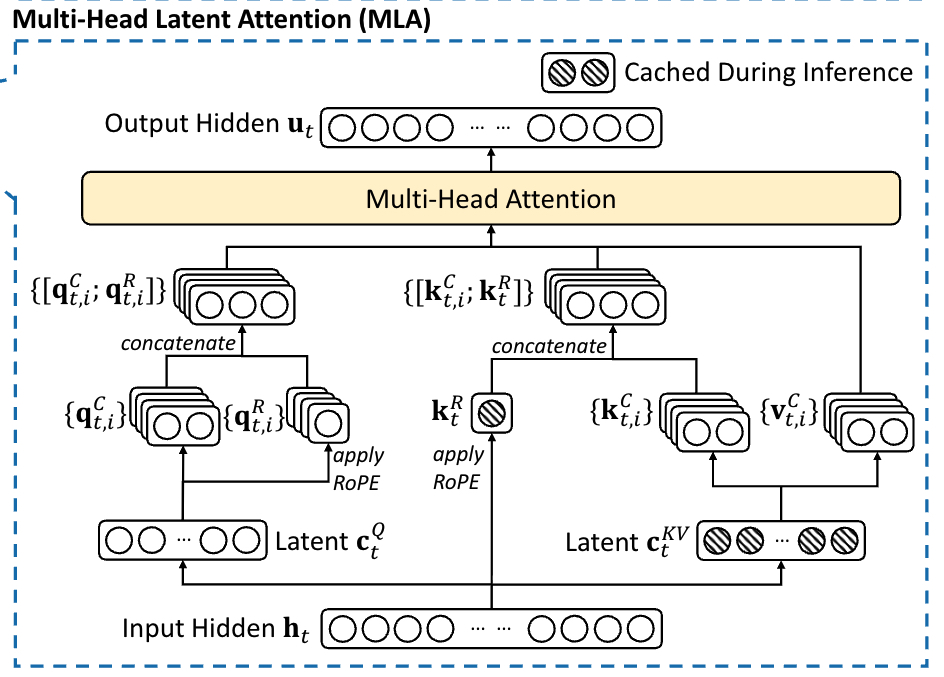

% MLA

### MLA




### Rope

__为什么 rope 和 nope 分离？__

首先 rope 的旋转矩阵无法被融合进入 W_q 和 k_b 矩阵之中（该矩阵并不是一个常量）：


$$
q_t^{(s)} {k_i^{(s)}}^\top 
= \left( x_t W_q^{(s)} \mathcal{R}_t \right) 
  \left( c_i W_k^{(s)} \mathcal{R}_i \right)^\top 
= x_t \left( W_q^{(s)} \mathcal{R}_{t-i} {W_k^{(s)}}^\top \right) c_i^\top
$$

既然无法融合，在使用 MLA 的情况下如果需要使用 rope，就需要升维之后重新计算，但这样的话需要在升维后再重新计算 rope，它也不想，所以干脆把 q 和 k 拆成两部分，一部分是位置编码的，一部分是无关位置编码的。带位置编码的 k 可以缓存，比缓存全部维度都带位置的 k 强。

### Absorb

__normal 和 absorb 的区别？__

absorb 就是把 wkv_b 拆分成 wk_b_nope 和 wv_b，然后分别合入到 wq_b_nope 和 o_proj 中。

$$\mathbf{q}_t^\top \mathbf{k}_j^C = (W^Q \mathbf{h}_t)^\top W^{UK} \mathbf{c}_j^{KV} = \mathbf{h}_t^\top (W^{Q^\top}) W^{UK} \mathbf{c}_j^{KV} = \mathbf{h}_t^\top W^{Q^\top} W^{UK} \mathbf{c}_j^{KV} = \mathbf{h}_t^\top W^{Q^\top UK} \mathbf{c}_j^{KV}$$

$$\mathbf{u}_t = W^O \mathbf{o}_t = W^{O} W^{UV} \sum_{j=1}^t \text{Softmax}_j \left( \frac{\mathbf{q}_t^\top \mathbf{k}_j}{\sqrt{d_h}} \right) \mathbf{c}_j^{KV} = W^{OUV} \sum_{j=1}^t \text{Softmax} \left( \frac{\mathbf{q}_t^\top \mathbf{k}_j^{KV}}{\sqrt{d_h}} \right) \mathbf{c}_j^{KV}$$

也就是将 wq_b_nope 和 wk_b_nope 进行一个融合，wv_b 和 o_proj 进行一个融合。融合之后实际上就相当于 kv_latent 和 absorb 之后的 q 每个 head 做 MQA。

此时 kv_latent 的 dim 为 (b, t, c)，q_absorb 的 dim 为 (b, s, h, c)，两者相乘实际上实在 lora_rank 上做向量内积，所以乘法结果 scores 的 dim 为 (b, t, s, h)，然后再将 scores 和 kv_latent 相乘，实际上实在 kv_len 上做内积，所以结果的 dim 为 (b, s, h, c)，可以发现，此时结果的最后一个维度是 c 而不是 h*d，但是我们已经将 o_proj 和 wv_b 融合了，融合后矩阵的 dim 为 (b, hd, hidden_size) * (b, c, hd) → (b, c, hidden_size)，所以这么一乘最后还是能够得到 hidden_size。


### Analysis

为了方便，这里不考虑 gemm 的乘 2，以及 softmax，乘以 factor 这种

__absorb 在 decode 可以减少计算量的本质原因__

absorb 之后做 k_b 和 v_b 矩阵乘法的时候是 q_len 为尺度，而不是以 kv_len 为尺度，所以这一部分减少了很多计算量。

absorb 之后 mqa 由于 head_dim 从 192 变成了 576，所以这一部分计算量是变高了，但是 k_v 和 v_b 减少的计算量完全可以抵消这一部分。

对于 prefill，attention 阶段的计算量增加太多，无法被抵消。

```py
def flops_vanilla(q_len, kv_len, verbose=False):
    all_ops = {
        'flops_q_a': q_len * hidden_size * q_lora_rank, # from Q to c_q
        'flops_kv_a': kv_len * hidden_size * (kv_lora_rank + qk_rope_head_dim), # from KV to c_kv and k_pe
        'flops_q_b': q_len * q_lora_rank * n_heads * qk_head_dim, # from c_q to q_nope and q_pe
        'flops_k_b': kv_len * kv_lora_rank * n_heads * qk_nope_head_dim, # from c_kv to k_nope
        'flops_v_b': kv_len * kv_lora_rank * n_heads * v_head_dim, # from c_kv to v_dim
        'flops_mha': n_heads * (q_len * kv_len * qk_head_dim + q_len * kv_len * v_head_dim), # MHA
        'flops_oproj': q_len * n_heads * v_head_dim * hidden_size # o_proj
    }
    total_flops = sum(v for v in all_ops.values())
    if verbose is True:
        print('-' * 20)
        print('Vanilla FLOPS for each step:')
        for k, v in all_ops.items():
            print(f'{k}: {v} (%{v/total_flops*100:.2f})')
        print('Total:', total_flops)
    return total_flops


def flops_absorb(q_len, kv_len, verbose=False):
    all_ops = {
        'flops_q_a': q_len * hidden_size * q_lora_rank, # from Q to c_q
        'flops_kv_a': kv_len * hidden_size * (kv_lora_rank + qk_rope_head_dim), # from KV to c_kv and k_pe
        'flops_q_b': q_len * q_lora_rank * qk_head_dim * n_heads, # from c_q to q_pe
        'flops_k_b': q_len * qk_nope_head_dim * n_heads * kv_lora_rank, 
        'flops_mqa': n_heads * (q_len * kv_len * (qk_rope_head_dim + kv_lora_rank) + q_len * kv_len * kv_lora_rank), # MQA
        'flops_v_b': q_len * kv_lora_rank * n_heads * v_head_dim,
        'flops_oproj': q_len * n_heads * v_head_dim * hidden_size,
    }
    total_flops = sum(v for v in all_ops.values())
    if verbose is True:
        print('-' * 20)
        print('Absorb2 FLOPS for each step:')
        for k, v in all_ops.items():
            print(f'{k}: {v} (%{v/total_flops*100:.2f})')
        print('Total:', total_flops)
    return total_flops
```

### Code

- **对于 q 来说**，首先计算 latent，然后由 latent 计算出来 q 的 rope 和 nope 部分
    - `qk_head_dim = qk_rope_head_dim + qk_nope_head_dim`
    - `hidden_size` → `qk_lora_rank` → `n_heads * qk_head_dim`

```python
if self.q_lora_rank == 0:
    q = self.wq(x)
else:
    q = self.wq_b(self.q_norm(self.wq_a(x)))
n_local_heads = n_heads / world_size
q = q.view(bsz, seqlen, n_local_heads, qk_head_dim)
q_nope, q_pe = torch.split(q, [qk_nope_head_dim, qk_rope_head_dim], dim=-1)
q_pe = apply_rope(q_pe)
q = torch.cat([q_nope, q_pe], dim=-1)
```

- **对于 kv 来说**
    - k 的 rope 部分直接由 x 计算得到，并且是 n_heads 共用一个 k_rope
    - k 的 nope 部分、v 由 kv_compressed 升维得到

```python
kv = self.wkv_a(x)
kv, k_pe = torch.split(kv, [kv_lora_rank, qk_rope_head_dim])
k_pe = apply_rope(k_pe)
k_pe = k_pe.expand(-1, -1, n_heads, -1)
kv = self.wkv_b(self.kv_norm(kv))
k_nope, v = torch.split(kv, [qk_nope_head_dim, v_head_dim])
k = torch.cat([k_nope, k_pe], dim=-1)
```

对于 __kv cache__ 保存和 **attention 计算**：

```python
k_cache[:bsz, start_pos:end_pos] = k
v_cache[:bsz, start_pos:end_pos] = v
scores = torch.einsum("bshd,bthd->bsht", q, k_cache[:bsz, :end_pos]) * softmax_scale
x = torch.einsum("bsth,bthd->bshd", scores, self.v_cache[:bsz, :end_pos])
```

上述是 naive attention 的实现，问题在于仍然需要保存完整的 kv cache，我们只想保存 latent，所以可以将 q_nope 和 wkv_b 的 k_nope 部分进行一个融合。

```python
wkv_b = wkv_b.view(n_local_heads, kv_lora_rank, -1)
q_nope = torch.einsum("bshd,hdc->bshc", q_nope, wkv_b[:, :qk_nope_head_dim]) 
q_absorb = q_nope
kv_cache[:bsz, start_pos:end_pos] = self.kv_norm(kv)
k_pe_cache[:bsz, start_pos:end_pos]
scores = (
    torch.einsum("bshc,btc->bsht", q_absorb, kv_cache[:bsz, :end_pos]) +
    torch.einsum("bshr,btr->bsht", q_pe, k_pe_cache[:bsz, :end_pos])
) * softmax_scale
x = torch.einsum("bsht,btc->bshc", scores, kv_cache[:bsz, :end_pos])
x = torch.einsum("bshc,hdc->bshd", x, wkv_b[:, -v_head_dim:])
```
