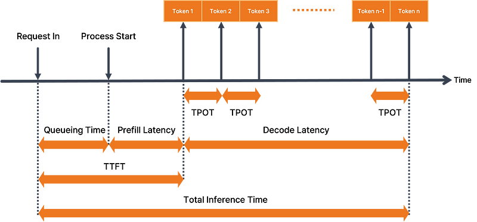

% Metrics

### Request

{ width=500px }

- ttft (Time to First Token)
- tpot (Time Per Token Output)
- e2el (End to End Latency)

### MFU

MFU (Model Flops Utilization)

$$\text{MFU} = \frac{\text{measured throughput}}{\frac{P}{6N + 12LHQT}}$$

implication:

```
                            measured throughput
----------------------------------------------------------------------------
                                    P
        --------------------------------------------------------
          3 * (gemm_flops_per_token + attention_flops_per_token)
```

$\times 3$ in training, ignored in inference 

- measured throughput: measure by perf tool
- P: hardware max flops
- N: model parameters
- 6LH(2QT): 单个 token 在 Attention 阶段的计算量
    - [Each token flops](/Computer/Artificial_Intelligence/Computation.md#Transformer): 4LHQT
    - L: layers
    - H: num_heads
    - Q: head_dims
    - T: seq length

---

Example:

one perf with following results:

- num requests: 4096
- total time: 153s
- input avg: 141
- throughput: 8151
- otps:  4350
- output avg: 164
- A800
    - fp16: 312T flops
    - bandwidth: 2039 GB/s

### MBU

MBU(Model Bandwidth Utilization)

```
   achieved memory bandwidth
-----------------------------------
     peak memory bandwidth
```

```
         N + KV cache size
    ----------------------------
                tpot
-----------------------------------
     peak memory bandwidth
```


KV cache and Model Parameters are saved in GPU global memory.

1 / tpot: how many tokens are generated in a second.
