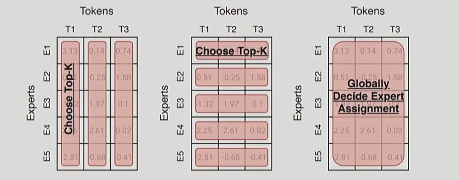
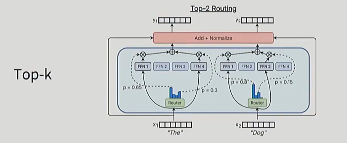

% MoE

Exploiting scale in both training data and model size has been central to the success of deep learning. When datasets are sufficiently large, increasing the capacity (number of parameters) of neural networks can give much better prediction accuracy.

### Idea

The basic idea of MoE is split the FFN into multiple sub-networks(experts), for each input token, only part of sub-networks(experts) are activated. Different sub-networks behavior as different “experts”, during training they absorb different information and knowledge from the dataset, during inferencing only part of experts are activated based on the input token.

- __Gating Network__: This small neural network takes the input and learns to determine which experts are most relevant for processing that specific input. It produces scores or probabilities for each expert

### Dense/Sparse Layer

#### Dense Layer

FFNN (Feedforward Neural Network)

An FFNN allows the model to use the contextual information created by the attention mechanism, transforming it further to capture more complex relationships in the data.

MLP is a type of FFNN

{ width=500px }

#### Sparse Layer

Only activate a portion of the parameters

Each expert learns different information during training

{ width=500px }

### Expert

`MoEGate`：选择专家的模块，为一个 token 选择专家，输入是 embedding + attention。

一个标准的 transformer block：

```
x ──▶ LayerNorm
     └──▶ Multi-Head Attention ───▶ residual add
                                   ↓
                             [hidden_state]
                                   ↓
                             LayerNorm
                                   ↓
                             FeedForward（原版）   
                               ↓
                             MoE（替代版）
                                   ↓
                             residual add
                                   ↓
                              output x
```

```python
# Before MoE
# MoE input = Attention Output + Residual = hidden_state
hidden_state = x + MultiHeadAttention(LayerNorm(x))

# Use MoE to replace FFN
output = FFN(LayerNorm(hidden_state))
output = MoE(LayerNorm(hidden_state))
```

首先通过 MoEGate 计算所有 token 的 logits，计算完之后通过 grouped_topk 为每一个 token 选择若干专家。

- 在 deepseek v3 中，从 256 个专家中选择 8 个

### Routing Function

Three general ideas:

- token choose experts
- expert choose tokens
- globally decide expert assignments

{ width=500px }

In practice, almost all the MoEs do token chooses top k. So each token is going to rank order experts by affinity（计算每个专家的亲和度，这也是 MoEGate 做的事情），and then there's going to be top K choice.

{ width=500px }


$$
\mathbf{h}_t^l = \sum_{i=1}^{N} \left( g_{i,t} \, \mathrm{FFN}_i\left( \mathbf{u}_t^l \right) \right) + \mathbf{u}_t^l,
$$

$$
g_{i,t} =
\begin{cases}
s_{i,t}, & \text{if } s_{i,t} \in \mathrm{Topk}\left(\{s_{j,t} \mid 1 \leq j \leq N\}, K \right), \\
0, & \text{otherwise},
\end{cases}
$$

$$
s_{i,t} = \mathrm{Softmax}_i\left( \left( \mathbf{u}_t^l \right)^\top \mathbf{e}_i^l \right)
$$

### Fine Grained Expert


#### 标准 MoE

标准 MoE 做 token level routing

* 输入 token 的完整 hidden vector（例如 4096 维）会被送到 1 或几个专家。
* 举例：一个 token 可能被分配到专家 3 和专家 7，这两个专家分别处理整个 hidden vector。

#### Fine-Grained Expert

Fined Grained MoE 做维度级的 routing

* 将每个 token 的 hidden vector 拆成多个 chunk（段），例如将 4096 拆成 4 个 1024 维小段。
* 然后为每段单独选择专家：

  * 第一个 chunk → 专家 1
  * 第二个 chunk → 专家 5
  * 第三个 chunk → 专家 1
  * 第四个 chunk → 专家 3
* 类似于专家是在维度上**并行拼接**，而不是处理整个 token。

### Practice

deepseek 之前大多数 MoE 时间都是选取 8-16 个专家，然后在 forward 的过程中激活其中两个专家，deepseek v3 做了一个非常激进的配置，在 256 专家中激活 8 个专家。

| Model          | Routed | Active | Shared | Fine-grained ratio |
|----------------|--------|--------|--------|---------------------|
| GShard         | 2048   | 2      | 0      |                     |
| Switch Transformer | 64     | 1      | 0      |                     |
| ST-MOE         | 64     | 2      | 0      |                     |
| Mixtral        | 8      | 2      | 0      |                     |
| DBRX           | 16     | 4      | 0      |                     |
| Grok           | 8      | 2      | 0      |                     |
| DeepSeek v1    | 64     | 6      | 2      | 1/4                 |
| Qwen 1.5       | 60     | 4      | 4      | 1/8                 |
| DeepSeek v3    | 256    | 8      | 1      | 1/14                |
| OlMoE          | 64     | 8      | 0      | 1/8                 |
| MiniMax        | 32     | 2      | 0      | ~1/4                |
