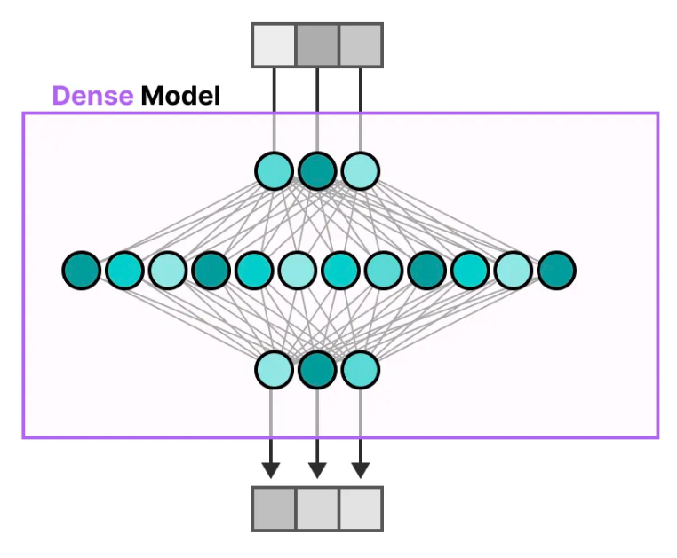
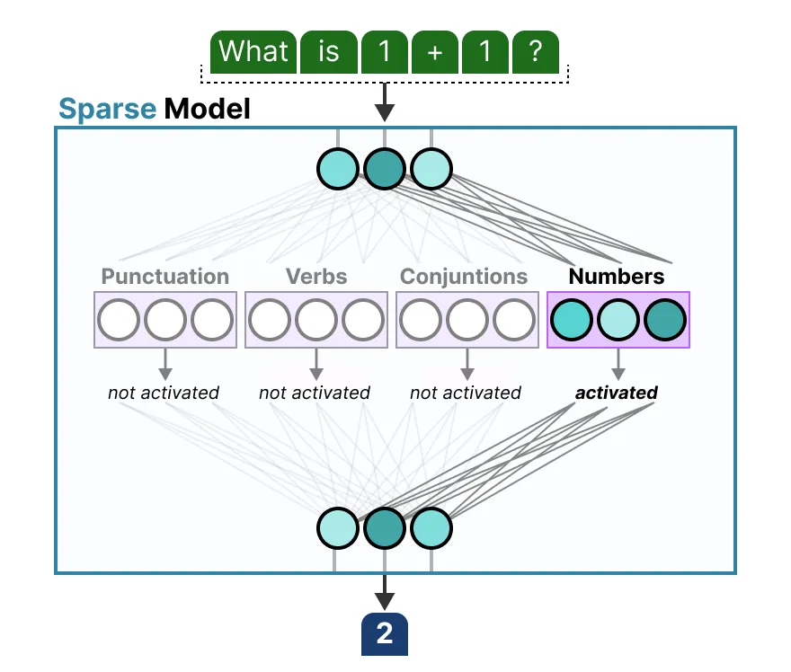
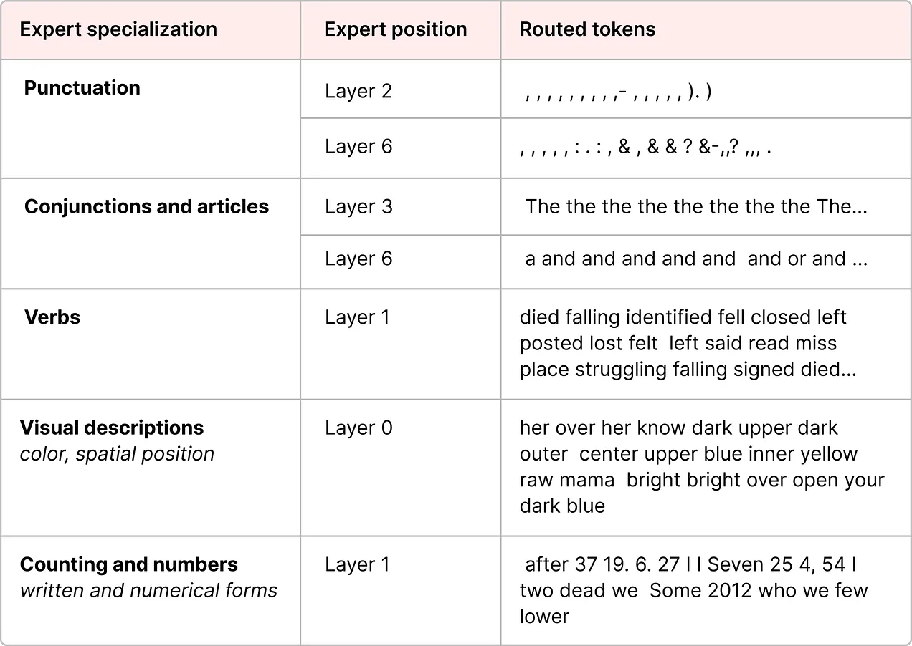

% MoE

### Dense/Sparse Layer

#### Dense Layer

FFNN (Feedforward Neural Network)

An FFNN allows the model to use the contextual information created by the attention mechanism, transforming it further to capture more complex relationships in the data.

MLP is a type of FFNN

{ width=500px }

#### Sparse Layer

Only activate a portion of the parameters

Each expert learns different information during training

{ width=500px }

### Expert

### What to learn

<u>Mixtral Paper</u>

{ width=500px }

------

[MoE walkthrough](https://newsletter.maartengrootendorst.com/p/a-visual-guide-to-mixture-of-experts)
