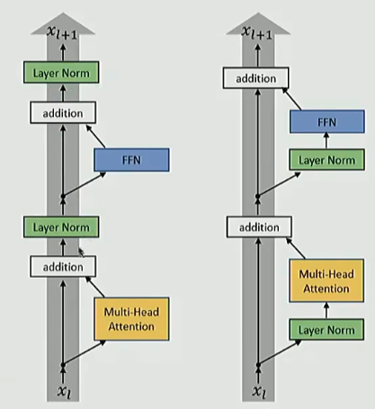

% Normalization

Normalization in deep learning refers to the process of transforming data to conform to specific statistical properties.

There are several ways: standardization or min-max normalization.

### Standardization

$$x' = \frac{x - \mu}{\sigma}$$

One common type is standardization, where each data point is adjusted by subtracting the mean of its column and then dividing by the standard deviation. This transformation results in a new column where the mean is zero and the standard deviation is one.

### Min Max

data is scaled to fit within a given range

__Nomalize data to improve training efficiency__

Imagine you’re training a neural network, and as you update the weights, some of them start getting really big. When that happens, the activations tied to those weights also become large, making it harder for your model to learn effectively. It slows things down and can cause problems in training.

Normalization helps fix this by keeping activations within a stable range. This not only makes the training process more stable but also speeds it up, allowing your model to learn more efficiently.

__Avoid internal covariate shift__ 

### Layer vs RMS

__LayerNorm__

$$y = \frac{x - \mathbb{E}[x]}{\sqrt{\mathrm{Var}[x]} + \epsilon} \cdot \gamma + \beta$$

__RMSNorm__

$$y = \frac{x}{\sqrt{\frac{1}{n} \sum_{i=1}^n x_i^2 + \epsilon}} \cdot \gamma$$

分母是 $x$ 各元素的 __均方根（RMS）__

Modern Explanation - faster and just as good

- fewer operations (no mean calculation)
- fewer parameters (no bias term to store)

__More generally__: dropping bias terms

original transformer: $\text{FFN}(x) = \text{max}(0, xW_1 + b_1)W_2 + b_2$

most implementations: $\text{FFN}(x) = \sigma(xW_1)W_2$

### Pre vs Post

{ width=500px }

✅ **Post-LN Transformer**

$$ x^{\text{post},1}_{l,i} = \text{MultiHeadAtt}(x^{\text{post}}_{l,i}, [x^{\text{post}}_{l,1}, \cdots, x^{\text{post}}_{l,n}]) $$

$$ x^{\text{post},2}_{l,i} = x^{\text{post}}_{l,i} + x^{\text{post},1}_{l,i} $$

$$ x^{\text{post},3}_{l,i} = \text{LayerNorm}(x^{\text{post},2}_{l,i}) $$

$$ x^{\text{post},4}_{l,i} = \text{ReLU}(x^{\text{post},3}_{l,i} W^{1,l} + b^{1,l}) W^{2,l} + b^{2,l} $$

$$ x^{\text{post},5}_{l,i} = x^{\text{post},3}_{l,i} + x^{\text{post},4}_{l,i} $$

$$ x^{\text{post}}_{l+1,i} = \text{LayerNorm}(x^{\text{post},5}_{l,i}) $$

---

✅ **Pre-LN Transformer**

$$ x^{\text{pre},1}_{l,i} = \text{LayerNorm}(x^{\text{pre}}_{l,i}) $$

$$ x^{\text{pre},2}_{l,i} = \text{MultiHeadAtt}(x^{\text{pre},1}_{l,i}, [x^{\text{pre},1}_{l,1}, \cdots, x^{\text{pre},1}_{l,n}]) $$

$$ x^{\text{pre},3}_{l,i} = x^{\text{pre}}_{l,i} + x^{\text{pre},2}_{l,i} $$

$$ x^{\text{pre},4}_{l,i} = \text{LayerNorm}(x^{\text{pre},3}_{l,i}) $$

$$ x^{\text{pre},5}_{l,i} = \text{ReLU}(x^{\text{pre},4}_{l,i} W^{1,l} + b^{1,l}) W^{2,l} + b^{2,l} $$

$$ x^{\text{pre}}_{l+1,i} = x^{\text{pre},3}_{l,i} + x^{\text{pre},5}_{l,i} $$
