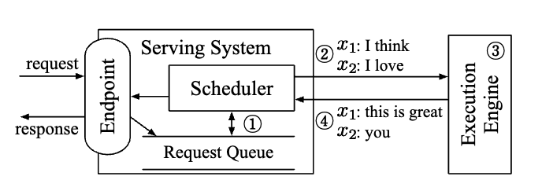

% ORCA

[reference pipeline image](https://friendli.ai/blog/llm-iteration-batching)

### Background

__Characteristics of LLM Model__

- Resnet, Bert: processed by running the model once
- Transformer: an iterative process

__LLM Serving__

agnostic to ML Models, execution engines and computing hardware

- expose endpoints that receives inference requests
- schedule execution of the engine
- send responses to the requests

{ width=400px }

__Batching__

- exploit the vast parrallel computation units
- reuse the model parameters loaded from the off-chip memory

previous batching restrictions:

Batching is only applicable when the two selected requests are in the same phase, with the same number of input tokens (in case of the initiation phase) or with the same token index (in case of the increment phase).

### Keypoint

ORCA’s scheduler can change which requests are going to be processed at every iteration.
