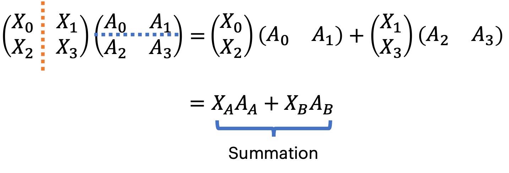

% inference

## Parallelism

| Parallelism    | batch dim | sequence dim | hidden dim | weights        | optimizer |
|----------------|-----------|--------------|------------|----------------|-----------|
| DP             | √         |              |            |                |           |
| TP             |           |              | √          | √(intra-layer) |           |
| Ring Attention |           | √            |            |                |           |
| PP             |           |              |            | √(intra-layer) | √         |
| ZeRO           | √         |              |            |                | √         |
| FSDP           | √         |              |            | √(intra-layer) | √         |


### Model Parallelism

{ width=500px }

- __Intra-Operator__: partitions computationally intensive operators, such as matrix multiplications, across multiple GPUs, accelerating computation but causing substantial communication.
- __Inter-Operator__: organizes LLM layers into stages, each running on a GPU to form pipelines. 

### DP

直接部署多份服务，将数据拆分到不同的服务上。

### TP

将矩阵运算拆分到多个 GPU 上，运算完之后进行 AllGather 或者 AllReduce 的操作。AllGather 适用于 Column-wise sharding，AllReduce 适用于 Row-wise sharding。

对于矩阵乘法 $A \times B$

#### 列拆分

Column-wise sharding 将 $B$ 拆分为 $B_{0}, B_{1}$

{ width=500px }

对结果进行 AllGather 操作，every shard calculates the partial target martix.

#### 行拆分

{ width=500px }

对结果进行 AllReduce 操作，every shard calculates the partial result of the whole target matrix.

```python
import torch
 
# Non-split matrices used for verification.
A = torch.rand(16, 32)
B = torch.rand(32, 8)
C = A @ B
 
# Split A along columns, B along rows, then:
#
# GPU 1: A1, B1
# GPU 2: A2, B2
A1, A2 = A.chunk(2, dim=1)
B1, B2 = B.chunk(2, dim=0)
C1 = A1 @ B1
C2 = A2 @ B2
 
# Verify that the result is the same after an element-wise sum.
torch.testing.assert_close(C, C1 + C2)
```

### PP

the model is split by layer into several chunks, each chunk is given to a device

During the forward pass, each device passes the intermediate activation to the next stage. During the backward pass, each device passes the gradient of the input tensor back to the previous pipeline stage.

Device with PP operates on __mirco-batch__ split by stages.

{ width=500px }

### EP

Expert Parallism

------

[Paradigm of Parallism](https://colossalai.org/docs/concepts/paradigms_of_parallelism/)

[Demystifying Tensor Parallelism](https://robotchinwag.com/posts/demystifying-tensor-parallelism/)
