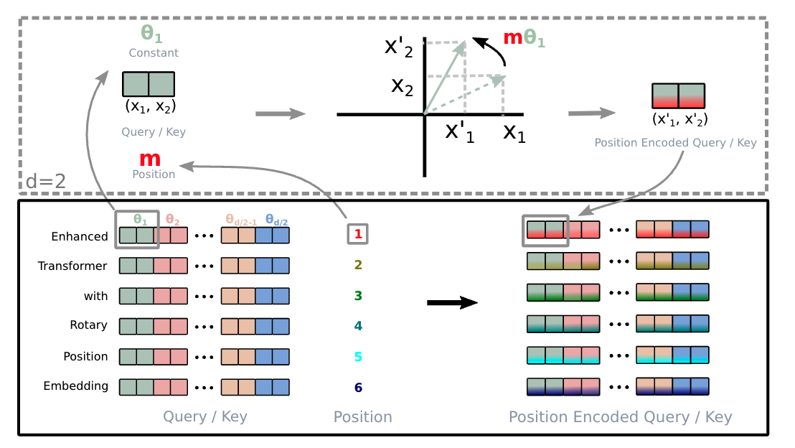

% RoPE

Before introducing RoPE, let’s recap the basics of the attention mechanism. Attention focuses on pair-wise relationships: there’s a query vector q from one token and a key vector k from another. __We obtain the attention score by taking the inner product of q and k, and this inner product is key to how position embeddings function.__

For example, to get the attention score for the pair (1, 3), we get the query vector from token 1 and the key vector from token 3.

The authors then reflect on this formulation and realize that in this setup, __the relative positional information is encoded before the inner product — meaning it’s inherently tied to the token embedding.__

They ask themselves: “Is there another way to encode relative positional information only when we need the attention score — i.e., at the moment we perform the q,k inner product?” Or equivalently, the __q,k__ inner product is __equivalent to another function g that takes only the token embeddings and their positions as input?__

In simple terms, this means that after the transformation, we can either rotate first and then perform the inner product, or we can perform the inner product first and then rotate, and take the real part. In the second approach, we only need (m–n) for the rotation, which signifies that this is a type of relative position embedding.

$$
R^d_{\Theta,m} = \begin{pmatrix}
\cos m\theta_1 & -\sin m\theta_1 & 0 & 0 & \cdots & 0 & 0 \\
\sin m\theta_1 & \cos m\theta_1 & 0 & 0 & \cdots & 0 & 0 \\
0 & 0 & \cos m\theta_2 & -\sin m\theta_2 & \cdots & 0 & 0 \\
0 & 0 & \sin m\theta_2 & \cos m\theta_2 & \cdots & 0 & 0 \\
\vdots & \vdots & \vdots & \vdots & \ddots & \vdots & \vdots \\
0 & 0 & 0 & 0 & \cdots & \cos m\theta_{d/2} & -\sin m\theta_{d/2} \\
0 & 0 & 0 & 0 & \cdots & \sin m\theta_{d/2} & \cos m\theta_{d/2}
\end{pmatrix}
$$

$$\theta_{i} = 10000^{-2i/d}$$

$$f_{\{q,k\}}(\mathbf{x}_m, m) = \mathbf{R}^d_{\Theta,m} \mathbf{W}_{\{q,k\}}\mathbf{x}_m$$

$$
\mathbf{R}^d_{\Theta,m} \mathbf{x} =
\begin{pmatrix}
x_1 \\
x_2 \\
x_3 \\
x_4 \\
\vdots \\
x_{d-1} \\
x_d
\end{pmatrix}
\otimes
\begin{pmatrix}
\cos m\theta_1 \\
\cos m\theta_1 \\
\cos m\theta_2 \\
\cos m\theta_2 \\
\vdots \\
\cos m\theta_{d/2} \\
\cos m\theta_{d/2}
\end{pmatrix}
+
\begin{pmatrix}
-x_2 \\
x_1 \\
-x_4 \\
x_3 \\
\vdots \\
-x_d \\
x_{d-1}
\end{pmatrix}
\otimes
\begin{pmatrix}
\sin m\theta_1 \\
\sin m\theta_1 \\
\sin m\theta_2 \\
\sin m\theta_2 \\
\vdots \\
\sin m\theta_{d/2} \\
\sin m\theta_{d/2}
\end{pmatrix}
$$

{ width=800px }

The objective of RoPE:

$$
\left\langle f_q(\mathbf{x}_m, \mathbf{m}), f_k(\mathbf{x}_n, \mathbf{n}) \right\rangle = g(\mathbf{x}_m, \mathbf{x}_n, \mathbf{m} - \mathbf{n}).
$$

$$
\begin{align*}
f_q(\mathbf{x}_m, m) &= (\mathbf{W}_q\mathbf{x}_m)e^{im\theta} \\
f_k(\mathbf{x}_n, n) &= (\mathbf{W}_k\mathbf{x}_n)e^{in\theta} \\
g(\mathbf{x}_m, \mathbf{x}_n, m-n) &= \text{Re}[(\mathbf{W}_q\mathbf{x}_m)(\mathbf{W}_k\mathbf{x}_n)^* e^{i(m-n)\theta}]
\end{align*}
$$
