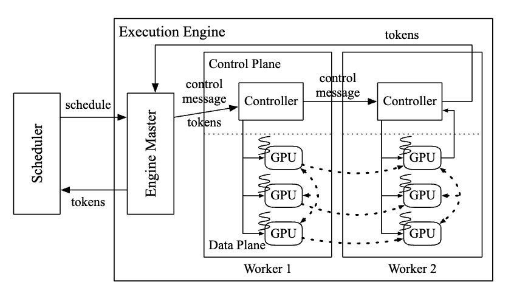

% Scheduling

### Key Design

- Request level scheduling → Iteration level scheduling
    - Resolve: early-finisehd and late-joining requests
- Static Batching → Selective Batching
    - Static batching is only applicable when two selected requests are in the same phase, with the same number of input tokens.
    - In selective batching, the merged tensor can be fed into non-Attention operations.
    - Attention operation requires a notion of requests to compute attention.

{ width=500px }

Split operation and run the attention operation separately on the split tensor for each request.

The outputs of attention operations are merged back into a tensor by a Merge operation.

### Distributed Arch

Each worker is responsible for an inter-layer partition of the model and can be placed on a different machine

{ width=500px }

- Old: cpu-gpu synchronization overhead for control message transfer
- ORCA: seperate the communication channel for message using grpc

Control plane works in CPU (grpc), Data plane works in GPU (nccl)

### Scheduling Alg

```
Params:
n_workers
max_bs
n_slots: number of K/V slot

# number of requets scheduled
n_scheduled ← 0
# slots used by current scheduled requests
n_rsrv ← 0

while true do
    batch, n_rsrv ← Select(request_pool, n_rsrv)
    schedule engine to run one iteration of the model for the batch
    foreach req in batch do
        req.state ← RUNNING
    n_scheduled ← n_scheduled + 1
    if n_scheduled = n_workers then
        wait for return of a scheduled batch
        foreach req in the returned batch do
            seq.state ← INCREMENT
            if finished(req) then
                n_rsrv ← n_rsrv - req.max_tokens
        n_scheduled ← n_scheduled - 1

def Select(pool, n_rsrv):
    batch ← {}
    pool ← { req ∈ pool | req.state ≠ RUNNING }
    SortByArrivalTime(pool)
    foreach req in pool do
        if batch.size() = max_bs then
            break
        if req.state = INITIATION then
            new_n_rsrv ← n_rsrv + req.max_tokens
            if new_n_rsrv > n_slots then
                break
            n_rsrv ← new_n_rsrv
        batch ← batch ∪ {req}
    return batch, n_rsrv
```

- variable number of requests can be batched in selective batching
- FCFS scheduler
- `Select` function selects a batch and there can be at most `n_workers` batches running in distributed orca system

{ width=500px }


