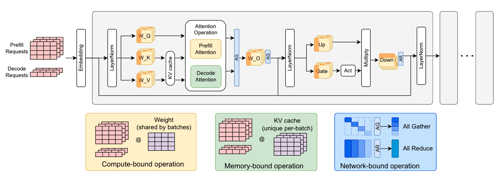

% Transoformer



- Weights:
    - $W_{Q}$, $W_{K}$, $W_{V}$
    - $W_{O}$
    - $W_{up}$, $W_{down}$

__Layers__

```
-------------
[NORM]
[ATTN]
    [QKV]
    [Self Dot-Product]
    [O Proj]
[Residual Add]
[NORM]
[MLP]
    [UP Proj]
    [NORM]
    [DOWN Proj]
[Residual Add]
[NORM]
-------------
```
