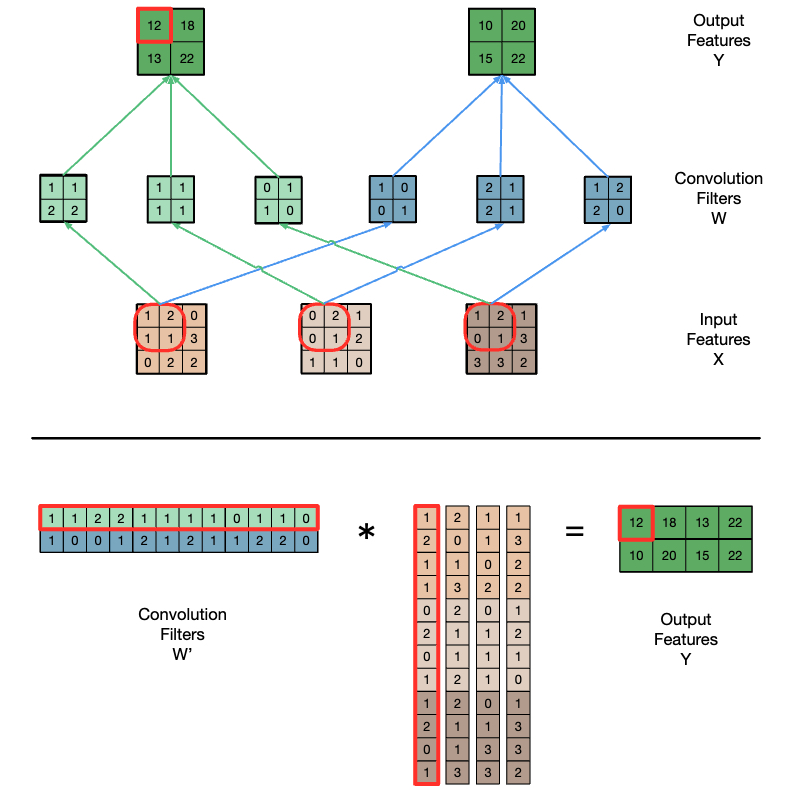

## GEMM

### coalesced

```cpp
__global__ void gemm(float *A, float *B, float *C, unsigned int N) {
    unsigned int row = blockIdx.y * blockDim.y + threadIdx.y;
    unsigned int col = blockIdx.x * blockDim.x + threadIdx.x;
    float sum = 0.0f;
    for (unsigned int i = 0; i < N; i++) {
        sum += A[row * N + i] + B[col + N * i];
    }
    C[row*N + col] = sum;
}
```

### tiled gemm

Example:

- 4 tiles
- `C = A · B`
- `C[0][0] = A[0][0] · B[0][0] + A[0][1] · B[1][0]`
- `(A[0][0], B[0][0])` and `(A[0][1], B[1][0])` are shared by the same thread block to decrease global memory read.

```cpp
__global__ void tiled_gemm(float *A, float *B, float *C, unsigned int N) {
    __shared__ float A_s[TILE_DIM][TILE_DIM];
    __shared__ float B_s[TILE_DIM][TILE_DIM];
    unsigned int row = blockIdx.y * blockDim.y + threadIdx.y;
    unsigned int col = blockIdx.x * blockDim.x + threadIdx.x;
    float sum = 0.0f;
    for (unsigned int t = 0; t < N / TILE_DIM; ++t) {
        // Load tile to shared memory
        A_s[threadIdx.y][threadIdx.x] = A[row * N + t * TILE_DIM + threadIdx.x];
        B_s[threadIdx.y][threadIdx.x] = B[col + (t * TILE_DIM + threadIdx.y) * N];
        __syncthreads(); // wait for others to finish before computing

        // Compute with tile
        for (unsigned int i = 0; i < TILE_DIM; ++i) {
            sum += A_s[threadIdx.y][i] * B_s[i][threadIdx.x];
        }
        __syncthreads(); // wait for others to finish computing before loading
    }
    C[row * N + col] = sum;
}
```

## Reduction

### naive

{ width=500px }

{ width=500px }

```cpp
__shared__ float partialSums[];

unsigned int t = threadIdx.x;

for (int stride = 1; stride < blockDim.x / 2; stride *= 2) {
    if (t % (2 * stride) == 0) {
        partialSums[t] += partialSums[t + stride];
    }
}
```

### divergence free

{ width=500px }

```cpp
__shared__ float partialSums[];
unsigned int t = threadIdx.x;
for (int stride = blockDim.x;  stride > 0; stride >> 1) {
    __syncthreads();
    if (t < stride) {
        partialSums[t] = partialSums
    }
}
```

### warp shuffle

- 每个线程块首先在共享内存中执行归约操作。通过这种方式，线程块内的线程可以快速地累加数据
- 当归约达到 WARP_SIZE 或更少的元素时，算法切换到使用 CUDA 的 shuffle 指令进行 warp 级别的归约。
CUDA 的 shuffle 指令允许在一个 warp内的线程之间直接交换数据，而无需通过共享内存进行同步。这大大提高了归约的效率。

```cpp
__global__ void reduce_kernel(int *input, int *partialSums, unsigned int N) {
    // Load data into shared memory
    ...

    // Reduction tree in shared memory
    for(unsigned int stride = BLOCK_DIM/2; stride > WARP_SIZE; stride /= 2) {
        if(threadIdx.x < stride) {
            input_s[threadIdx.x] += input_s[threadIdx.x + stride];
        }
        __syncthreads();
    }

    // Reduction tree with shuffle instructions
    float sum;
    if(threadIdx.x < WARP_SIZE) {
        sum = input_s[threadIdx.x] + input_s[threadIdx.x + WARP_SIZE];
        for(unsigned int stride = WARP_SIZE/2; stride > 0; stride /= 2) {
            sum += __shfl_down_sync(0xffffffff, sum, stride);
        }
    }

    // Store partial sum
    if(threadIdx.x == 0) {
        partialSums[blockIdx.x] = sum;
    }
}
```

### thread coarsensing

```cpp
__global__ void reduce_kernel(int *input, int *partialSums, unsigned int N) {
    __shared__ int input_s[BLOCK_SIZE];

    unsigned int i = blockDim.x * blockIdx.x + threadIdx.x; // global thread index
    const unsigned int gridSize = gridDim.x * blockDim.x;   // total number of threads

    int muSum = 0; // Local (per-thread) sum
    while (i < N) {
        mySum += input[i];
        i += gridSize;
    }
    input_s[threadIdx.x] = mySum;

    ...
}
```

## Histogram

### sequential

```cpp
void histogram_calc(unsigned int *histo,
                    unsigned int *input,
                    unsigned int input_size) {
    int i = 0;
    while (i < input_size) {
        unsigned int val = input[i];
        histo[val] += 1;
        i++;
    }
}
```

### simple

```cpp
__gloabl__ void histogram_calc(unsigned int *histo,
                               unsigned int *input,
                               unsigned int input_size) {
    int i = blockIdx.x * blockDim.x + threadIdx.x;
    int stride = blockDim.x * gridDim.x;
    while (i < input_size) {
        unsigned int val = input[i];
        atomicAdd(&histo[val], 1);
        i += stride;
    }
}
```

### Privatization + Coarsening

__Privatization__ is an optimization technique where multiple private copies of an output are maintained, then the global copy is updated on completion

- Reduce contention on global memory
- If the output is small enough, the private copy can be placed in shared memory reducing access latnecy.

__Coarsening__: Each block processes several chunks.

```cpp
__global__ void histogram_kernel(unsigned int *histo, unsigned int *input, unsigned int input_size){
    int tid = blockIdx.x * blockDim.x + threadIdx.x; // Thread index
    int stride = blockDim.x * gridDim.x; // Total number of threads
    __shared__ unsigned int histo_s[BINS]; // Private per-block sub-histogram

    // Sub-histogram initialization
    for(int i = threadIdx.x; i < BINS; i += blockDim.x) {
        histo_s[i] = 0;
    }
    __syncthreads(); // Intra-block synchronization

    // Main loop to compute per-block sub-histograms
    for(int i = tid; i < input_size ; i += stride) {
        unsigned int val = input[i]; // Global memory read (coalesced)
        atomicAdd(&histo_s[val], 1); // Atomic addition in shared memory
    }
    __syncthreads(); // Intra-block synchronization

    // Merge per-block sub-histograms and write to global memory
    for(int i = threadIdx.x; i < BINS; i += blockDim.x) {
        // Atomic addition in global memory
        atomicAdd(histo + i, histo_s[i]);
    }
}
```

## convolution

Convolution applies a filter or mask or kernel* on eachelement of the input (e.g., a signal, an image, a frame) toobtain a new value, which is a weighted sum of a set ofneighboring input elements

- convolutions are traditionally used for feature detection in image processing
    - They can be used as neural network layers
- convolutions have an advantage over fully connected layers (e.g. in MLP)
    - loacl weights: They compute on only a window around the element of interest
    - data sharing via on-chip memories is feasible

{ width=500px }

### simple

```cpp
__global__ void convolution_1D_basic_kernel(float *N, float *M, float *P,
                                            int Mask_Width, int Width) {
    int i = blockIdx.x * blockDim.x + threadIdx.x; // Index of output element
    float Pvalue = 0;
    int N_start_point = i - (Mask_Width/2); // Index of first neighbor
    for (int j = 0; j < Mask_Width; j++) {
        // Check the boundaries
        if (N_start_point + j >= 0 && N_start_point + j < Width) {
            Pvalue += N[N_start_point + j] * M[j]; // Multiply and accumulate
        }
    }
    P[i] = Pvalue; // Store output element
}
```
