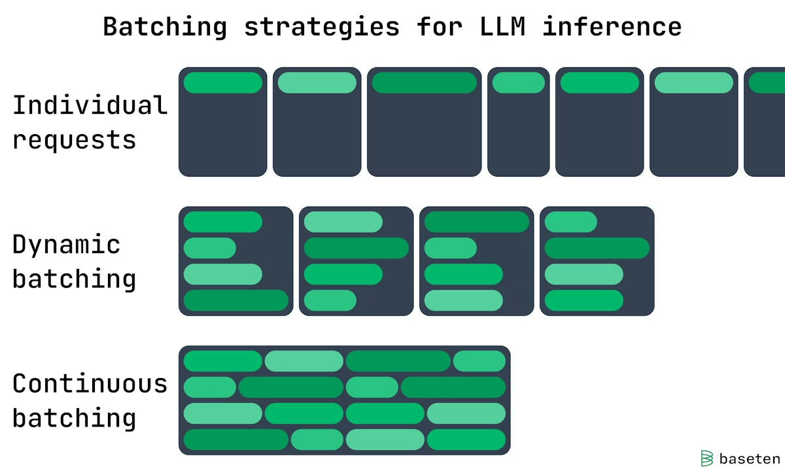

% inference

## Parallelism

| Parallelism    | batch dim | sequence dim | hidden dim | weights        | optimizer |
|----------------|-----------|--------------|------------|----------------|-----------|
| DP             | √         |              |            |                |           |
| TP             |           |              | √          | √(intra-layer) |           |
| Ring Attention |           | √            |            |                |           |
| PP             |           |              |            | √(intra-layer) | √         |
| ZeRO           | √         |              |            |                | √         |
| FSDP           | √         |              |            | √(intra-layer) | √         |

### Model Parallelism

{ width=500px }

- __Intra-Operator__: partitions computationally intensive operators, such as matrix multiplications, across multiple GPUs, accelerating computation but causing substantial communication.
- __Inter-Operator__: organizes LLM layers into stages, each running on a GPU to form pipelines. 

### DP

Data Parallelism is most common due to its simplicity:

the dataset is split into several shards, each shard is allocated to a device.

{ width=500px }

### TP

Tensor Parallelism: 

{ width=500px }

{ width=500px }

{ width=500px }

Collective communications involve network-intensive operations are required after the operation.

Operations

- AG (AllGather): column-wise
- AR (AllReduce): row-wise

### PP

the model is split by layer into several chunks, each chunk is given to a device

During the forward pass, each device passes the intermediate activation to the next stage. During the backward pass, each device passes the gradient of the input tensor back to the previous pipeline stage.

Device with PP operates on __mirco-batch__ split by stages.

{ width=500px }

### EP

Expert Parallism

## Batching

{ width=500px }

- __Continuous Batching__: continuous and dynamic gpu memory
- __Static Batching__: create static gpu memory for each request

batch size: how many user inputs are processed concurrently in the LLM. 

### metrics

{ width=500px }

- ttft (Time to First Token)
- tpot (Time Per Token Output)
- e2el (End to End Latency)
- MBU (Model Bandwidth Utilization):
    - (achieved memory bandwidth) / (peak memory bandwidth)
    - achieved memory bandwidth = ((total model parameter size + KV cache size) / TPOT)

------

[Paradigm of Parallism](https://colossalai.org/docs/concepts/paradigms_of_parallelism/)
