% neural network

## 术语

- dimension size：维度大小
- number of dimensions：维数
- embedding matrix：嵌入矩阵
- dtype：数据类型
    - BF16
    - FP16
    - FP32
- cuda graph

## 基础

### perceptron

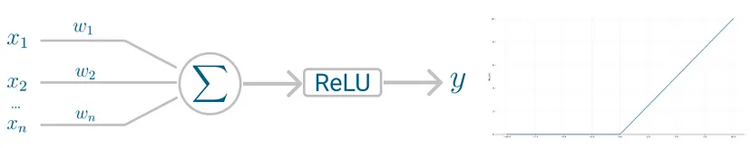{ width=500px }

The neuron receives inputs and picks an initial set of weights a random. These are combined in weighted sum and then ReLU, the activation function, determines the value of the output.

perceptron can learn the weights by __stochastic gradient descent__. Once it converges, the dataset is separated into two regions by a linear hyperplane.

{ width=250px }

Perceptron also has its limitations: it cannot represent XOR gate, where the gate only returns 1 if the inputs are different.

### multilayer perceptron

The Multilayer Perceptron was developed to tackle this limitation. It is a neural network where the mapping between inputs and output is non-linear.

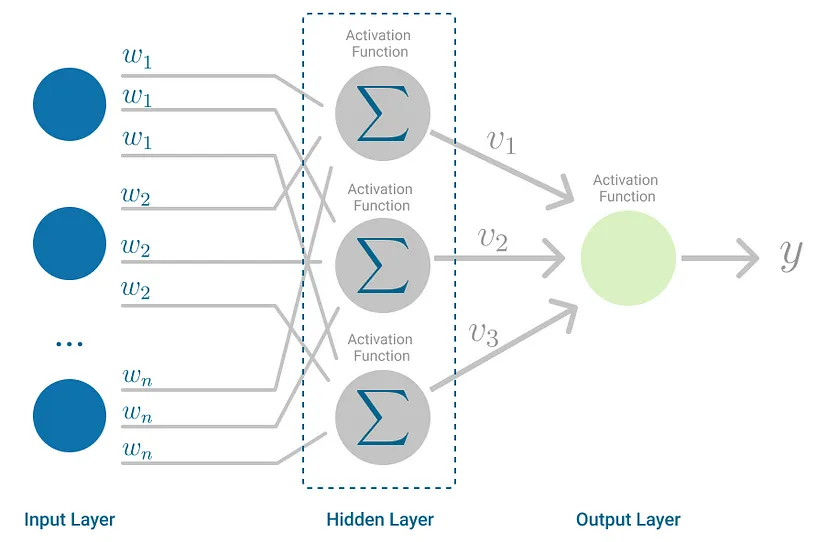{ width=500px }

Multilayer Perceptron falls under the category of feedforward algorithms.

If the algorithm only computed the weighted sums in each neuron, propagated results to the output layer, and stopped there, it wouldn’t be able to learn the weights that minimize the cost function. If the algorithm only computed one iteration, there would be no actual learning.

### backpropagation

Backpropagation is the learning mechanism that allows the Multilayer Perceptron to __iteratively adjust the weights__ in the network, with the goal of minimizing the cost function.

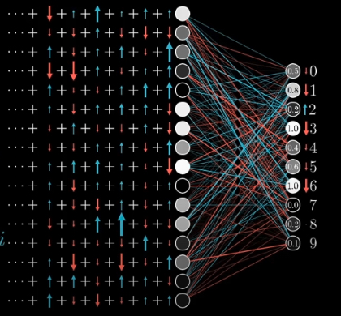{ width=250px }

Each node expected the previous layer's nodes to be either lighter or dimer.

Suppose $b = a_{0} w_{0} + a{1} w_{1} + \cdots + a_{n} w_{n}$

Then we increase $w_{i}$ in proportion to $a_{i}$, also change $a_{i}$ in proportion to $w_{i}$

### activation function

<b><u>ReLU (Rectified Linear Function)</u></b>

$$f(x) = \frac{x + |x|}{2}$$

### tensor

The input has to be formatted as an array of real numbers.
It could mean a list of numbers, a two-dimensional array or a higher dimensional array.

The general term is __tensor__.

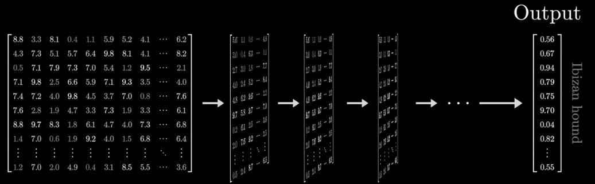{ width=600px }

### word embeddings

in GPT3 they have 12,288 dimensions

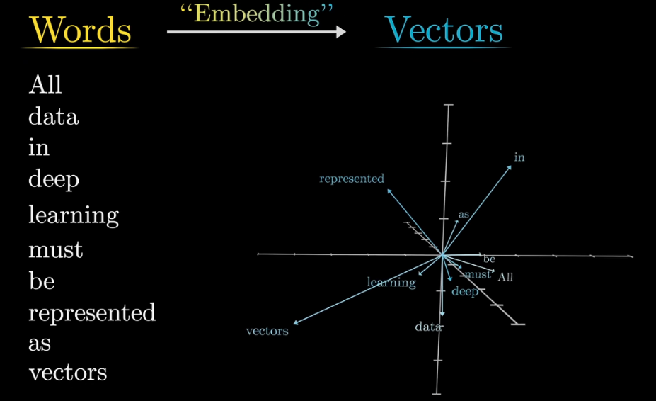{ width=500px }

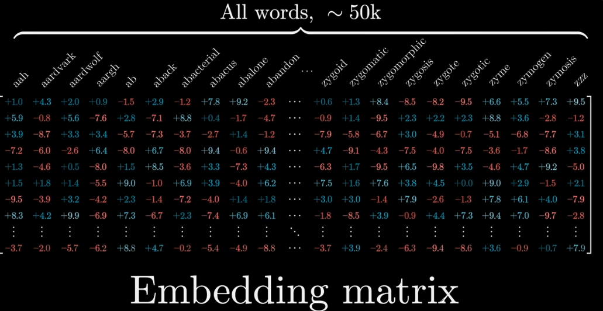{ width=500px }

vector substraction to measure difference

vector alignment measred by $\frac{| v_1 \cdot v_2 |}{| v_1 | \cdot | v_2 | }$ （dot product, inner product）

### hidden state

### unembedding matrix

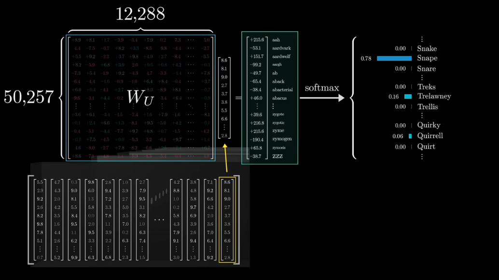{ width=500px }

the size of unembedding matrix is `d_model * vocab_size`

__logits:__ the vector of raw (non-normalized) predictions that a classification model generates, which is ordinarily then passed to a normalization function.

### softmax

softmax 是激活函数的一种

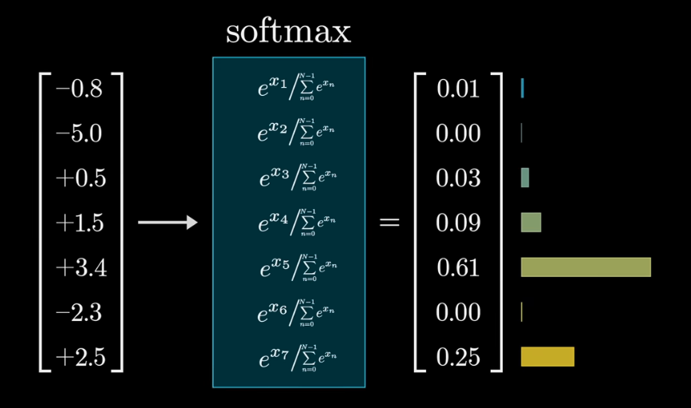{ width=500px }

softmax 其实就是将一个数组转化为另一个概率分布数组，对于输入数组中的元素 $z_{i}$，它在结果数组中的值为

$$\text{softmax}(z_i) = \frac{e^{z_{i}}}{\sum_{j=1}^{K} e^{z_{j}}}$$

当然这里是假设有 K 个元素

还有一个函数叫 log\_softmax，因为 softmax 使用对数计算，可能会溢出

$$\text{log_softmax}(z_i) = log(\frac{e^{z_{i}}}{\sum_{j=1}^{K} e^{z_{j}}}) = z_i - log(\sum_{j=1}^{K} e^{z_{j}})$$

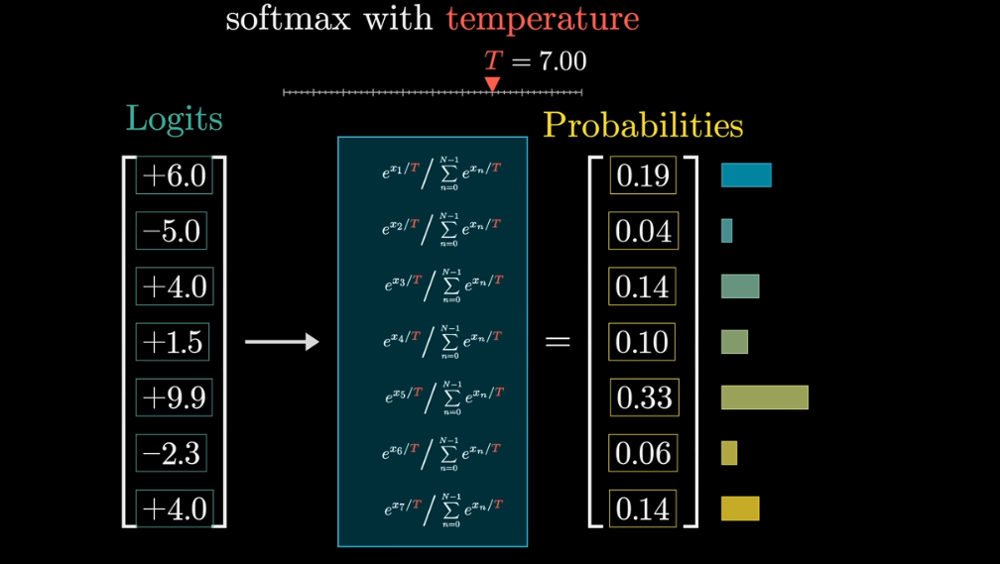{ width=500px }

when temperature is higher, the higher value is more focused.

## 层

### FC

全连接层（Fully Connected Layer）执行线性变换，核心操作是通过权重矩阵对输入张量（X）进行线性变换，并且加上一个偏置矩阵/向量，这个变换将输入空间中的特征映射到输出空间中

$$O = WX + B$$

### Attention

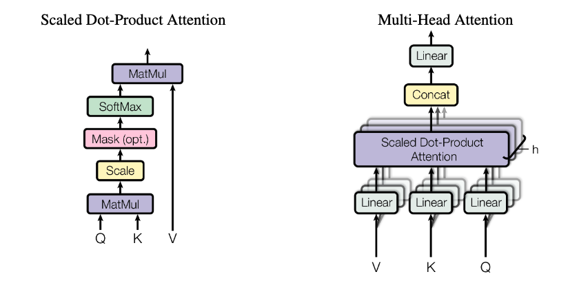{ width=650px }

$$Q = XW^{Q}$$

$$K = XW^{K}$$

$$V = XW^{V}$$

$$\text{Attention}(Q,K,V) = \text{softmax} (\frac{QK^T}{\sqrt{d_{k}}}) V$$

$$\text{MultiHead}(Q,K,V) = \text{Concat}(\text{head}_{1}, \dots, \text{head}_{h}) W^{O}$$

$$\text{head}_i = \text{Attention}(QW_{i}^{Q}, KW_{i}^{K}, VW_{i}^{V})$$

输入嵌入矩阵 $X$ 的尺寸通常为 $b \times n_{seq} \times d_{model}$，其中 $b$ 为 batch size 即一次推理中同时处理的样本数量，$n$ 为 sequence length 即序列中的 token 数量，$d_{model}$ 为特征维度，在 transformer 的不同层中保持一致。

查询矩阵 $W^{Q}$ 的尺寸为 $d_{model} \times d_{model}$，$Q = X \cdot W^{Q}$ 的尺寸为 $b \times n_{seq} \times d_{model}$。键矩阵 $W^{K}$ 和值矩阵 $W^{V}$ 是一样的。

对于每一个注意力头 $i$，查询矩阵 $W_{i}^{Q}$ 的尺寸为 $b \times d_{model} \times d_{k}$，其中 $d_{k} = \frac{d_{model}}{n_{head}}$

$Q, K, V$ 的形状与 $X$ 一致也是 $b \times n_{seq} \times d_{model}$，MultiHeadAttention 的形状为 $b \times n_{seq} \times d_{model}$

$Q_{i}, K_{i}, V_{i}$ 的形状是 $b \times n_{seq} \times d_{k}$，Attention 的形状为 $b \times n_{seq} \times d_{k}$

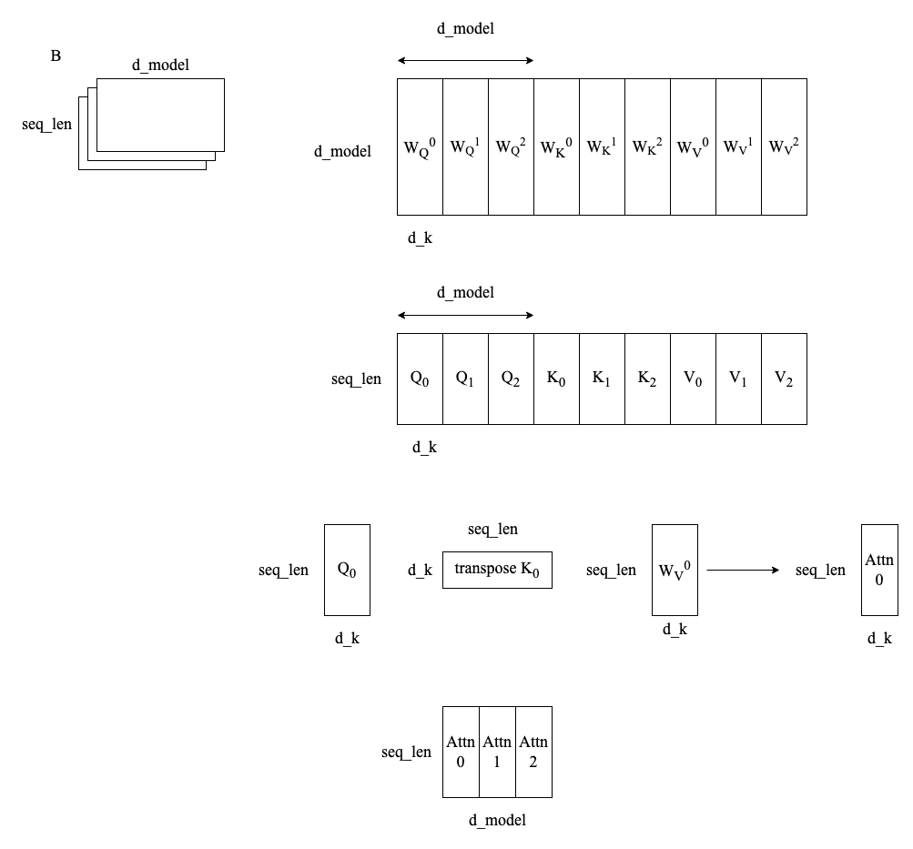{ width=700px }

__pytorch如何进行多头的并行计算__

`(batch_size, seq_len, d_model)` → `(batch_size, seq_len, n_head, d_head)` →(permute)→ `(batch_size, n_head, seq_len, d_head)` →($Q \times K^{T} \times V$)→ `(batch_size, n_head, seq_len, d_head)`

pytorch 中的矩阵乘法对于多维矩阵会自动进行并行化处理，注意前面维度的大小必须一致。

### MLP

多层感知机（Multiple Layer Perception），将输入张量通过线性变换映射到一个更高的维度，然后再映射回来，这个过程称为【扩展和压缩】。

为什么要这样？

### Normalization

- 减少数据中的极端值，从而避免计算过程中可能出现的数值不稳定性。
- 通过将输入数据或激活函数的输出调整到一个较小的范围（通常是0到1或-1到1），可以加速梯度下降算法的收敛速度。

## 模型

### Transformers

Process: tokenizer → (attention → multi layer perception → norm)+ → unembed

For each word, you might raise a question with its context.
This question is encoded as yet another vector which we call __query vector__. The query vector has a much smaller dimension than the embedding vector.

$$ [Q, K, V] = XW + b $$

$$ Q_i, K_i, V_i = \text{split}(Q, K, V) $$

$$ \text{Attention}(Q_i, K_i, V_i) = \text{softmax}\left(\frac{Q_i K_i^T}{\sqrt{d_k}} + \text{mask}\right) V_i $$

$$ \text{Concat}(head_1, head_2, \ldots, head_h) $$

$$ O = \text{Concat}(head_1, head_2, \ldots, head_h)W_o + b_o $$

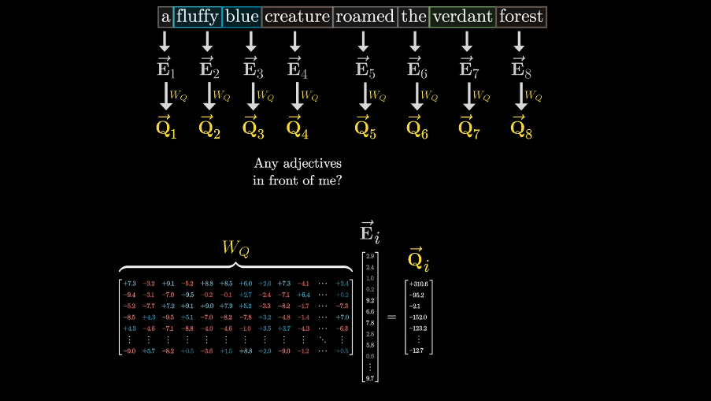{ width=500px }

compute the query vector by $W_{Q} \cdot \vec{E_{i}} = \vec{Q_{i}}$

The entries of this matrix are parameters of the model. which means the true behavior is learned from data.

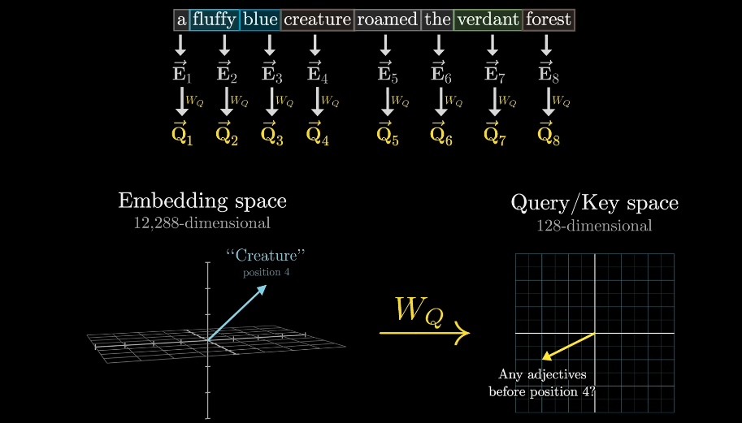{ width=500px }

In this example, the action of looking for an adjactives in noun's preceding positions is encoded as a query vector.

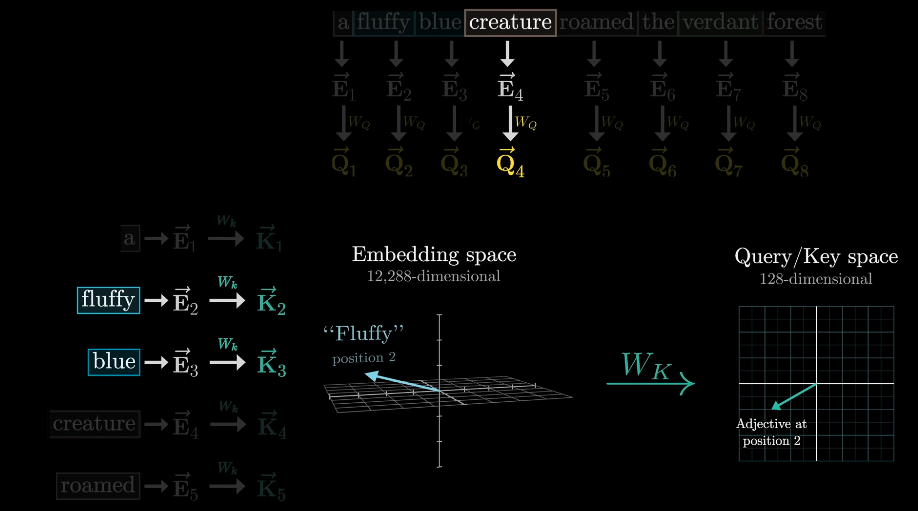{ width=500px }

Conceptually, you want to think of the keys as potentially answering the queries.

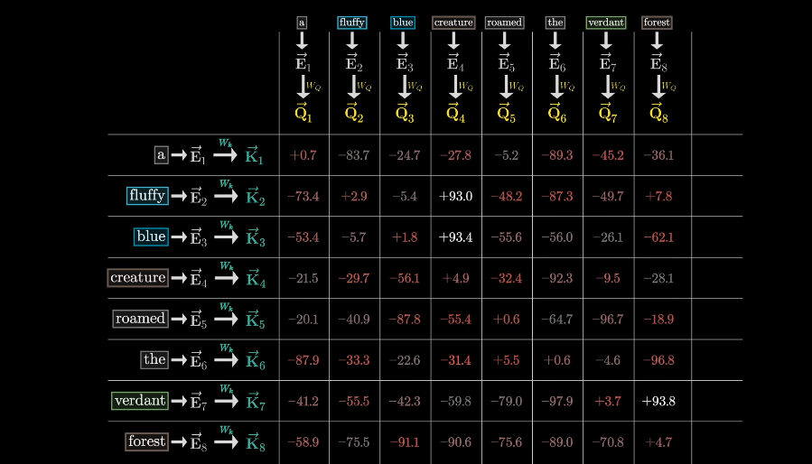{ width=500px }

To measure how well each key matches each query, you compute a dot product between each possible key-query pair.

This grid gives us a score for how relevant each word is to update the meaning of every other word

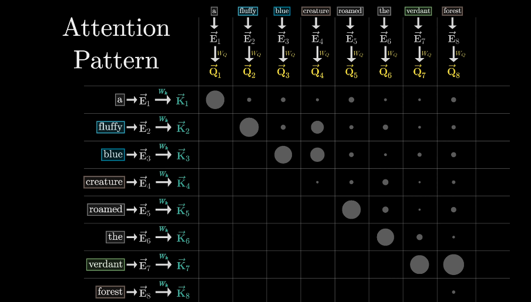{ width=500px }

Computing this pattern lets the model __deduce the words' relevance__.
Now you need to actually update the embeddings, allowing words to __pass information__ to whichever other words they're relevant to.

This most straightforward is to use a matrix $W_{V} \times \vec{E} = \vec{V}$.

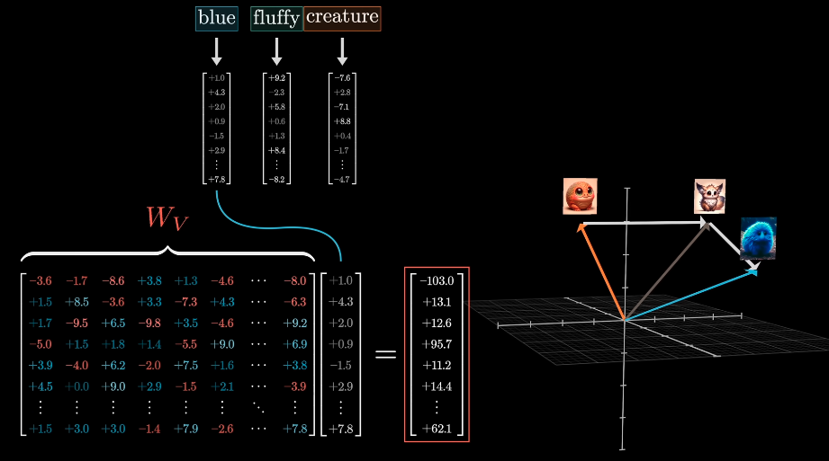{ width=500px }

When adding $\vec{V}$ to the relevant word, the result a vector with more meaning.

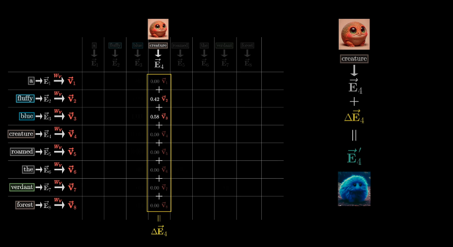{ width=500px }

Weighted sum of value vector is added to the embedding vector.

Each weight is computed by dot product of key and query vector.

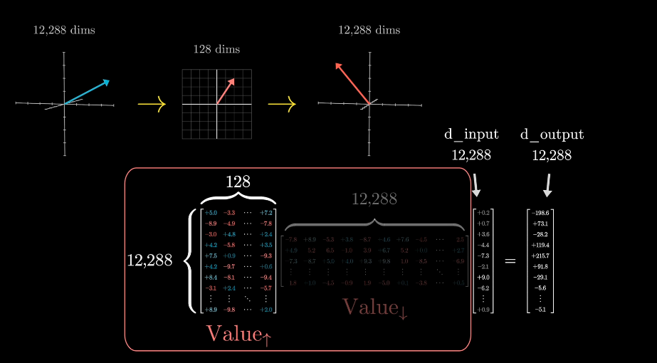{ width=500px }

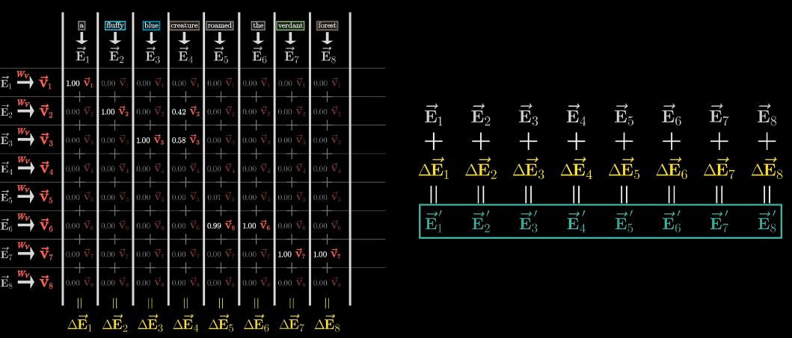{ width=500px }

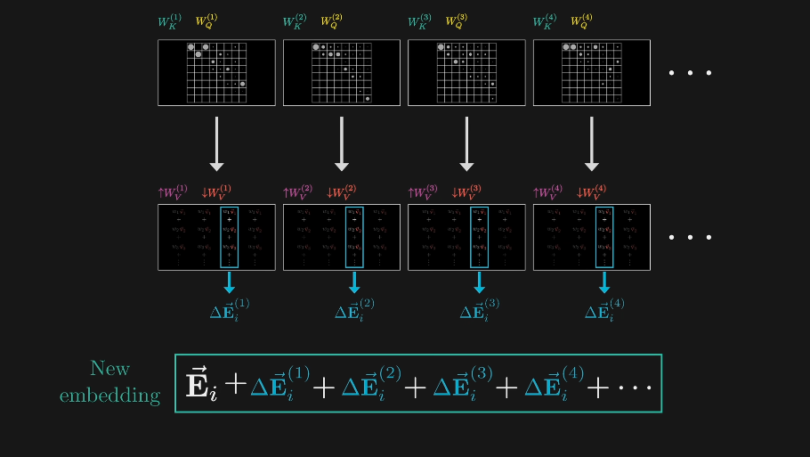{ width=500px }

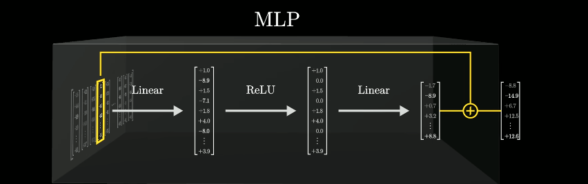{ width=500px }

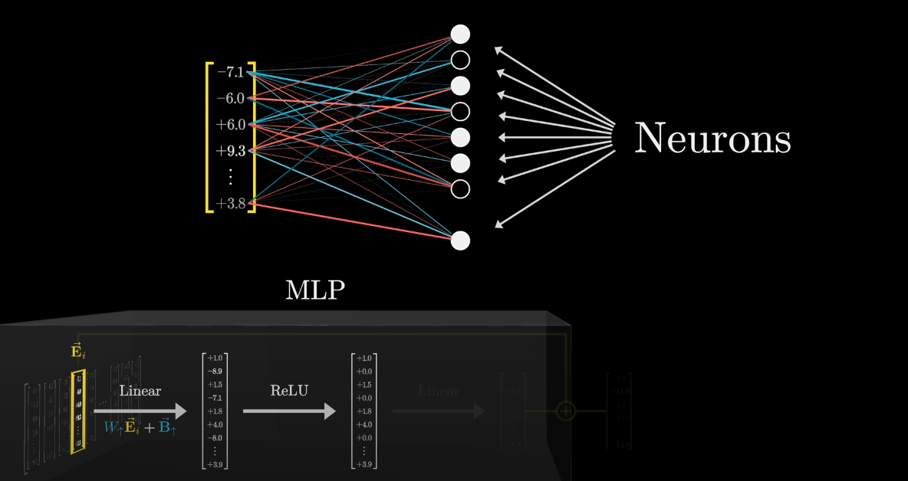{ width=500px }

The rows of the first matrix can be thought of as directions in embedding space, and that means the activation of each neuron tells you how much a given vector aligns with some specific direction.

The columns of the second matrix tell you what will be added to the result if the neuron is active.

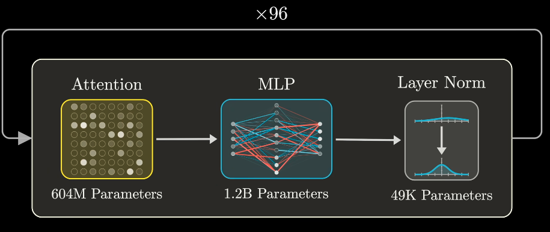{ width=500px }

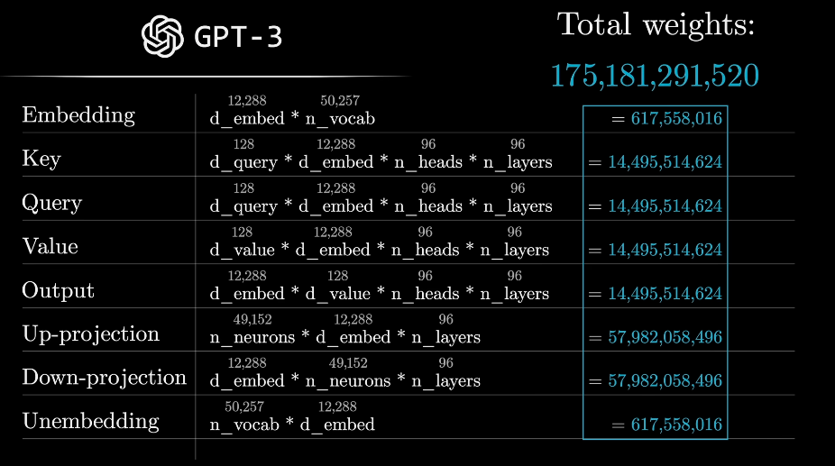{ width=500px }

### Attention

- raw tokens → encoded tokens
    - `(B, t)`
- encodeds tokens → embedding vector
    - `(B, t)` → `(B, t, d_model)`
    - $\vec{embd} = \vec{wpe} + \vec{wte}$
- $\vec{embd}$ -----(n blocks)-----> $\text{more_detail}(\vec{embd} + \vec{attn})$
    - block
        - attention layer
        - norm layer
        - mlp layer
        - norm layer
    - attention: `(B, t, d_model)` → `(B, n_head, t, d_head)` → `(B, t, d_model)`
        - $Q \times K^{T} \times V$: `(t, d_model) · (d_model, t) · (t, d_model)` → `(t, d_model)`
    - mlp: `(B, t, d_model) → (B, t, d_model * 3) → (B, t, d_model)`
- attn vector → vocab
    - `(B, t, d_model)` → `(B, t, vocab_size)`
    - `logits = output[i][-1], 0 <= i < B`

shape of $W_{i}^{Q}, W_{i}^{K}, W_{i}^{V}$ is `(d_model, d_k)`

$Q_{i} = x \cdot W_{i}^{Q}$ → `(B, t, d_model) · (d_model, d_k)` → `(B, t, d_model) · (B, d_model, d_k)` → `(B, t, d_k)`

generally `d_k · n_heads = d_model`

```
                  encoder
sentence (B, T) -----------> embd (B, T, M)
                  attention
            /-  -----------> embd + attn (B, T, M)
            |       norm
            |   ----------->
       12x  |       MLP
            |   -----------> more_detail(embd + attn) (B, T, M)
            |       norm
            \-  ----------->
                 tok linear
                -----------> vocabs (B, T, V)
            T=-1, retrieve the V
                -----------> logits (B, V)
```

### Size

- inputs: `n` tokens
- embeddings: `(n, d_model)`
- Q,K,V: `(n, d_model)` ---> `(n, head_num, d_head)`

__size of each K, V tensor?__

`hidden_size * num_layers *  wp`
