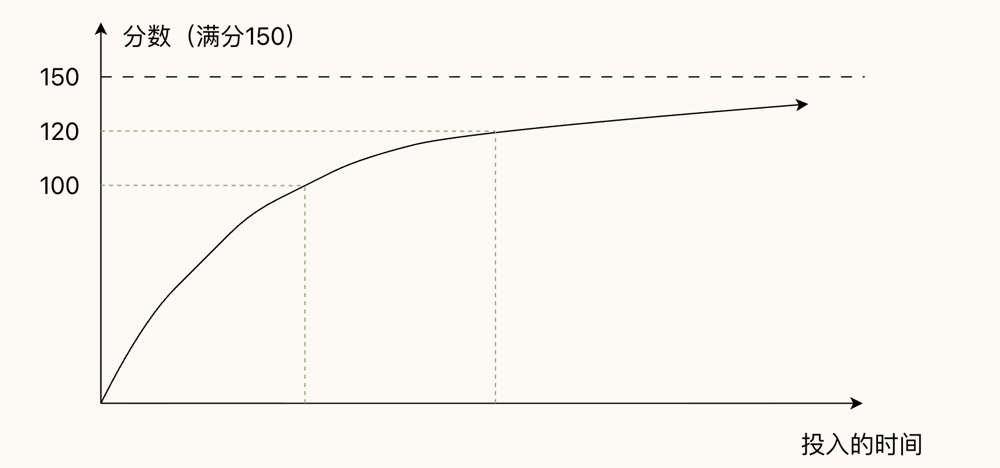

% Intro

__408 学习两大定律：廉价七成和体系化__

### 廉价七成

知识点的重要程度有高低之分，掌握重点可以 “快速” 帮你提升到 110-120 分。

更高的分数需要投入极多的精力，性价比需要由你自己衡量。

#### 知识点掌握的四个层次

学习英文单词 → 一般知识点

1. 看到文字能够认出来 → 对于知识点细节只有基本印象，看到选项能选出正确答案（__C__）
2. 听到单词能够认出来 → 稍作思考可以想出来（__B__）
3. 可以在写作中运用 → 可以快速的公式化的写出来（__A__）
4. 可以在口语中运用 → 知道会怎么考，甚至可以自己去出相似的题目（__S__）

以上四个层次，优先级从高到低使用 S、A、B、C 四个字母来标注。

### 体系化

不通过单一媒介学习知识，牢靠的知识体系是一张复杂的网络结构，每个知识点要和其他知识点建立足够多的连接。

- 对于知识有图形化的想象
- 学习 和 实践/做题 结合
- 把握知识的底层脉络
- 口述知识（费曼学习法）
