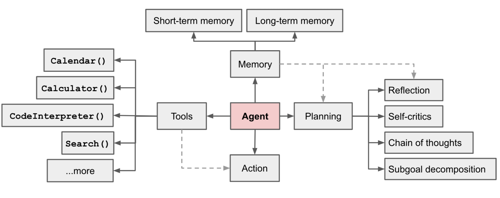

% AIOps

### 概念

#### Agent

GPT 和 Agent 的区别：

- GPT = generative pre-trained transformer，也就是生成式预训练转换器，这是驱动大型语言模型（LLM）如 ChatGPT 的核心机器学习模型架构。
- Agent（Agent）= 一个设置了一些目标或任务，可以迭代运行的大型语言模型。它与大型语言模型（LLM）在像ChatGPT这样的工具中“通常”的使用方式不同。在ChatGPT中，你提出一个问题并获得答案作为回应。而Agent拥有复杂的工作流程，可以自我对话，而无需人类驱动每一部分的交互。

Agent 的能力：

1. 规划（Planning）：智能体将大型任务分解为更小、更易于管理的子目标，从而实现复杂任务的有效的处理。它还可以对过去的行动进行自我批评和反思，从错误中学习，并为未来的步骤改进它们，从而提高最终结果的质量。
2. 记忆（Memory）：短期记忆包括上下文学习，长期记忆使代理能够保留和回忆（无限期）信息。
3. 工具使用（Tool use）：智能体学会了调用外部API以获取模型权重中缺失的额外信息，包括当前信息、代码执行能力、访问专有信息源等。

#### 大模型

- Temperature：控制模型生成文本时的随机性。较高的温度会使生成的文本更加随机和多样化，而较低的温度会使生成的文本更加确定和集中。
- Toq p：从累积概率达到 p 的最有可能的词汇中采样。预测时下一个词有很多潜在的可能性，p设置的值越大可选择的词汇越多。
- Max Tokens：控制模型生成文本的最大长度，即生成的单词或符号的最大数量。

### AI

- 为AI提供更加准确的上下文
    - 上下文包含项目、框架、依赖、业务、代码的注释、文档、已经实现的功能等
        - 在文件头部添加说明
            - 介绍什么时候使用该文件
            - 其他需要特殊说明的，对于有内容规律的文件，说明内容的规律
        - 实现组织好外部依赖
        - 用注释加强代码理解
        - 使用有意义的命名
        - 准备高质量的私域知识
            - 文字描述丰富
            - 文档结构清晰
            - 目录结构清晰
- 写代码之前先写注释
    - 何时写注释？
        - 新建文件时：描述文件功能、依赖关系和注意事项
        - 实现函数前：描述函数的功能、输入和输出
        - 实现关键功能、边界条件和复杂逻辑：描述代码意图和需求
- 写完代码让AI查一查
- 让AI复用并拓展你的能力
    - 连通整个研发流程，让研发过程更加专注
