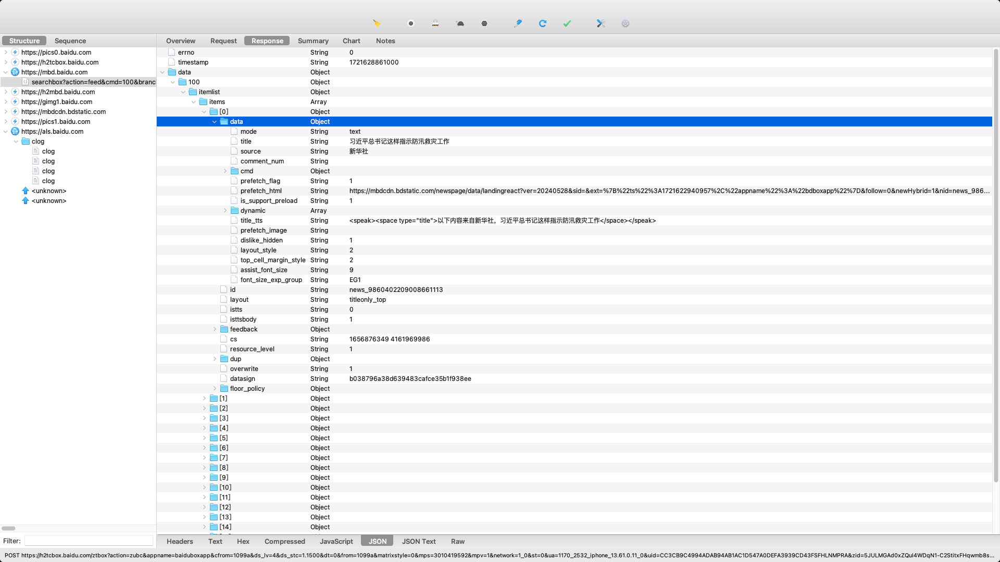
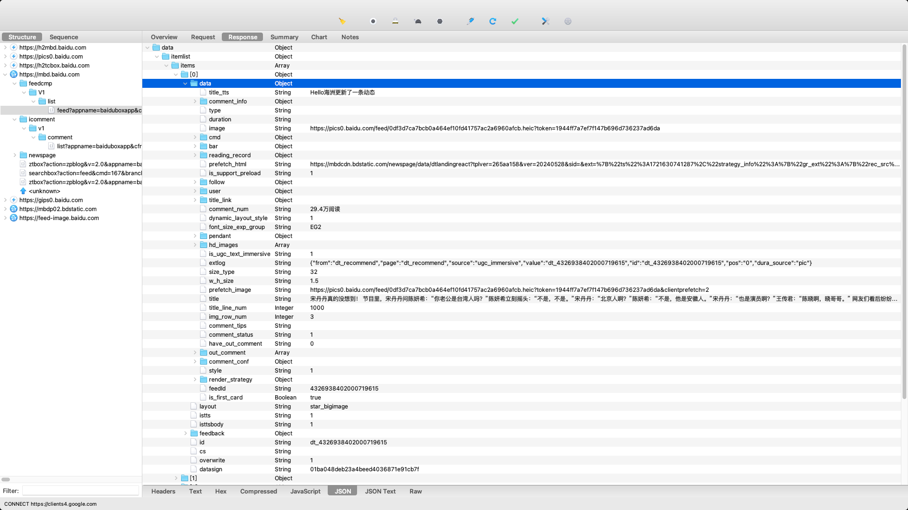
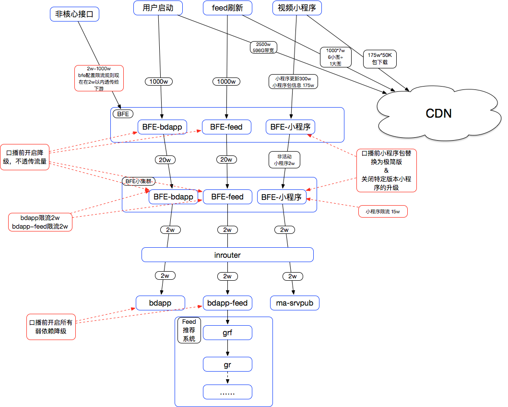

% 手机百度架构

### 业务梳理

- __下拉刷新__

请求 `mbd.baidu.com/searchbox?action=feed?cmd=100`，刷新当前推荐页面，服务端返回的响应为一个feed列表。

每个feed都包含在主页现实的具体信息，包含政治要求信息、推荐post 以及 广告。

根据 cmd 号提供不同的 feed 信息，比如有的是博主，有的是主页新闻，有的是推荐搜索内容

请求 `h2tcbox.baidu.com/ztbox?action=zubc`，tcbox是统计模块，提供打点、跳转统计支持。

- __读取具体页面__

请求 `mbd.baidu.com/searchbox?action=feed?cmd=102`

有的会进入 feedcmp，显示百度动态，具体内容包含一系列推荐的具体内容，与下拉刷新类似

其中通过 `mbd.baidu.com/v1/comment/list?` 获取评论列表

`himg.bdimg.com/sys/portrait/item` 显示用户头像

`mbd.baidu.com/newspage` 显示九图页面 以及 放大页面

`pics0.baidu.com/feed` 显示页面中的图片

- __点击博主个人主页__

请求 `mbd.baidu.com/webpage`

`ext.baidu.com/api/subscribe/v1/relation/recommand?` 显示相似博主

`*.bdstatic.com` 返回静态资源

- __关注和取关__

访问 `ext.baidu.com/api/subscribe/v1/relation/receive?`

通过 type 标记用户类型，third_id 标记用户号，optype 标记关注或取关，通过 add 和 cancel

- __个人主页__

`mbd.baidu.com/userx/v1/info`

- __搜索__ 

`m.baidu.com/s?word=`

### 架构分析

### 名词解释

- HTTP REQUEST ARGUMENTS
    - uid：登录用户的passport uid，同一用户的uid不变，所有登录用户都有
    - zid
    - baiduid：cookie id，生命周期同cookie，易变。
    - mps, mpv: [双清单功能](https://ku.baidu-int.com/knowledge/HFVrC7hq1Q/qCCPuIpbfn/GDGp0e0TRH/vWcZS8O07cp2Q4)
    - cuid：设备id，同一设备的cuid不变，native app有（手百，好看），web app没有（wise，中途岛）
    - ztbox：将用户行为转化为埋点日志，包含很多详细的信息，比如用户停留长度，客户端信息等等
- FEED MODULES
    - sbox：一个中间服务层，对上需要拉取前端的用户交互，对下需要拉取gr的feed队列资源
    - gr：global recommender，决定下游数据的分发，是feed数据的融合层
    - fs：feature service，特征服务，包含 ums 和 gcms
    - ums：user model service，用户数据 + 从数据中抽取的用户特征（包括 attention, tags）的集合
    - gcms：global content management system，全局内容管理系统（说的正排一般指这个）
    - al4：algorithm4，分发用户模型，通过上游日志流（rdc）实时获取用户交互行为，产出描绘用户对兴趣点、一二级分类等的偏好情况的用户模型。通俗来说，是从pipe中读取用户下发，展现，点击，dislike等日志，进行策略处理，更新用户模型。当前应用于feed流分发、视频、图集等队列和gr的召回、排序、过滤等。
    - bs：basic seearcher，基本检索系统，提供倒排索引的检索
    - disp：disp模块是一个计算密集型模块，主要结合query和摘要包数据，对搜索结果的基础展现计算【标题，摘要，dispurl等】，结构化摘要计算【特性，部分阿拉丁摘要等】和飘红，deepqa的一些摘要相关的策略也在放到disp上实现。
    - dstream：百度新一代实时数据流计算系统，面向有向无环的数据处理流，满足实时性要求较高的计算业务的需求。

### 日志中台

### 部署信息

参考 [百度APP系服务等级](https://ku.baidu-int.com/knowledge/HFVrC7hq1Q/jPVgeifnCf/U4oku0zvYf/lafphhXP__We-7)

主界面推荐、小视频推荐和融合都在 `bdapp-bdappcore-feed` 中

热搜榜单、词条落地页在 `bdapp-feedlist`

图文落地页在 `bdapp-landingpage`

### 请求trace

### 推荐后台

<b>理解什么是重复？</b>

- 展示重复：已经展示过的内容在短时间内再次推荐给同一用户
- 资源重复：不同类型的资源可能引用相同的内容
- 召回策略重复：同一个内容可能被多个召回策略召回

<b>召回策略</b>

召回策略是推荐系统中的一个重要环节，用于从海量候选内容中筛选出与用户兴趣相关的候选内容，并提供给后续的排序和推荐过程。

