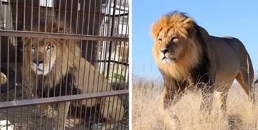

% Chuang Tzu

## 内篇

### 养生主

<b><u>吾生也有涯，而知也无涯。以有涯隨无涯，殆已。</u></b>

以有限去追求无限，终将是无比疲惫。

<b><u>爲善无近名，爲惡无近刑，緣督以爲經，可以保身，可以全生，可以養親，可以盡年。</u></b>

当你的行为被别人认为是善的时候，就注意不要被这些东西缠住了。当你的行为被别人认为是恶的时候，就要注意不要去触犯刑法。这样就可以保护自己的身体，保全自己的身心。

<b><u>庖丁解牛</u></b>

_彼節者有間，而刀刃者無厚，以無厚入有間，恢恢乎其於遊刃必有餘地矣，是以十九年而刀刃若新發於硎。_ 

_雖然，每至於族，吾見其難爲，怵然爲戒，視爲止，行爲遟，動刀甚微，謋然已解，如土委地。_

1. 不要把人生看成“整牛”，不要把人生当成任务或负担，而是以开放平和、随遇而安的心态，一点点去地探索人生的旅程，顺其自然，随遇而安。
2. 顺应人生的自然纹理，不要 “明知不可为而为之，明知不可求而求之”。
3. 使自己成为没有厚度的刀，舍弃不必要的世俗纠缠，减少不必要的欲望，放下不必要的执念。
4. 找到世俗世界中的间隙，远离是非矛盾的纠缠，尽量避免身心与外物的过分摩擦。
5. 面对复杂的人生问题，必须谨小慎微，不要让自己失足沉沦。
6. 学会功成身退，不露锋芒。

<b><u>澤雉十步一啄，百步一飲，不蘄畜乎樊中。神雖王，不善也。</u></b>

沼泽中的野鸡十步才能迟到一口事物，百步才能喝到一口水，但是它却不愿意被关在笼子中，当一只家鸡。

身心的自由自在，是人活着的最大意义，如果被种种枷锁束缚，那就与行尸走肉无异。

动物园中的狮子有安稳的环境、免费的食物、住宿和医疗，另一只狮子什么保障也没有，需要独自面对大自然的洗礼，但是完全自由，你想做哪一种狮子？

不要用长寿、安全和舒适来衡量社会的进步，动物园里的狮子较野生动物而言也是这样的。

## 外篇

### 刻意

<b><u>若夫不刻意而高，無仁義而修，無功名而治，無江海而閒，不道引而壽，無不忘也，無不有也，澹然無極而眾美從之，此天地之道，聖人之德也。</u></b>

什么都不放在心上，但是什么都可以拥有，以上这些美好都能够汇聚，这就是“无为而无不为”。

<b><u>夫恬惔寂寞，虛無無為，此天地之平而道德之質也。</u></b>

恬淡、寂寞、虚无、无为，乃是天地的本源和道德的实质。

<b><u>水之性，不雜則清，莫動則平；鬱閉而不流，亦不能清，天德之象也。故曰：純粹而不雜，靜一而不變，惔而无為，動而以天行，此養神之道也。</u></b>

水的本性，不混杂则清澈，不搅动则平静，这是自然规律中的现象。
